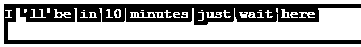
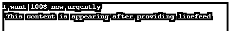
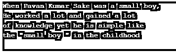
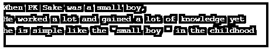
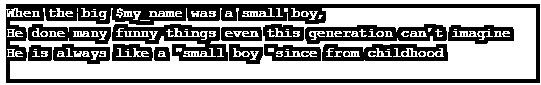
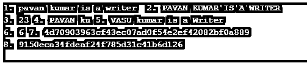

# PHP 中的字符串

> 原文：<https://www.educba.com/string-in-php/>


## PHP 中的字符串介绍

基本上，我们都知道字符串是一些字符的集合。它也是 PHP 编程语言实际支持的数据类型之一。字符串可以包含字母数字字符。它可以通过下列方式创建:

*   你可以声明一个变量，然后把一个字符串赋给一个字符
*   通过使用 echo 语句
*   字符串是语言结构，它可以帮助捕获单词。
*   除此之外，学习 PHP 编程语言中字符串的工作方式可以让你像一个高效的开发者一样有效地使用字符串。

### 如何用各种方法声明？

有四种不同类型的申报。

<small>网页开发、编程语言、软件测试&其他</small>

*   通过使用单引号
*   通过使用双引号
*   通过使用 Heredoc 字符串创建方法++
*   通过使用 Nowdoc 字符串创建方法

#### 1.使用单引号的 PHP 字符串创建方法

使用单引号创建一个或多个字符串是创建字符串最简单的方法。现在让我们看看下面列出的 PHP 语法，它创建了一个简单的字符串。

**语法:**

```
<?php
echo 'Login to the Page to view this page template';
?>
```

**输出:**


如果这个 PHP 单引号字符串是字符串值的一部分，那么我们使用反斜杠字符对它进行转义。检查下面代码语法。

```
<?php
echo 'I \'ll be in 10 minutes just wait here';
?>
```

**输出:**




#### 2.使用双引号的 PHP 字符串创建方法

大多在 PHP 语言的字符串创建中，会用到双引号。双引号字符串声明方法可以创建复杂的字符串，而不是使用单引号创建的字符串。

我们还可以在双引号内使用变量名，这样变量值将按照我们想要的方式显示。看一下双引号声明的例子，变量声明，这样你会理解使用双引号的字符串声明的概念。

**语法:**

```
<?php
$myname = 'Pavan Kumar Sake';
echo "$myname and Surendra Gandham is friends since from the College times";
?>
```

**输出:**

上面的示例将创建一个简单的字符串变量“myname”，其值为“Pavan Kumar Sake”。这个字符串变量现在可以在 PHP 编程语言中随时使用。

双引号声明的字符串也可以转义特殊字符。\n 表示换行符，$表示美元符号，等等。，可用于获得空行和美元符号的输出。同样，也有使用双引号来转义特殊字符的方法。

**语法:**

```
<?php
echo "I want 100\$ now urgently";
echo "\n This content is appearing after providing linefeed";
?>
```

**输出:**




#### 3.使用 Heredoc 字符串创建方法创建 PHP 字符串

在这里我们将知道这里是什么。与双引号字符串声明相比，Heredoc 的主要方法是在 PHP 中创建最复杂的字符串。

Heredoc 将支持双引号的所有特性。除此之外，Heredoc 还将允许您创建字符串值，而无需在多行中使用 php [字符串连接](https://www.educba.com/java-string-concatenation/)。您可以根据需要创建任意多的带字符串的线条。使用 Heredoc 方法可以创建多行字符串。我们甚至可以在 Heredoc 方法中对双引号进行转义。

让我们看一个 PHP Heredoc 方法创建单个/多个字符串值的例子。

**语法:**

```
<?php
$my_name = "Pavan Kumar Sake";
echo <<<EOT
When $my_name was a small boy,
He worked a lot and gained a lot
of knowledge yet he is simple like
the "small boy " in the childhood
EOT;
?>
```

**输出:**




< < < EOT 是字符串分隔符，EOT 表示文本结束。应该在字符串的开头和结尾使用/指定 EOT。您还可以为< < < EOT 使用任何变量声明。

**语法:**

```
<?php
$my_name = "PK Sake";
$eot_variable = <<<EOT
When $my_name was a small boy,
He worked a lot and gained a lot of knowledge yet he is simple like the "small boy " in the childhood
EOT;
echo $eot_variable;
?>
```

**输出:**




#### 4.使用 Nowdoc 字符串创建方法创建 PHP 字符串

PHP Nowdoc 字符串创建方法与 PHP Heredoc 字符串创建方法非常相似，但是 Nowdoc 方法主要像单引号一样工作。解析不会发生在 Nowdoc 内部。Nowdoc 方法是理想的，那么我们正在处理根本不需要解析的原始数据。

下面我们来看一个 Nowdoc 方法的代码示例:

**语法:**

```
<?php
$my_name = "Pavan Kumar Sake";
$my_variable = <<<'EOT'
When the big $my_name was a small boy,
He has done many funny things even this generation can’t imagine He is always like a "small boy "since from childhood
EOT;
echo $my_variable;
?>
```

**输出:**




除了字符串声明之外，还有一些字符串函数在开发小型 web 程序到大型项目时非常有用。请看看它们。另外，要知道字符串双引号声明和单引号声明的输出区别。

strtolower、strtoupper、strlen、explode、substr、str_replace、strops、sha1、md5、str_word_count、ucfirst、lcfirst 是字符串函数。这些字符串函数在创建项目或程序时非常有用。

“strtolower”将所有字符串字符转换成小写字母的[，而“strtoupper”将它们转换成大写字母。“strlen”将向](https://www.educba.com/lowercase-in-python/)[提供字符串长度](https://www.educba.com/javascript-string-length/)(字符数)。“explode”函数将字符串转换成数组变量。“substr”将使用 3 个基本参数返回字符串的一部分。“str_replace”将使用 3 个基本参数替换一些字符串内容。“strpos”函数将返回特定字符串的位置。“sha1”函数返回字符串的哈希代码。“md5”函数为字符串提供 md5 哈希值。同样，其他字符串也起作用。

**语法:**

```
<?php
echo strtolower("1\. PAVAN kumar is a Writer  ");
echo strtoupper("2\. PAVAN kumar is a Writer  \n");
echo "3\. ";
echo strlen("PAVAN kumar is a Writer");
echo substr(" 4\. PAVAN kumar is a Writer  ",0,12);
echo str_replace('PAVAN','VASU'," 5\. PAVAN kumar is a Writer  \n");
echo "6\. ";
echo strpos("PAVAN kumar is a Writer  ",'kumar');
echo " 7\. ";
echo sha1("PAVAN kumar is a Writer  ");
echo "\n8\. ";
echo md5("PAVAN kumar is a Writer  ");
?>
```

**输出:**




### 结论

在这里，我们了解了各种字符串声明方法的概念，以及重要字符串函数的基本介绍，这些函数在 php 程序/项目中非常有用

### 推荐文章

这是 PHP 中字符串的指南。这里我们讨论介绍以及如何使用各种方法声明 String。您也可以看看以下文章，了解更多信息–

1.  [PHP 文件处理](https://www.educba.com/php-file-handling/)
2.  [PHP 过滤器](https://www.educba.com/php-filters/)
3.  PHP 中的[数组](https://www.educba.com/arrays-in-php/)
4.  [PHP 拆分数组](https://www.educba.com/php-split-array/)


