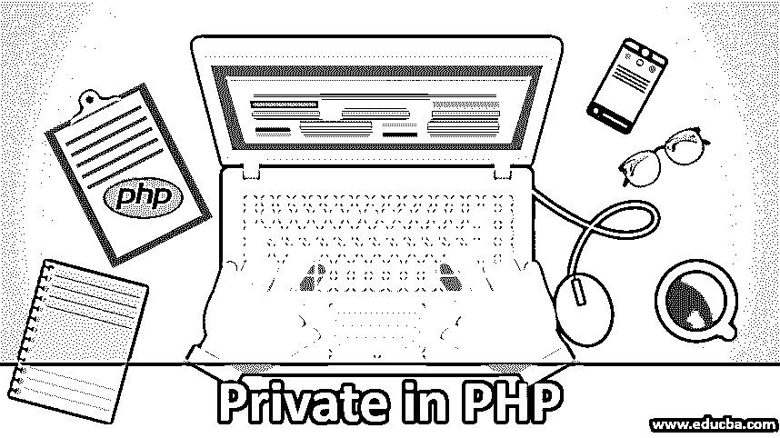
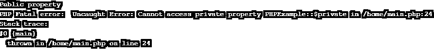
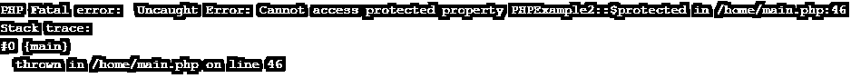
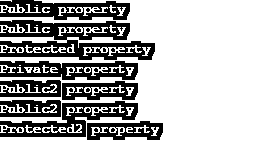
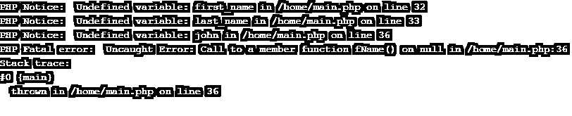

# PHP 中的私有

> 原文：<https://www.educba.com/private-in-php/>




## PHP 中的 Private 简介

关键字是在程序中用作保留的词，它们被赋予了特殊的含义。它们可以是命令或参数。像所有其他编程语言一样，PHP 也有一组称为关键字的特殊单词，它们不能作为变量名用于其他目的。它们也被称为保留名称。

顾名思义，private 关键字只能从定义它的类中访问。默认情况下，所有关键字都在公共类别下，除非它们被指定为私有或受保护。私有关键字通过在整个代码中为关键字提供最少的可见性来帮助实现安全目的。当只有一个类调用[这个关键字](https://www.educba.com/this-keyword-in-c-sharp/)时，也更容易折射。

<small>网页开发、编程语言、软件测试&其他</small>

除了私有关键字，也可以有私有方法。[在面向对象编程](https://www.educba.com/object-oriented-programming-in-java/)中，方法是与任何类相关联的过程集合。对于私有方法，只允许在属于同一个类或其模块的方法中调用它们。

还有可以声明的私有常量和属性。在这些情况下，可见性仅限于它们的类之间，而不是实例之间。如果两个对象属于同一类型，那么一个对象可以调用另一个对象的私有方法。

**语法**:

任何变量、属性或方法都可以通过在前面加上“private”关键字来声明为私有的。

```
class MyClass()
{
private variable_name;
private Method_name();
private $priv = 'Private property';
}
```

### 私有财产的例子

让我们通过下面的例子来理解 PHP 中私有属性的工作方式:

**代码:**

```
<?php
/**
* Definition of PHPExample
*/
class PHPExample
{
public $public = 'Public property';
protected $protected = 'Protected property';
private $private = 'Private property';
function displayValue()
{
echo $this->public;
echo "\n";
echo $this->protected;
echo "\n";
echo $this->private;
echo "\n";
}
}
$val = new PHPExample();
echo $val->public; // Public will work without any error
echo "\n";
echo $val->protected; // Uncaught Error: Cannot access protected property PHPExample::$protected in /workspace/Main.php:21
echo $val->private; // Uncaught Error: Cannot access private property PHPExample::$private in /workspace/Main.php:22
$val->displayValue(); // Displays all 3 Public, Protected and Private properties
/**
* Definition of PHPExample2
*/
class PHPExample2 extends PHPExample
{
// It supports redeclaration of public and protected properties and not private
public $public = 'Public2 property';
protected $protected = 'Protected2 property';
function displayValue()
{
echo $this->public;
echo "\n";
echo $this->protected;
echo "\n";
echo $this->private; //Undefined property: PHPExample2::$private in /workspace/Main.php on line 39
}
}
$val2 = new PHPExample2();
echo $val2->public; // Public will work without error
echo "\n";
echo $val2->protected; // Fatal Error
echo $val2->private; // Undefined property: PHPExample2::$private in /workspace/Main.php on line 46
$val2->displayValue(); // Shows Public2, Protected2, Undefined
?>
```

**输出 1:**


**第 23 行注释后输出 2:** 。




**第 24 行注释后输出 3:** 。




**输出 4:** 在注释完第 46、47、40 行之后。




**对上面代码的解释:**当您完整地运行这段代码时，您肯定会在一些行号处得到致命的错误，比如 25，26，45，52，53 行。我们首先在主类 PHPExample 中声明所有 3 个属性 public、private 和 protected，以显示它们各自的单词。Inline 25，我们试图从 PHPExample 类中访问所有 3 个属性。由于私有和受保护的示例不能在它们的类之外被访问，我们在所示的输出中得到一个致命错误，并且只显示公共属性。

在代码的后半部分，我们声明了另一个类 PHPExample2，其中我们重新声明了 protected 和 public 属性的显示值。同样的事情不允许发生在私人领域，然后我们就像在上半场一样执行同样的动作。因为我们试图调用这里没有声明的私有属性，所以我们得到了未定义的属性错误。

### 私有方法和关键字的示例

让我们通过下面的例子来理解 PHP 中私有方法和关键字的工作原理:

**代码:**

```
<?php
class NameExample {
// Declaring first name as private value
private $first_name;
// Declaring last name as private value
private $last_name;
public $public = 'Displaying from public method';
private $private ='Displaying from private method';
// private function for setting the value for first_name
private function fName($first_name) {
$this->$first_name = $first_name;
echo $this -> private;
}
// public function for setting the value for last_name
public function lName($last_name) {
$this->$last_name = $last_name;
echo $this -> public;
}
// public function to display full name value
public function dispName() {
echo "My name is: " . $this->$first_name . " " . $this->$last_name;
}
}
// Creating a new object named $arun of the class
$arun = new NameExample();
// trying to access private class variables
$arun->$first_name = "Arun"; // invalid
$arun->$last_name = "Sharma"; // invalid
// calling the public function to set $first_name and $last_name
$john->fName("John");
$arun->lName("Wick");
// $arun-> dispName();
?>
```

**输出 1:**




**输出 2:** 在注释完第 32、33、36 行之后。


**对上面代码的解释:**在上面的例子中，$first_name 和$last_name 被声明为类名 example 的私有变量，因此不能使用类对象直接调用它们。因此，当我们第一次尝试运行代码时，我们得到一个错误“未定义的变量:first _ name in/workspace/name example . PHP on line 32”，第 33 行也是如此。当我们对这两行进行注释并再次运行代码时，我们得到错误“未捕获的错误:调用/workspace/NameExample.php:36 中 null 上的成员函数名()。

这是因为我们已经将函数 fName 声明为 private，并且它正在尝试访问该函数。当第 36 行也被注释并从方法名显示时，代码运行顺畅，因为它是一个公共方法。

### 在 PHP 中使用 Private 的优势

以下是在 PHP 中使用 Private 的优点:

1.  私有变量仍然可以通过使用“getters”和“setters”来访问，这给了编码者更多的访问数据的控制权。
2.  Private inturn [意味着封装](https://www.educba.com/encapsulation-in-php/),它也将变量从一个类分离到另一个类，因此在内部保护对类所做的更改。
3.  私有变量的行为被限制在特定的类中，这也避免了混淆。
4.  私有变量可以很容易地被重新实现，而没有在任何地方破坏代码的风险。

### PHP 中私有的规则和规范

以下是 PHP 中 Private 需要遵守的规则和条例:

1.  对于任何变量成员或方法，都必须声明它的作用域，无论它是属于 public、protected 还是 private。
2.  在方法的顺序中，应该遵循以下顺序:公共的>受保护的>私有的
3.  私有变量不能从声明它们的主类的子类中访问。但是，如果在子类中再次声明了相同的私有属性，则可以访问它，但这样做是不可取的。
4.  因此，在类中声明的私有方法只能在该类内部调用。

### 结论

Private 是限制类的变量、方法或属性的可访问性的一种方式。只能在声明它们的类中访问它们，而不能从它的任何子类中访问它们。来自父类的任何受保护的属性都可以被子类覆盖并成为公共属性，但不能成为私有属性。

### 推荐文章

这是一个 PHP 中私有的指南。在这里，我们讨论 PHP 中 Private 的两个不同例子，它们的优点以及需要遵循的规则和条例。您也可以浏览我们的其他相关文章，了解更多信息——

1.  [PHP 中的函数](https://www.educba.com/functions-in-php/)
2.  [PHP 表单](https://www.educba.com/php-form/)
3.  [用于 PHP 中的循环](https://www.educba.com/for-loop-in-php/)
4.  [受 PHP 保护](https://www.educba.com/protected-in-php/)


