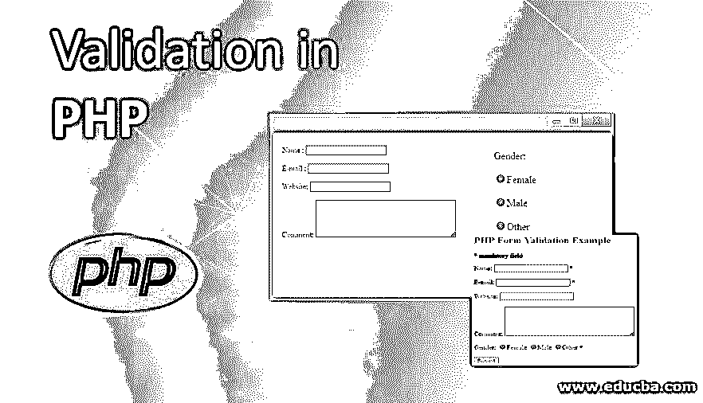
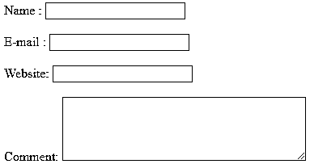
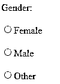
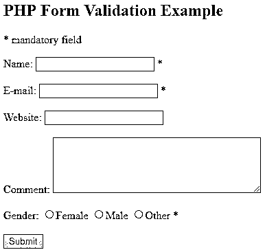

# PHP 中的验证

> 原文：<https://www.educba.com/validation-in-php/>




## PHP 中验证的介绍

PHP 中的验证是这样一个过程:我们检查最终用户在表单中提交的各种字段中的输入信息(如文本、复选框或单选按钮等)是否正确，或者是否使用了 HTML 代码。

PHP 中有两种可用的验证:

<small>网页开发、编程语言、软件测试&其他</small>

1.  **客户端验证:**这种类型的验证是在客户端机器的网络浏览器上完成的。
2.  **服务器端验证:**提交的数据随后被发送到服务器，在那里执行验证检查。

### PHP 中的验证规则

表单验证有一定的规则，这些规则适用于以下字段:

*   **Name** :必填字段，数据只包含空格和字母。
*   **Email** :这也是一个必填字段，应该包含一个有效的电子邮件地址，这意味着它应该采用 abc@website.com 的格式。
*   **网站**:这是一个可选字段，如果给出，它应该包含一个有效的 URL
*   **注释**:可选字段，是多行文本输入，我们可以在这里给出长句。
*   **性别**:必填项，应在女性、男性、其他中选择一个性别。

### PHP 中的验证类型

现在让我们看看如何验证不同类型的字段。

#### 1.文本字段的验证

上述属性中有几个文本字段，如姓名、电子邮件、网站和评论。相同的 HTML 代码如下所示:

**代码:**

```
<blockquote>
<p>Name : <input name="name" type="text" /> <br /><br /> E-mail : <input name="email" type="text" /><br /><br /> Website: <input name="website" type="text" /><br /><br /> Comment: <textarea cols="40" name="comment" rows="5"></textarea></p>
</blockquote>
```

**输出:**




**对上述程序的解释:**在这里，我们可以通过使用不同的头标签和空格标签来定制这些属性名。我们在这里展示了其中一个段落格式选项。

#### 2.单选按钮的验证

单选按钮基本上是那些具有布尔值真或假的按钮，它们用一个圆形的盒子来表示。如果方框被圈起来，就表示正确，反之亦然。让我们看看实现上述“性别”属性的 HTML 代码。

**代码:**

```
Gender:<br /><br />
<input type="radio" name="gender" value="female">Female<br /><br />
<input type="radio" name="gender" value="male">Male<br /><br />
<input type="radio" name="gender" value="other">Other
```

**输出:**




**对上述程序的解释:**通过使用该代码，我们在性别类别下显示 3 个选项，分别为男性、女性和其他。用户可以通过点击圆圈在所需选项上画圈，该选项将被保存和验证。

#### 3.表单元素的验证

在填写完提交表单所需的所有细节后，在最后使用此方法。在使用这个 HTML 代码时，提交的表单数据用“post”方法发送。在验证表单元素时，我们需要指定两个基本属性:动作和方法。我们可以将某些 HTML 属性转换成它们各自的实体名称，以防止用户提交时表单被破坏。“动作”决定提交时表单数据发送到哪里，“方法”定义如何提交表单数据。

**代码:**

```
<form method="POST"
action="<?php echo htmlspecialchars($_SERVER["PHP_SELF"]);?>">
```

让我们通过结合我们在上面学到的所有不同类型的验证来检查一个完整的验证形式:

**代码:**

```
<!DOCTYPE HTML>
<html>
<head>
<style>
.Error {color: #FF0000;}
</style>
</head>
<body>
<?php
// we are defining variables here and setting their default values to zero
$nameError = $emailError = $genderError = $websiteError = "";
$name = $email = $gender = $comment = $website = "";
if ($_SERVER["REQUEST_METHOD"] == "POST") {
if (empty($_POST["name"])) {
$nameError = "Name is mandatory";
} else {
$name = test_input($_POST["name"]);
}
if (empty($_POST["email"])) {
$emailError = "Email is mandatory";
} else {
$email = test_input($_POST["email"]);
}
if (empty($_POST["website"])) {
$website = "";
} else {
$website = test_input($_POST["website"]);
}
if (empty($_POST["comment"])) {
$comment = "";
} else {
$comment = test_input($_POST["comment"]);
}
if (empty($_POST["gender"])) {
$genderError = "Gender is mandatory";
} else {
$gender = test_input($_POST["gender"]);
}
}
function test_input($data) {
$data = trim($data);
$data = stripslashes($data);
$data = htmlspecialchars($data);
return $data;
}
?>
<h2>PHP Form Validation Example</h2>
<p>* mandatory field</p>
<form method="post" action="<?php echo htmlspecialchars($_SERVER["PHP_SELF"]);?>">
Name: <input type="text" name="name">
* <?php echo $nameError;?>
<br><br>
E-mail: <input type="text" name="email">
* <?php echo $emailError;?>
<br><br>
Website: <input type="text" name="website">
<?php echo $websiteError;?>
<br><br>
Comment: <textarea name="comment" rows="5" cols="40"></textarea>
<br><br>
Gender:
<input type="radio" name="gender" value="female">Female
<input type="radio" name="gender" value="male">Male
<input type="radio" name="gender" value="other">Other
* <?php echo $genderError;?>
<br><br>
<input type="submit" name="submit" value="Submit">
</form>
<?php
echo "<h2>Your Input:</h2>";
echo $name;
echo "<br>";
echo $email;
echo "<br>";
echo $website;
echo "<br>";
echo $comment;
echo "<br>";
echo $gender;
?>
</body>
</html>
```

**输出:**




**对上述程序的解释:**在上面的例子中，我们组合了所有不同的可用字段，如文本字段、单选按钮以及电子邮件格式类型。输出将以一个框的形式显示，这将根据我们在 HTML 代码中给出的规范。输入强制值后，强制值将显示在文本“输入的详细信息是:”下。假设没有给出任何一个强制值，那么除了这个特定的属性之外，它还会抛出一个错误消息，说明它是强制的，需要填充。

### PHP 中验证的优势

*   通过使用客户端验证，我们可以更快地接收反馈，而不必关闭服务器并下载另一个 HTML 页面。
*   客户端的验证也有助于节省服务器的负载并提高性能。

### 结论

在本教程中，我们已经看到了如何在客户端用 PHP 进行验证，以及它有多重要。这有助于节省时间，从而允许更多的带宽来指出最终用户在填写给定表格时的错误。然而，服务器端验证也很重要，这是使用 JavaScript 等[完成的。因此，我们最后可以说，客户端和服务器端的验证都很重要，因为它们在服务于最终目的时是相辅相成的。](https://www.educba.com/what-is-javascript/)

### 推荐文章

这是一个 PHP 验证指南。在这里，我们讨论验证的某些规则、类型和优点，以及相应的示例。您也可以浏览我们的其他相关文章，了解更多信息——

1.  [HTML 表单验证](https://www.educba.com/html-form-validation/)
2.  [ASP.Net 验证控制](https://www.educba.com/asp-dot-net-validation-controls/)
3.  [JavaScript 表单验证](https://www.educba.com/javascript-form-validation/)
4.  [PHP 日志错误](https://www.educba.com/php-log-errors/)


