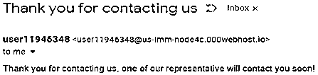
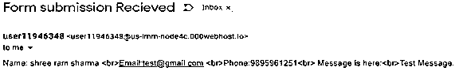
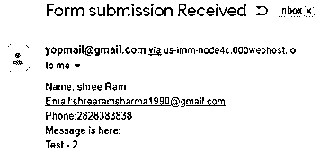

# PHP 电子邮件表单

> 原文：<https://www.educba.com/php-email-form/>


## PHP 电子邮件表单介绍

在本文中，我们将学习 PHP 电子邮件表单。沟通在任何应用中都起着重要的作用。基于事件的通知在任何在线通信中都很常见。就 PHP 语言而言，有各种类型的基于动作(基于事件)的通信。PHP 电子邮件是我们可以在应用程序中使用的通信媒介之一。

根据业务需求，我们可以在 PHP 代码文件或应用程序中使用 PHP 电子邮件功能。这是基本要求之一。我们可以在任何网站或应用程序中看到各种各样的开放表单，如联系我们表单、注册表单、登录表单、查询表单等。现在，一个人需要通知的表格提交的基础。如果我们提交了联系我们的形式，它应该在一封电子邮件给管理员或任何其他人谁将照顾这些联系我们的电子邮件。

<small>网页开发、编程语言、软件测试&其他</small>

**语法:**

标准的 PHP 电子邮件表单没有什么需要处理的，它可以是任何一种具有电子邮件功能的表单。但是是的，它将与表单提交一起通知用户和管理员。使用 PHP 发送电子邮件非常简单，并且可以很容易地从任何互联网资源中找到语法。

以下是用 PHP 发送电子邮件的语法:

```
mail("TO EMAIL","EMAIL Subject","EMAIL MESSAGE");
```

*   **mail:** mail 是 PHP 预定义的函数，我们可以用它来发送电子邮件。
*   **TO EMAIL** : To email 是我们要发送邮件的电子邮件地址。
*   **邮件主题:**这是一封邮件主题是邮件的主题/头。
*   **电子邮件消息**:这是我们想要发送到指定电子邮件 id 的消息本身。

当用户提交任何指定的表单时，我们可以捕获细节，然后我们可以使用此电子邮件功能通知最终接收者。

使用 PHP 发送电子邮件还有其他各种方式。有一个插件叫 PHP MAILER。这个 PHP 邮件程序除了正常的 PHP 电子邮件功能之外，还增加了各种特性。使用这个 PHP 邮件程序，我们将有各种其他功能可以使用，如发件人电子邮件地址，抄送地址，密件抄送地址，文件作为附件，发件人 IP 地址，主机名等。

### PHP 邮件表单是如何工作的？

因为这篇文章是关于表单驱动的电子邮件，所以在应用电子邮件通知之前，我们需要在 PHP 中有一个工作表单。因此，要使事情完全正常，我们必须遵循以下步骤:

*   用必需的字段制作一个简单的表单。我们可以使用 HTML、CSS、jQuery 和 PHP 来确保我们都准备好了表单处理。
*   我们可以根据需要使用 HTML 和 CSS 来美化表单。
*   提交表单后，我们必须验证字段，然后我们可以使用电子邮件功能将电子邮件发送到所需的电子邮件地址。最终用户不会有太多的感受。当用户提交表单时，它会在获得正确的详细信息后发送电子邮件，并且会通知用户表单已成功提交。

我们将在本文的示例部分看到详细的示例。

### 实现 PHP 电子邮件表单的例子

下面是用 PHP 实现电子邮件表单的例子:

#### 示例#1

**代码:**

```
<!DOCTYPE html>
<head>
<title>Form submission</title>
</head>
<body>
<?php
if(isset($_POST['submit'])){
$name = $_POST['name']." ".$_POST['lname'];
$email = $_POST['email'];
$mobile_no = $_POST['mobile_no'];
$subject = "Form submission Received";
$subject2 = "Thank you for contacting us";
$message = "Name: ".$name ." <br>Email:". $email ." <br>Phone:" . $mobile_no. "<br> Message is here:<br>" . $_POST['message'];
$message2 = "Thank you for contacting us, one of our representatives will contact you soon!";
mail($email,$subject2,$message2);
mail('test@gmail.com',$subject,$message);
}
?>
<div class="container-fluid">
<div class="container inner">
<div class="col-lg-12"><h1>Contact Us</h1>
<div class="col-xl-6 col-lg-6 col-md-6 col-sm-6 mb-4 float-left">
<p>Need a helping hand? Please reach out to us using the below form: </p>
<div class="col-lg-12" style="padding:0;">
</div>
</div>
<div class="col-xl-6 col-lg-6 col-md-6 col-sm-6 mb-4 float-left">
<p id="error_msg" style="display: none;"></p>
<form class="contact-form" id="Contact_frm" autocomplete="off" method="post" action="<?php echo $_SERVER['PHP_SELF']; ?>" >
<div class="form-group">
<label>First Name</label>
<input type="text" class="form-control" name="name" placeholder="First name">
</div>
<div class="form-group">
<label>Last Name</label>
<input type="text" class="form-control" name="lname" placeholder="Last name">
</div>
<div class="form-group">
<label>E-mail Address</label>
<input type="text" class="form-control" name="email" placeholder="E-mail">
</div>
<div class="form-group">
<label>Phone Number</label>
<input type="text" class="form-control" id="mobile_no" maxlength="10" name="mobile_no" placeholder="Phone number">
</div>
<div class="form-group">
<label>Message</label>
<textarea class="form-control" name="message" placeholder="Message"></textarea>
</div>
<button type="submit" name="submit" class="btn contact-btn">Submit</button>
</form>
</div>
</div>
</div>
</div>
</body>
<style>
.form-group{margin:10px; clear:both}
</style>
</html>
```

**输出:**


根据上述代码，我们将收到 2 封电子邮件。

*   第一封电子邮件发送到在表单中输入的电子邮件。




*   第二份遗嘱属于 test@gmail.com




#### 示例# 2**–**从电子邮件地址设置

在电子邮件功能中，我们也可以设置发件人电子邮件。让我们看看相同的示例代码。这里，只关注 PHP 部分，其他 HTML 部分与上面的示例代码保持一致。

**代码:**

```
<?php
if(isset($_POST['submit'])){
$name = $_POST['name']." ".$_POST['lname'];
$email = $_POST['email'];
$mobile_no = $_POST['mobile_no'];
$subject = "Form submission Received";
$subject2 = "Thank you for contacting us";
$message = "Name: ".$name . " <br>Email:" . $email . " <br>Phone:" . $mobile_no. "<br> Message is here:<br>" . $_POST['message'];
$message2 = "Thank you for contacting us, one of our representatives will contact you soon!";
mail($email,$subject2,$message2);
$headers  = "From: " . "yopmail@gmail.com" . "\r\n";
$headers .= "Reply-To: ". strip_tags($email) . "\r\n";
$headers .= "MIME-Version: 1.0\r\n";
$headers .= "Content-Type: text/html; charset=ISO-8859-1\r\n";
mail('shreeramsharma1990@gmail.com',$subject,$message,$headers);
}
?>
```

**输出:**




### 结论

我们有各种使用 PHP 电子邮件的方法。PHP Mailer 是最流行的一种。PHP 邮件程序是普通 PHP 邮件功能中最值得推荐的一个。我们应该使用 PHP 中可用的过滤或净化功能来验证电子邮件地址，然后再将电子邮件发送到指定的电子邮件地址。各种组织更喜欢亚马逊服务通过任何其他可用的媒介发送电子邮件，因为它总是在收件箱中发送电子邮件。

### 推荐文章

这是一个 PHP 电子邮件表单指南。在这里，我们讨论语法，用正确的代码和输出实现的例子，知道它是如何工作的。您也可以浏览我们的其他相关文章，了解更多信息——

1.  [PHP 中的日历](https://www.educba.com/calendar-in-php/)
2.  [受 PHP 保护](https://www.educba.com/protected-in-php/)
3.  [PHP 登录模板](https://www.educba.com/php-login-template/)
4.  [PHP 超全局变量](https://www.educba.com/php-superglobal-variables/)


