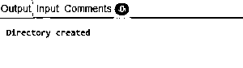
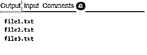
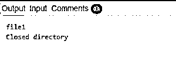
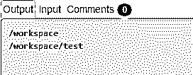
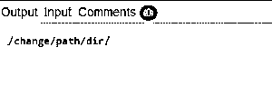

# PHP 目录

> 原文：<https://www.educba.com/php-directory/>


## PHP 目录介绍

PHP 目录函数，顾名思义，是一组用于检索细节、修改细节和获取各种文件系统目录及其特定内容的信息的函数。可以对目录执行许多操作，如创建、删除、更改当前工作目录、列出目录中的文件等。这些函数不需要单独安装，因为它们是 PHP 核心的一部分。但是要启用 chroot()函数，我们需要配置–enable-ch root-func 选项。

### PHP 目录的功能

让我们看看下面几个基本的 PHP 目录函数:

<small>网页开发、编程语言、软件测试&其他</small>

#### 1.创建新目录

我们使用 mkdir()函数在 PHP 编程脚本中创建新目录。

**语法**:

```
mkdir($dir_path,$mode,$recursive_flag,$context);
```

在哪里，

*   $dir_path 是将在其中创建指定的新目录的相对或绝对路径。
*   $mode 是接受八进制值的参数，它决定了新创建的目录的可访问级别。
*   $recursive 是一个标志类型字段，它有两个值:true 或 false，可以允许我们创建嵌套目录，也可以不允许。
*   $context 类似于我们用 PHP unlink()得到的东西，比如用一个流来指定某些协议等等。这也将只返回一个布尔值，如果执行成功完成，该值为真，否则为假。

**举例:**

```
<?php
mkdir("/articles/");
echo("Directory created");
?>
```

**输出:**




这是一个基本的例子，展示了在我们需要的路径中创建一个目录。请确保该路径有足够的权限，否则将引发“权限被拒绝”错误。

#### 2.列出目录的内容

我们使用 opendir()和 readdir()分别打开目录链接和读取它。第一步是打开目录，第二步是读取目录。

**第一步:**打开目录链接，opendir()是我们用来做这一步的函数。它需要两个输入参数，如下所示。

**语法:**

```
opendir($dir_path,$context);
```

*   $dir_path 是需要打开的目录的路径。
*   $context 是一个可选参数，我们可以在其中指定上下文流是否存在。

这将返回资源数据值作为其输出。它提供的这个资源 ID 用于我们进一步的处理步骤，否则我们会得到一个错误，因为资源 ID 无效。

**步骤 2:** 为了读取目录的内容，readdir()是用于此目的的函数，它需要被递归调用，直到目录句柄到达目录的末尾。

**举例**:

```
<?php
$direct = "/files/";
if (is_dir($direct)){
if ($td = opendir($direct)){
while (($file = readdir($td)) !== false){
echo "filename:" . $file . "<br>";
}
closedir($td);
}
}
?>
```

**输出:**




在这个例子中，我们首先声明需要读取的目录路径。我们检查 if 语句中是否存在该目录，然后打开该目录的内容并进行读取。输出显示目录中存在的文件名。

#### 3.关闭目录

我们使用 closedir()函数在读取目录内容后关闭目录。

**语法**:

```
$dir_handle = opendir($dir_path);
...
...
closedir($dir_handle);
```

**举例:**

```
<?php
$dir = "/file1";
if (is_dir($dir)) {
if ($dh = opendir($dir)) {
$direc = readdir($dh);
echo("File present inside directory are:" .direc);
closedir($dh);
echo("Closed directory");
}
}
?>
```

**输出:**




在这个例子中，我们首先声明目录的路径。然后使用 if 条件语句，我们检查路径是否有效，如果有效，那么我们打开目录，读取它的变量，然后关闭它。因此，在打开和关闭目录之间可以进行任何操作。

#### 4.要更改当前目录

我们使用函数 chdir()来改变它所指向的当前工作目录。

**语法**:

```
chdir(directory)
```

它只需要一个参数，即当前工作目录应该指向的目录。如果成功，则返回 true，如果未能更改目录，则返回 false。

**举例:**

```
<?php
// Get current directory
echo getcwd()."\n";
// Change directory
chdir("/workspace/test");
// Get current directory
echo getcwd();
?>
```

**输出:**




在这个例子中，我们首先打印当前的工作目录。然后，我们使用 chdir 函数将相同的内容更改为“test”目录，并在输出中打印相同的内容。因此，确保我们在这里给出的整个路径存在。

#### 5.要更改根目录的目录路径

我们使用函数 chroot()将正在进行的进程的根目录更改为我们作为参数传递的目录路径。此外，当前的工作目录路径将更改为“/”。要执行此功能，需要 root 权限/特权。

**语法**:

```
chroot(directory)
```

**举例:**

```
<?php
// Changing root directory path
chroot("/change/path/dir/");
// Displaying present directory
echo getcwd();
?>
```

**输出:**




在这个例子中，我们首先使用 chroot 函数来改变根目录的路径。接下来，我们将显示当前的工作目录，该目录现在将更改为主路径。

#### 6.重置目录句柄

为此，我们使用 rewinddir()函数来重置最初由 opendir()函数创建的目录句柄。

**语法**:

```
rewinddir(directory)
```

它只接受目录路径作为它的输入参数，用来告诉之前用 opendir()打开的目录句柄资源路径。这是一个可选参数，如果没有指定，那么将考虑 opendir()使用的前一个链接。

**举例:**

```
<?php
$direc = "/file/";
// To open the directory and read its contents
if (is_dir($direc)){
if ($place = opendir($direc)){
// List files in images directory
while (($file = readdir($place)) !== false){
echo "filename:" . $file . "\n";
}
rewinddir();
echo("Using the function rewinddir\n");
// List files again
while (($file = readdir($place)) !== false){
echo "filename:" . $file . "\n";
}
closedir($place);
echo("Closed directory");
}
}
?>
```

**输出:**


在本例中，我们首先指定目录路径和 if 语句，我们使用该语句来验证目录路径是否存在。如果目录存在，那么我们打开并读取文件的内容并打印出来。现在文件处理程序将停止打印，因为它到达了文件指针的末尾。当我们使用 rewinddir()函数时，它会重置文件处理程序，因此当我们打印目录内容时，它会再次打印相同的输出。

### 结论

我们已经讨论了本文中常用的一些基本而重要的 PHP 目录函数。我们还注意到其中一些功能是相互依赖的。例如，如果不使用 opendir()，我们就不能使用 readdir()。其他几个被使用的函数是 dir()、scandir()和 getcwd()。

### 推荐文章

这是一个 PHP 目录指南。在这里，我们讨论了入门，我们学习了如何使用 PHP 显示网站目录中的所有文件。您也可以看看以下文章，了解更多信息–

1.  [PHP if 语句](https://www.educba.com/php-if-statement/)
2.  [PHP 操作符](https://www.educba.com/php-operators/)
3.  [PHP 调用函数](https://www.educba.com/php-call-function/)
4.  [PHP 数组搜索](https://www.educba.com/php-array-search/)


