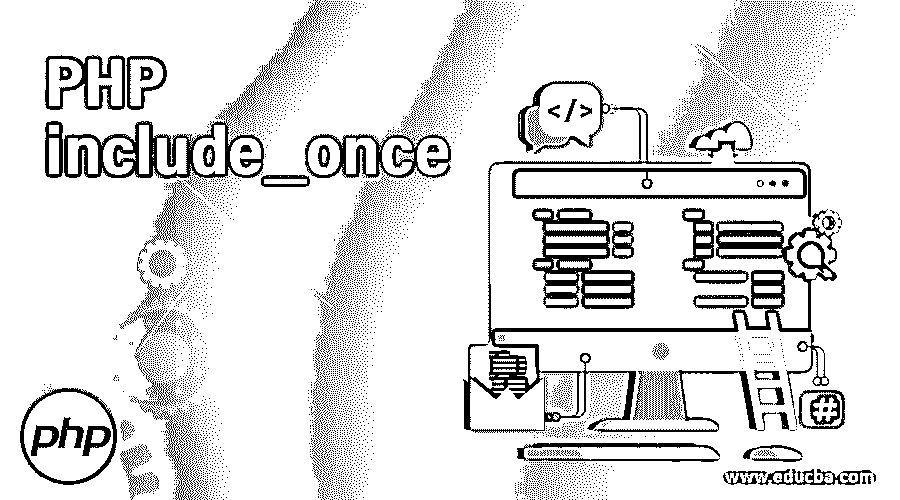
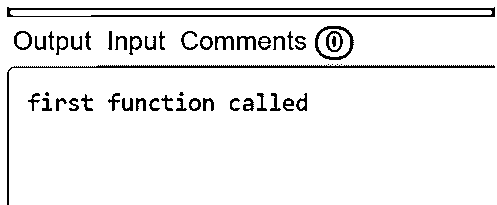

# PHP 包含 _once

> 原文：<https://www.educba.com/php-include_once/>

## PHP include_once 简介

PHP 中的 include_once 函数在执行脚本时组成并执行特定文件的操作。因此，这与 PHP 的 include 语句相同，唯一的变化是，如果来自另一个文件的脚本已经存在，那么它将不再包含它，并且这个函数 include_once 只返回 TRUE。因此，顾名思义，这里的文件只被它包含一次。

include_once 主要用于在执行脚本时可以多次封闭和操作单个文件的地方，因此这将有助于防止不同的问题，如变量值的重新分配、函数的重新定义等。,.这个函数也非常类似于 require_once 函数。

<small>网页开发、编程语言、软件测试&其他</small>

**语法:**

`include_once('file name with its full path');`

上层语法是不言自明的。

### PHP include_once 函数的例子

让我们考虑一下，在代码中，我们需要两个不同的文件，如文件 p 和文件 q。检查以下条件:

p:包含 m，包含 n

男:包括 n

n: echo“这是功能 a”

这里假设我们执行函数 p，那么首先它包含函数 m 和 n，正如我们在下面看到的，函数 m 也调用 n，因此包含它。由此，我们可以看出 n 将被包含两次，这是相当不恰当的。因此，通过使用 include_once 函数，我们可以将其调用限制为仅一次。

因此 include_once 将适用于假设有两个模型并且其中一个需要调用数据库连接模型的情况。这里包括它，每次都可能造成重复错误。因此，使用 include_once 可以避免只包含一次的情况。

### PHP 的例子包括 _once

下面是一些例子:

#### 示例#1

**代码:**

`<?php
// First file displaying present date
echo "Finding the current date here \n";
echo "today is:".date("Y-m-d");
?>`

这是我们用“Main.php”这个名字保存的第一个文件，我们在下一段代码中调用这个名字。

`<?php
include_once('Main.php');
include_once('Main.php');
?>`

**输出:**

我们使用 include_once 函数在上面的代码中两次包含了我们的 Main.php 文件。但是正如我们在输出中看到的，我们只得到一次回显数据，因为调用的第二个实例被忽略了。这是因为 include_once()函数忽略了执行后与第一个包含相同的所有包含。

#### 实施例 2

让我们假设有 3 个文件要运行，如下所示:

**代码:**

`FIRST_FUNCTION.php
SECOND_FUNCTION.php
THIRD_FUNCTION.php`

FIRST_FUNCTION.php 的代码如下所示:

`<?php
// declaring a function
function func(){
echo 'first function called';
}
?>
SECOND_FUNCTION.php:
<?php
// using include function to include the above function
include('FIRST_FUNCTION.PHP');
echo 'second function called';
func();
?>
THIRD_FUNCTION.php
<?php
include('FIRST_FUNCTION.PHP');
include('SECOND_FUNCTION.PHP');
func();
?>`

现在，当这个 THIRD_FUNCTION.php 被执行时，我们得到一个错误，因为 SECOND_FUNCTION.php 文件已经包含了 FIRST_FUNCTION.php。该错误将声明函数 func()已经在 SECOND_FUNCTION.php 中声明，并且我们已经包含在 THIRD_FUNCTION.php 中，这意味着我们已经包含 FIRST_FUNCTION.php 两次。因此，为了确保我们只使用 FIRST_FUNCTION.php 一次，我们应该使用 include_once()函数，这样我们的 THIRD_FUNCTION.php 就可以修改为如下所示:

`<?php
// using include_once function
include_once('FIRST_FUNCTION.PHP');
include('SECOND_FUNCTION.PHP');
?>`

**输出:**

所以现在当我们运行这段代码时，我们不会得到任何错误，因为 PHP 将只包含 FIRST_FUNCTION.php 一次，以避免抛出错误。因此，在这种情况下，有必要在 PHP 代码中使用 include_once()函数，而不是 include()函数。

PHP include 函数虽然与 require 函数非常相似，但我们确实发现了它们之间的一些不同之处，如下所示:

*   每当发生错误时，Include 函数都会抛出警告(E_WARNING ),而 require 函数则不会。
*   即使在 include 函数过程中遇到错误，脚本仍会继续执行，但在运行所需函数时，如果出现错误(E_COMPILE_ERROR ),脚本将停止执行。
*   例如:require 语句可用于在 CMS、框架或 PHP 函数编码的情况下执行，其中我们必须将一个密钥文件包含到它的流程中。假设其中一个关键文件不存在，这有助于维护应用程序的完整性和安全性。
*   同样，通过包含文件，我们可以节省很多时间，因为我们总是可以为所有的网页创建和包含标准的页脚、页眉或菜单文件。然后我们可以在需要的时候只更新头文件。

### 使用 PHP 的优点包括 _once

*   因为这个 include_once 在找不到特定文件时抛出一个警告，而不是一个致命错误，因此执行不会中断，仍然可以顺利进行。
*   最适合处理需要重用一些函数和变量的情况。
*   它有助于避免变量值的重新分配、重新定义某些函数等问题。
*   在我们必须定期调用某些函数的情况下非常有用。

### 结论

PHP includes once 用于包含任何脚本，并确保它只执行一次，从而防止由于重复调用而导致的任何错误。这基本上用于需要将一段公共代码用于代码执行所需的任何类型的声明或配置文件的情况。

### 推荐文章

这是一个 PHP include_once 的指南。在这里，我们还讨论了 PHP include_once 函数的介绍和工作原理，以及不同的例子和代码实现。您也可以看看以下文章，了解更多信息–

1.  [PHP 字符串操作符](https://www.educba.com/php-string-operators/)
2.  [PHP explode()](https://www.educba.com/php-explode/)
3.  [PHP strtok()](https://www.educba.com/php-strtok/)
4.  [PHP wordwrap()](https://www.educba.com/php-wordwrap/)

