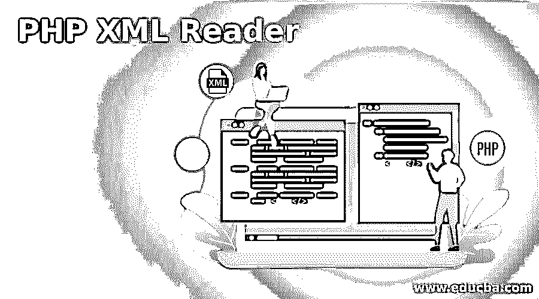
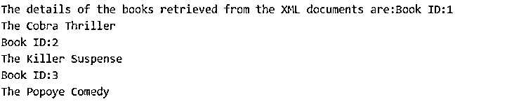
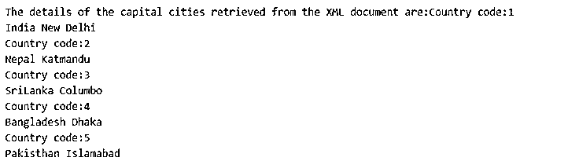
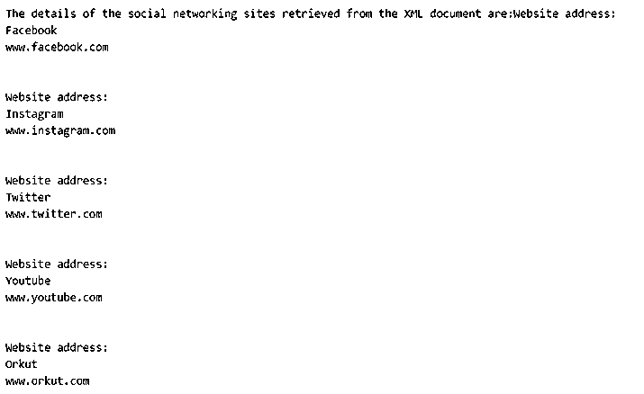

# PHP XML 阅读器

> 原文：<https://www.educba.com/php-xml-reader/>

## PHP XML Reader 简介

PHP 中的 XML 解析技术之一是 XML Reader 扩展，使用它可以创建用于读取 XML 文档的 XML 解析器，PHP 中的这种解析器被称为拉解析器或基于流的 XML 解析器，PHP 中的 XML Reader 可以用于基于当前节点检索 XML 文档的一部分，可以基于名称、命名空间或索引获得属性，可以使用属性的名称、命名空间或索引解析元素， 可以解析元素而无需进入内部级别，可以获取当前节点的值，可以将附加属性设置为 XML 解析器，并且可以验证 XML 文档。

**语法:**

<small>网页开发、编程语言、软件测试&其他</small>

在 PHP 中声明 XML Reader 的语法如下:

`XMLReader();`

### PHP 中 XML 阅读器的使用

PHP 中 XML Reader 的工作方式如下:

*   PHP 中的 XML 解析技术之一是 XML Reader 扩展，使用它可以创建用于读取 XML 文档的 XML 解析器，PHP 中的这种解析器被称为拉解析器或基于流的 XML 解析器。
*   PHP 中的 XML Reader 可以用来根据当前节点检索 XML 文档的一部分。
*   使用 PHP 中的 XML Reader，可以基于名称、命名空间或索引获得属性。
*   使用 PHP 中的 XML Reader，可以使用属性的名称、命名空间或索引来解析元素。
*   使用 PHP 中的 XML Reader 可以解析元素，而无需进入内部级别。
*   当前节点的值可以使用 PHP 中的 XML Reader 获得。
*   使用 PHP 中的 XML Reader 可以将附加属性设置为 XML 解析器。
*   可以使用 PHP 中的 XML Reader 来验证 XML 文档。

### PHP XML 阅读器的例子

下面是一些例子:

#### 示例#1

使用 PHP 中的 XML Reader 解析 XML 文档并检索 XML 文档内容的 PHP 程序:

**代码:**

`<?php
//creating an XML documents that is to be parsed using XML reader to retrieve the contents
$xmlDocument = '<?xml version="1.0"?>
<books>
<book ID="1">
<bookname>The Cobra</bookname>
<genre>Thriller</genre>
</book>
<book ID="2">
<bookname>The Killer</bookname>
<genre>Suspense</genre>
</book>
<book ID="3">
<bookname>The Popoye</bookname>
<genre>Comedy</genre>
</book>
</books>';
//declaring an instance of XML Reader
$xml = new XMLReader();
$xml->XML($xmlDocument);
//parsing the contents of the XML document and retrieving the required contents from the document
echo "The details of the books retrieved from the XML documents are:";
while( $xml->read() )
{
if($xml->name == "book")
{
print "Book ID:" . $xml->getAttribute("ID") . " ";
print $xml->readInnerXML() . " ";
$xml->next();
}
}
?>`

**输出:**

在上面的程序中，我们创建了一个 XML 文档，该文档将被解析，以便使用 XML 阅读器从文档中检索内容。然后创建 XML 阅读器的一个实例。然后，使用 XML 阅读器解析 XML 文档，从 XML 文档中检索所需的内容，并将其作为输出显示在屏幕上。输出显示在上面的快照中。

#### 实施例 2

使用 PHP 中的 XML Reader 解析 XML 文档并检索 XML 文档内容的 PHP 程序:

**代码:**

`<?php
//creating an XML documents that is to be parsed using XML reader to retrieve the contents
$xmlDocument = '<?xml version="1.0"?>
<capital>
<country ID="1">
<countryname>India</countryname>
<capital>New Delhi</capital>
</country>
<country ID="2">
<countryname>Nepal</countryname>
<capital>Katmandu</capital>
</country>
<country ID="3">
<countryname>SriLanka</countryname>
<capital>Columbo</capital>
</country>
<country ID="4">
<countryname>Bangladesh</countryname>
<capital>Dhaka</capital>
</country>
<country ID="5">
<countryname>Pakisthan</countryname>
<capital>Islamabad</capital>
</country>
</capital>';
//declaring an instance of XML Reader
$xml = new XMLReader();
$xml->XML($xmlDocument);
//parsing the contents of the XML document and retrieving the required contents from the document
echo "The details of the capital cities retrieved from the XML document are:";
while( $xml->read() )
{
if($xml->name == "country")
{
print "Country code:" . $xml->getAttribute("ID") . " ";
print $xml->readInnerXML() . " ";
$xml->next();
}
}
?>`

**输出:**

在上面的程序中，我们创建了一个 XML 文档，该文档将被解析，以便使用 XML 阅读器从文档中检索内容。然后创建 XML 阅读器的一个实例。然后，使用 XML 阅读器解析 XML 文档，从 XML 文档中检索所需的内容，并将其作为输出显示在屏幕上。输出显示在上面的快照中。

#### 实施例 3

使用 PHP 中的 XML Reader 解析 XML 文档并检索 XML 文档内容的 PHP 程序:

**代码:**

`<?php
//creating an XML documents that is to be parsed using XML reader to retrieve the contents
$xmlDocument = '<?xml version="1.0"?>
<socialnetworking>
<website ID="1">
<websitename>Facebook</websitename>
<address>www.facebook.com</address>
</website>
<website ID="2">
<websitename>Instagram</websitename>
<address>www.instagram.com</address>
</website>
<website ID="3">
<websitename>Twitter</websitename>
<address>www.twitter.com</address>
</website>
<website ID="4">
<websitename>Youtube</websitename>
<address>www.youtube.com</address>
</website>
<website ID="5">
<websitename>Orkut</websitename>
<address>www.orkut.com</address>
</website>
</socialnetworking>';
//declaring an instance of XML Reader
$xml = new XMLReader();
$xml->XML($xmlDocument);
//parsing the contents of the XML document and retrieving the required contents from the document
echo "The details of the social networking sites retrieved from the XML document are:";
while( $xml->read() )
{
if($xml->name == "webiste")
{
print "Webiste address:" . $xml->getAttribute("address") . " ";
print $xml->readInnerXML() . " ";
$xml->next();
}
}
?>`

**输出:**

在上面的程序中，我们创建了一个 XML 文档，该文档将被解析，以便使用 XML 阅读器从文档中检索内容。然后创建 XML 阅读器的一个实例。然后，使用 XML 阅读器解析 XML 文档，从 XML 文档中检索所需的内容，并将其作为输出显示在屏幕上。输出显示在上面的快照中。

### 结论

在这篇文章中，我们学习了 PHP 中 XML Reader 的概念，通过 PHP 中 XML Reader 的定义、语法和工作原理，通过编程实例及其输出来解析和检索 XML 文档的内容。

### 推荐文章

这是一个 PHP XML 阅读器指南。在这里，我们还讨论了 php 中 xml reader 的介绍和工作，以及不同的例子和代码实现。您也可以看看以下文章，了解更多信息–

1.  [PHP 自定义异常](https://www.educba.com/php-custom-exception/)
2.  [PHP json_decode](https://www.educba.com/php-json_decode/)
3.  [PHP XML 解析器](https://www.educba.com/php-xml-parser/)
4.  [PHP mail()](https://www.educba.com/php-mail/)

