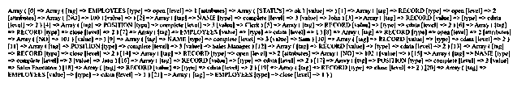

# PHP XML 解析器

> 原文：<https://www.educba.com/php-xml-parser/>

## PHP XML 解析器的定义

PHP XML 解析器允许读取、创建、更新和操作 XML 文档。XML 语言用于构建跨网站的共享数据。它的扩展使用了 Expect XML 解析器。XML 函数解析 XML 文档，但不进行验证。PHP 中有两种类型的 XML 解析器:基于三个的解析器和基于事件的解析器。Expat 是基于事件的解析器；它是基于事件的(当事件发生时调用处理函数)，它是一个非验证解析器(不验证并忽略文档的 DTD 链接，但是如果文档格式不正确，那么它将结束并抛出一个错误消息)，因此它适合于 web 应用程序，并且它是快速的。PHP 不需要安装 XML 解析器，因为它是核心 PHP 的一部分。

PHP XML 解析器的常量列表是

<small>网页开发、编程语言、软件测试&其他</small>

1.  XML _ ERROR _ NONE–数据类型为整数。
2.  XML _ ERROR _ SYNTAX–数据类型整数。
3.  XML _ ERROR _ NO _ MEMORY–数据类型整数。
4.  XML _ ERROR _ INVALID _ TOKEN–数据类型整数。
5.  XML _ ERROR _ NO _ ELEMENTS–数据类型整数。
6.  XML _ ERROR _ un closed _ TOKEN–数据类型整数。
7.  XML _ ERROR _ PARTIAL _ CHAR–数据类型整数。
8.  XML _ ERROR _ TAG _ MISMATCH–数据类型整数。
9.  XML _ ERROR _ DUPLICATE _ ATTRIBUTE–数据类型整数。
10.  XML _ ERROR _ UNDEFINED _ ENTITY–数据类型整数。
11.  XML _ ERROR _ JUNK _ AFTER _ DOC _ ELEMENT–数据类型整数。
12.  XML _ ERROR _ PARAM _ ENTITY _ REF–数据类型整数。
13.  XML _ ERROR _ RECURSIVE _ ENTITY _ REF–数据类型 integer。
14.  XML _ ERROR _ ASYNC _ ENTITY–数据类型整数。
15.  XML _ ERROR _ BAD _ CHAR _ REF–数据类型整数。
16.  XML _ ERROR _ displaced _ XML _ PI–数据类型为整数。
17.  XML _ ERROR _ BINARY _ ENTITY _ REF–数据类型整数。
18.  XML _ ERROR _ ATTRIBUTE _ EXTERNAL _ ENTITY _ REF–数据类型整数。
19.  XML _ ERROR _ UNKNOWN _ ENCODING–数据类型整数。
20.  XML _ ERROR _ INCORRECT _ ENCODING–数据类型整数。
21.  XML _ ERROR _ EXTERNAL _ ENTITY _ HANDLING–数据类型 integer。
22.  XML _ ERROR _ un closed _ CDATA _ SECTION–数据类型 integer。
23.  XML _ OPTION _ CASE _ FOLDING–数据类型 integer。
24.  XML _ OPTION _ TARGET _ ENCODING–数据类型整数。
25.  XML _ OPTION _ SKIP _ tag start–数据类型 integer。
26.  XML _ OPTION _ SKIP _ WHITE–数据类型整数。
27.  XML _ SAX _ IMPL–数据类型字符串。

### PHP XML 解析器的功能

PHP XML 解析器的功能有:

*   utf8 _ decode()–此函数用于将 utf8 字符串解码为 ISO-8859-1。
*   utf8 _ encode()–该函数用于将 ISO-8859-1 字符串编码为 utf8。
*   xml _ get _ current _ column _ number()–这个函数用于从 XML 解析器中获取当前的列号。
*   xml _ get _ current _ byte _ index()–此函数用于获取 XML 解析器的当前字节索引。
*   xml _ get _ current _ line _ number()–此函数用于获取 XML 解析器的当前行号。
*   xml _ error _ string()–此函数用于获取 XML 解析器中的错误(如果有)。
*   xml _ get _ error _ code()–此函数用于获取 XML 解析器中的错误代码(如果有)。
*   xml _ Parse()–该函数用于对 XML 文档执行解析操作。
*   xml _ parse _ into _ struct()-这个函数用于将 XML 数据解析到一个数组中。
*   xml _ parser _ create()–此函数用于创建 XML 解析器
*   xml _ parser _ create _ ns()–这个函数用来创建一个带有名称空间的 XML 解析器。
*   xml _ parser _ free()–这个函数用于释放 XML 解析器。
*   xml _ parser _ set _ option()–此函数用于将选项设置到 XML 解析器中。
*   xml _ parser _ get _ option()–此函数用于获取 XML 解析器的选项。
*   xml _ set _ default _ handler()–此函数用于设置 XML 解析器中的默认数据处理程序。
*   xml _ set _ character _ data _ handler()–此函数用于设置 XML 解析器中的字符数据处理程序。
*   xml _ set _ end _ namespace _ decl _ handler()–此函数用于设置 XML 解析器的名称空间声明处理程序的结尾。
*   xml _ set _ external _ entity _ ref _ handler()–此函数用于设置 XML 解析器的外部实体引用处理程序。
*   xml _ set _ object()–此函数用于允许对象使用 XML 解析器。
*   xml _ set _ processing _ instruction _ handler()–此函数用于设置 XML 解析器的处理指令处理程序。
*   xml _ set _ notation _ decl _ handler()–此函数用于设置 XML 解析器的符号声明处理程序。
*   xml _ set _ un parsed _ entity _ decl _ handler()–此函数用于将 XML 解析器的处理函数设置为未解析的实体声明。
*   xml _ set _ element _ handler()–此函数用于设置 XML 解析器的元素处理程序的开始和结束。
*   xml _ set _ start _ namespace _ decl _ handler()–此函数用于设置 XML 解析器的开始名称空间声明处理程序。

### PHP XML 解析器示例

PHP XML 解析器读取数组中 XML 文件的例子

接下来，我们通过下面的例子编写 PHP 代码来更清楚地理解 PHP XML 解析器，其中 XML 解析器用于读取 XML 数据文件并存储到一个数组中，如下所示

#### 示例#1

首先，我们创建名为“Examplefile.xml”的 XML 数据文件，并将数据内容生成为

`<?xml version="1.0" encoding="utf-8"?>
<employees status = "ok">
<record no = "100">
<name> John </name>
<position> Clerk </position>
</record>
<record no = "101">
<name> Sam </name>
<position> Sales Manager </position>
</record>
<record no = "102">
<name> Jaan </name>
<position> Sales Executive </position>
</record>
</employees>
Next create the php file as below -
<!DOCTYPE html>
<html>
<body>
<?php
// using this function to creates an XML parser
$xmlparser = xml_parser_create();
// opening the xml file to read
$file = fopen("Examplefile.xml", "r");
//freeing the memory when read is done with
$xml_data = fread($file, 4096);
// Parsing the XML data of the file into an array
xml_parse_into_struct($xmlparser,$xml_data,$values);
// This function is using to frees the XML parser
xml_parser_free($xmlparser);
// printing the values from the xml file
print_r($values);
// closing the xml file
fclose($file);
?>
</body>
</html>`

**输出:**

如上述程序，创建 xml 解析器，然后打开文件“Examplefile.xml”文件，读取并解析文件的 XML 数据到数组中；正如我们所看到的，它也在输出中打印。

### 结论

PHP XML 解析器允许读取、创建、更新和操作 XML 文档。XML 解析器具有上面讨论的常量和函数。

### 推荐文章

这是一个 PHP XML 解析器的指南。这里我们还讨论了 PHP XML 解析器的描述，PHP XML 解析器的常量列表，函数以及一个例子。您也可以看看以下文章，了解更多信息–

1.  [PHP 输出缓冲](https://www.educba.com/php-output-buffering/)
2.  [PHP json_decode](https://www.educba.com/php-json_decode/)
3.  [PHP 表单验证](https://www.educba.com/php-form-validation/)
4.  [PHP mail()](https://www.educba.com/php-mail/)

