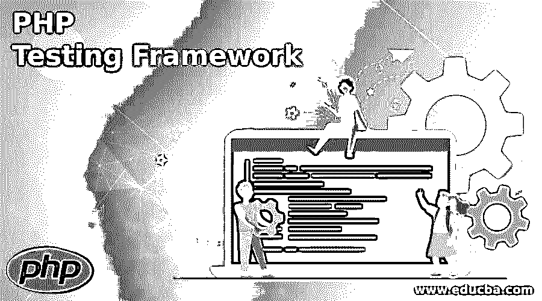

# PHP 测试框架

> 原文：<https://www.educba.com/php-testing-framework/>

## PHP 测试框架介绍

PHP 是最常见的 web 开发脚本语言之一。它被许多组织使用，特别是像 WordPress 这样的网站用于内容管理。当你考虑使用 php 创建 web 应用时，你还需要一个 2019 年最好的 PHP 平台来测试你的应用。您可以手动运行可视化和可用性测试，但是自动化的 PHP 框架允许您显著加快功能、验收和单元测试、跨浏览器测试的测试周期。

### 顶级 PHP 测试框架

让我们看看 PHP 测试框架:

<small>网页开发、编程语言、软件测试&其他</small>

#### 1.共同认知

除了单元测试之外，Codeception 是一个多用途的自动化测试系统。该框架基于 PHPUnit，可以处理功能、系统和 web 应用程序验收测试。这三个都是主要的代码接收套件，你也可以添加一个 API 套件用于其他测试，比如 API 测试。支持多种框架，无需扩展或代码修改。如果您的项目进行迁移，同样的方式也适用于您的旧代码错误测试用例。Codeception 的 Db 模块允许测试人员在数据库中定位某些东西，并从测试模块中清理数据。分离测试也容易得多。

#### 2.贝哈特

Behat 是一个 PHP 应用程序的行为评估平台。该工具的目的是在软件开发的整个生命周期中支持涉众、经理和开发人员之间的非语言交流。它有助于在测试完成时跟踪软件行为示例，以及期望的行为是如何符合的。测试用例是在人性化的基础上编写的，功能定义了特定网站的需求，测试套件提供了由 web 应用程序的功能组成的简单文档。有助于确保应用程序部署周期的一致性。您只需要测试、发现和纠正错误，并重复该过程，直到所有测试用例都通过，并且在项目中开发出稳定的应用程序。

#### 3.PHPSpec

BDD 是一种创建技术，它使一个项目能够在故事和规范层面开始。PHPSpec 是通过 PHP 编写纯代码的常用 BDD 工具。创作首先通过解释物体的动作来进行。利益相关者批准后，编码必须开始下一个过程。PHPSpec 在测试用例执行期间，根据测试用例中方法的使用，生成类或方法的框架。您可以通过编写一个补充测试用例来覆盖任何额外的边缘。

#### 4.阿图姆

Atoum 是一个自动化平台，用于评估 PHP 语言程序的单元。虽然它的行为类似于 PHPUnit，但它更现代、更简单、更自主。与 PHPUnit 相反，用 Atoum 编写的测试用例易于阅读和简化。此外，Atoum 断言允许您编写更少的代码并测试更多的功能。测试用例由 3 个引擎运行。除了默认引擎之外，您可以为特定的测试用例指定一个特定的引擎。不再需要操纵实际的目录。Atoum 将在执行测试用例时构建一个虚拟的目录文件系统，这降低了恶意处理实际项目文件的可能性。

#### 5.橄榄石

Peridot 是一个高度稳定、可扩展的 PHP 框架，它有助于行为环境框架的测试。该框架比 PHPSpec 或其他框架更简单、更快速。此外，它是事件驱动的这一事实使得它很受欢迎，因为当你使用 Peridot 时，插件更容易创建。像 Kahlan 一样，它也使用描述语法来编写自然和人类的可读案例。任何属于非技术背景的人都可以很容易地理解使用 Peridot 编写的测试用例。

#### 6.硒

Selenium 是最好的自动化跨浏览器 web 应用评估平台。对于用 PHP 构建的应用程序，您可以将 PHP 绑定用于基于开发人员的自动化测试用例。框架是灵活的，所有主要的浏览器都在新版 Selenium 互联网驱动上完美运行。它支持许多编程语言。当您的项目有一天从 PHP 迁移到其他技术时，Selenium 仍然可以用于测试用例。Selenium 可以在所有主流浏览器上使用，比如 Safari、Opera、Chrome、IE 和 Firefox。

#### 7\. Xdebug

它是一个 PHP 开源测试平台，用于代码创建和调试。DBGpprotocol 是用于调试的协议。它支持代码覆盖的概述和 PHPUnit 集成的分析器。

### 结论

在这篇文章中，我们已经详细了解了市场上的顶级 PHP 测试框架、工具、定价、优点、缺点和特性。这些工具主要关注行为或测试漂移增长，例如单元测试和端到端测试。

### 推荐文章

这是一个 PHP 测试框架指南。在这里，我们还讨论了介绍和顶级 PHP 测试框架以及解释。您也可以看看以下文章，了解更多信息–

1.  [PHP 堆栈溢出](https://www.educba.com/php-stack-overflow/)
2.  [PHP 写文件](https://www.educba.com/php-write-file/)
3.  [PHP 框架](https://www.educba.com/php-frameworks/)
4.  [PHP mail()](https://www.educba.com/php-mail/)

