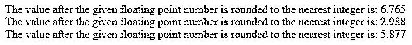
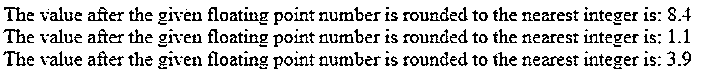
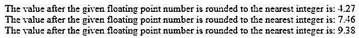

# PHP 回合

> 原文：<https://www.educba.com/php-round/>

## PHP 回合介绍

每当需要将给定的浮点数向上或向下舍入到最接近的整数时，我们都会使用 PHP 中的 round function 函数。它需要三个参数，即数字、精度和模式。其中，number 是已经向上舍入或向下舍入到最接近的整数的浮点数。Precision 表示要舍入到的小数位数，该参数是可选的，mode 是指定舍入模式的常量，该参数也是可选的，其值可以是 PHP_ROUND_HALF_UP、PHP_ROUND_HALF_DOWN、PHP_ROUND_HALF_EVEN 或 PHP_ROUND_HALF_ODD。

**PHP 中声明 round 函数的语法:**

<small>网页开发、编程语言、软件测试&其他</small>

`round(number, precision, mode)`

在哪里，

*   该数字是向上舍入或向下舍入到最接近的整数的浮点数。
*   Precision 表示要四舍五入的小数位数，该参数是可选的。
*   Mode 是指定舍入模式的常量，该参数也是可选的，其值可以是 PHP_ROUND_HALF_UP、PHP_ROUND_HALF_DOWN、PHP_ROUND_HALF_EVEN 或 PHP_ROUND_HALF_ODD。

### PHP 中 round 函数的使用

*   每当需要将给定的浮点数向上或向下舍入到最接近的整数时，我们都会使用 PHP 中的 round function 函数。
*   PHP 中的 round 函数带三个参数，分别是数字、精度和模式。
*   参数号是向上舍入或向下舍入到最接近的整数的浮点数。
*   参数 precision 表示要舍入到的小数位数，这是可选的。
*   参数 mode 是一个指定舍入模式的常量，这个参数也是可选的，它的值可以是 PHP_ROUND_HALF_UP，PHP_ROUND_HALF_DOWN，PHP_ROUND_HALF_EVEN 或者 PHP_ROUND_HALF_ODD。

### PHP 回合示例

下面给出了 PHP 回合的例子:

#### 示例#1

这个 PHP 程序演示了 round 函数的工作原理，它将给定的浮点整数四舍五入为最接近的整数，最多三个十进制值。

**代码:**

`<html>
<body>
<?php
#round function is used on the given floating point number to round to up to three decimal values and is stored in a variable called a
$a = round(6.7654,3);
#round function is used on the given floating point number to round to up to three decimal values and is stored in a variable called b
$b = round(2.98765,3);
#round function is used on the given floating point number to round to up to three decimal values and is stored in a variable called c
$c = round(5.87654,3);
#The result after using the round function is displayed as the output on the screen
echo("The value after the given floating point number is rounded to the nearest integer is: ");
echo $a;
echo " ";
echo("The value after the given floating point number is rounded to the nearest integer is: ");
echo $b;
echo " ";
echo("The value after the given floating point number is rounded to the nearest integer is: ");
echo $c;
echo " ";
?>
</body>
</html>`

**输出:**

在上面的程序中，round 函数用于将给定的浮点整数舍入到最接近的整数(最多三个十进制值),并存储在变量 a、b 和 c 中。然后，将给定的浮点整数舍入到最接近的整数 2(最多为 round 函数中指定的十进制值)后的结果在屏幕上显示为输出。

#### 实施例 2

这个 PHP 程序演示了 round 函数的工作原理，它将给定的浮点整数四舍五入为最接近的整数，最多一个十进制值。

**代码:**

`<html>
<body>
<?php
#round function is used on the given floating point number to round to up to three decimal values and is stored in a variable called a
$a = round(8.37465,1);
#round function is used on the given floating point number to round to up to three decimal values and is stored in a variable called b
$b = round(1.09456,1);
#round function is used on the given floating point number to round to up to three decimal values and is stored in a variable called c
$c = round(3.87654,1);
#The result after using the round function is displayed as the output on the screen
echo("The value after the given floating point number is rounded to the nearest integer is: ");
echo $a;
echo " ";
echo("The value after the given floating point number is rounded to the nearest integer is: ");
echo $b;
echo " ";
echo("The value after the given floating point number is rounded to the nearest integer is: ");
echo $c;
echo " ";
?>
</body>
</html>`

**输出:**

在上面的程序中，round 函数用于将给定的浮点整数舍入到最接近的整数(最多三个十进制值),并存储在变量 a、b 和 c 中。然后，将给定的浮点整数舍入到最接近的整数 2(最多为 round 函数中指定的十进制值)后的结果在屏幕上显示为输出。

#### 实施例 3

这个 PHP 程序演示了 round 函数的工作原理，它将给定的浮点整数四舍五入为最接近的整数，最多两位十进制数。

**代码:**

`<html>
<body>
<?php
#round function is used on the given floating point number to round to up to three decimal values and is stored in a variable called a
$a = round(4.273645,2);
#round function is used on the given floating point number to round to up to three decimal values and is stored in a variable called b
$b = round(7.45567,2);
#round function is used on the given floating point number to round to up to three decimal values and is stored in a variable called c
$c = round(9.3778335,2);
#The result after using the round function is displayed as the output on the screen
echo("The value after the given floating point number is rounded to the nearest integer is: ");
echo $a;
echo " ";
echo("The value after the given floating point number is rounded to the nearest integer is: ");
echo $b;
echo " ";
echo("The value after the given floating point number is rounded to the nearest integer is: ");
echo $c;
echo " ";
?>
</body>
</html>`

**输出:**

在上面的程序中，round 函数用于将给定的浮点整数舍入到最接近的整数(最多三个十进制值),并存储在变量 a、b 和 c 中。然后，将给定的浮点整数舍入到最接近的整数 2(最多为 round 函数中指定的十进制值)后的结果在屏幕上显示为输出。

### 推荐文章

这是一个 PHP 回合指南。这里我们分别讨论 PHP 中 round 函数的介绍、工作原理以及例子。您也可以看看以下文章，了解更多信息–

1.  [PHP 梁()](https://www.educba.com/php-strlen/)
2.  [PHP 异步](https://www.educba.com/php-async/)
3.  [PHP preg_match_all](https://www.educba.com/php-preg_match_all/)
4.  [PHP 发布方法](https://www.educba.com/php-post-method/)

