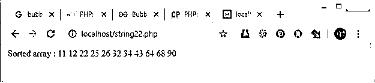
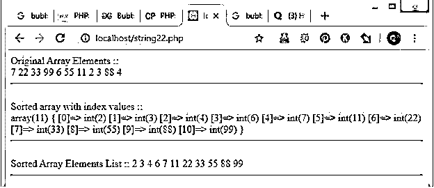
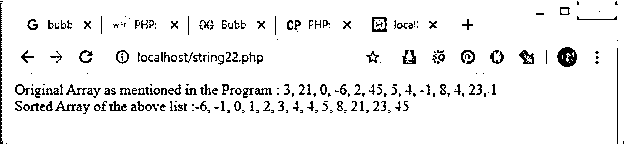

# PHP 中的冒泡排序

> 原文：<https://www.educba.com/bubble-sort-in-php/>


## PHP 中的冒泡排序介绍

PHP 中的冒泡排序是一种简单的排序技术/算法，它重复比较每一对相邻项目的步骤，并且只在它们顺序错误时交换它们，就像我们不需要的那样。这种分类也称为下沉分类。重复传递元素，直到不需要交换为止，这意味着现在列表已排序。这种排序技术/算法是一种比较排序，使用称为“气泡”的较小元素/数字。

### PHP 中冒泡排序背后的逻辑

只有当元素顺序错误时，冒泡排序才会重复交换相邻元素。冒泡排序首先比较第二个元素和第一个元素。如果第一个元素/索引值大于第二个，则将进行元素交换。如果不是，交换将不会完成。如果数组的第一个元素大于第二个元素，那么将进行元素交换。现在第一个<sup>元素变成了第二个<sup>元素和第三个</sup>元素，反之亦然。现在，被交换的元素再次与第 3 个<sup>第 3 个</sup>元素进行比较，依此类推，如果达到条件，交换将一直进行到数组元素的末尾。现在，上面的场景通过运行数组长度/数组大小的循环发生，该循环在程序内部传递。</sup>

<small>网页开发、编程语言、软件测试&其他</small>

### PHP 中的冒泡排序是如何工作的？

PHP 编程语言中有不同类型的冒泡排序技术实现。一种是使用 FOR 循环，第二种是使用 WHILE 循环，第三种是使用 DO WHILE 循环。在每个程序中，逻辑都是一样的，但是语法会有一点不同。

### 要实现的示例

#### 示例#1

**在 PHP 中使用 for 循环:**在下面的例子中，使用 FOR 循环方法实现了冒泡排序。首先，计算并存储数组的大小，然后开始一个循环，然后在循环内部再次开始一个循环。然后比较相邻的数组值。如果 0 值的数组索引大于 1 值的数组索引，则 1 索引值将存储在 0 索引值中。0 索引值将存储在 1 索引值中。然后用函数本身内部的一些元素来引用数组，并再次创建一个 FOR 循环来调用排序后的数组值。像这样，我们将得到数组中排序后的元素。

**代码:**

```
<?php
function bubbleSort1(&$arr1)
{
$n1 = sizeof($arr1);
for($i1 = 0; $i1 < $n1; $i1++)
{
for ($j1 = 0; $j1 < $n1 - $i1 - 1; $j1++)
{
if ($arr1[$j1] > $arr1[$j1+1])
{
$t1 = $arr1[$j1];
$arr1[$j1] = $arr1[$j1+1];
$arr1[$j1+1] = $t1;
}
}
}
}
$arr1 = array(64, 32, 34, 26, 25, 43, 12, 68, 22, 90, 11);
$len1 = sizeof($arr1);
bubbleSort1($arr1);
echo "Sorted array : \n";
for ($i1 = 0; $i1 < $len1; $i1++)
echo $arr1[$i1]." ";
?>
```

**输出:**




#### 实施例 2

**在 PHP 中使用 WHILE 循环:**在下面的例子中，创建了一个数组变量并在元素中列出。然后计算大小并存储在$len12 中。然后首先创建一个循环，通过使用数组的长度作为循环条件来显示数组中存在的实际元素。然后，通过调用变量内部的函数，创建一个变量来存储排序后的数组元素。然后创建一个普通函数。在函数内部，WHILE 循环用于通过交换相邻元素来实现 PHP 中的冒泡排序。但是这里只有当数组的第 2 个<sup>和第 3 个</sup>元素小于第 1 个<sup>和第 1 个</sup>元素时才会进行交换。

**代码:**

```
<?php
$arr2 = array(7, 22, 33, 99, 6, 55, 11, 2, 3, 88, 4);
echo "Original Array Elements :: ";
echo "<br>";
$len12 = sizeof($arr2);
for ($z1 = 0; $z1 < $len12; $z1++)
echo $arr2[$z1]." ";
echo "<hr>";
echo "<br>Sorted array with index values :: \n<br>";
$sortedArr2 = bubbleSort($arr2);
var_dump($sortedArr2);
echo "<hr>";
function bubbleSort(array $arr2) {
$sorted2 = false;
while (false === $sorted2) {
$sorted2 = true;
for ($i2 = 0; $i2 < count($arr2)-1; ++$i2) {
$current2 = $arr2[$i2];
$next2 = $arr2[$i2+1];
if ($next2 < $current2) {
$arr2[$i2] = $next2;
$arr2[$i2+1] = $current2;
$sorted2 = false;
}
}
}
return $arr2;
}
echo "<br> Sorted Array Elements List :: ";
$len12 = sizeof($sortedArr2);
for ($z1 = 0; $z1 < $len12; $z1++)
echo $sortedArr2[$z1]." ";
echo "<br>";
echo "<hr>";
?>
```

**输出:**




#### 实施例 3

**在 PHP 中使用 DO WHILE 循环:**在下面的程序中，创建了一个函数，也实现了 DO WHILE 循环来实现冒泡排序技术。这里首先创建了一个带有假值的变量。然后创建一个 FOR 循环来运行数组元素。在循环内部，使用 IF 条件来检查 array1[0]是否大于 array1[1]值。如果是，那么索引的值将被交换。然后在 while 条件中检查交换的值，并再次运行 DO WHILE 循环。同样，该过程继续并使用冒泡排序技术以排序的方式打印数组元素。

**代码:**

```
<?php
function bubble_Sort1($my_array1 )
{
do
{
$swapped1 = false;
for( $i1 = 0, $c1 = count( $my_array1 ) - 1; $i1 < $c1; $i1++ )
{
if( $my_array1[$i1] > $my_array1[$i1 + 1] )
{
list( $my_array1[$i1 + 1], $my_array1[$i1] ) =
array( $my_array1[$i1], $my_array1[$i1 + 1] );
$swapped1 = true;
}
}
}
while( $swapped1 );
return $my_array1;
}
$test_array1 = array(3, 21, 0, -6, 2, 45, 5, 4, -1, 8, 4, 23, 1);
echo "Original Array as mentioned in the Program :\n";
echo implode(', ',$test_array1 );
echo "<br>";
echo "\nSorted Array of the above list\n:";
echo implode(', ',bubble_Sort1($test_array1)). PHP_EOL;
echo "<br>";
?>
```

**输出:**




### 结论

我希望你了解了 PHP 中冒泡排序的定义，PHP 中冒泡排序背后的逻辑，以及如何使用各种方法在 PHP 中实现冒泡排序。

### 推荐文章

这是 PHP 中的冒泡排序指南。这里我们讨论 PHP 中的冒泡排序的介绍，它背后的逻辑，它是如何工作的，代码和输出的例子。您也可以浏览我们的其他相关文章，了解更多信息——

1.  [冒泡排序算法](https://www.educba.com/bubble-sort-algorithm/)
2.  [Python 中的冒泡排序](https://www.educba.com/bubble-sort-in-python/)
3.  [JavaScript 中的快速排序](https://www.educba.com/quick-sort-in-javascript/)
4.  [Java 中的排序](https://www.educba.com/sorting-in-java/)


