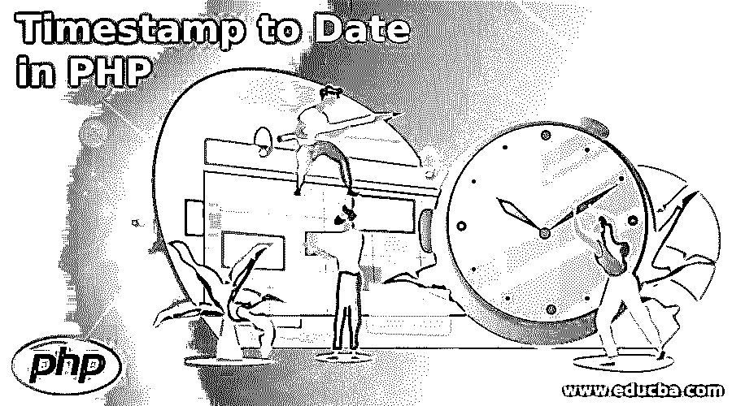
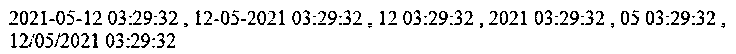

# PHP 中的时间戳

> 原文：<https://www.educba.com/timestamp-to-date-in-php/>

## PHP 中的时间戳简介

下面的文章提供了 PHP 中时间戳的概要。在 PHP 中，我们可以将时间戳转换成数据；我们必须提到我们希望时间戳转换成的数据格式。当将时间戳转换为数据时，格式是必需的，在 PHP 中，我们有一些方法，或者我们可以说是为我们做这种转换的函数；我们只需要在那里提到时间戳来获取数据。

顾名思义，这个时间戳是一个表示数据和数据时间的长整型值；它由数据和时间组成，所以在转换时间戳时，我们也可以从中获得时间。在这里，我们将看到在 PHP 中处理时间戳时所需的方法定义和必需的参数。为了更好地理解，我们还将详细了解它的实现和用法。

<small>网页开发、编程语言、软件测试&其他</small>

**PHP 中时间戳的语法**

时间戳用于获取数据和时间；我们只需要这个的格式。

`date ( string $format , int|null $timestamp = null ) : string`

正如您在上面的语法中看到的，这是 PHP 官方文档为 timestamp 给出的语法，这里需要两个参数来将 PHP 中的时间戳转换为日期。

**举例:**

`date ( "ddmmyy" , timestamp ) : string`

### PHP 中如何把时间戳转换成日期？

到目前为止，我们已经知道如何在 PHP 中从时间戳整数中获取数据对象。为此，我们必须有一个合适的格式来帮助我们从时间戳中获取日期，在这里，我们将首先看到时间戳的方法签名，然后我们将看到如何在我们的程序中一步一步地实现这一点。

**方法签名:**我们有一个仅由 PHP 提供的方法；它是 PHP 库中的一个内置方法，要使用它，我们不需要添加一个外部库；此外，我们也不需要任何进口声明。

**签名:**

`date ( string $format , int|null $timestamp = null ) : string`

如您所见，这是该方法的官方声明，我们可以用它来将时间戳对象转换为日期。但是在这里，我们有两个参数:格式和另一个是时间戳。

形容词（adjective 的缩写）string $format 这个变量负责定义我们想要的日期的格式，这意味着我们可以在这里指定我们想要的日期的格式。

下面给出了 PHP 中可用的不同数据格式:

*   如果我们在格式中指定这个值，它将从我们在上面的方法中使用的时间戳对象中返回日期。它只会返回给我们日期。
*   如果我们在格式中指定这个值，它将从我们在上面的方法中使用的时间戳对象中返回月份。它只会给我们一个月的回报。
*   如果我们在格式中指定这个值，它将从我们在上面的方法中使用的时间戳对象中返回年份。它只会给我们一年的回报。
*   **dmy:** 如果我们在格式中指定这个值，它将从我们在上面的方法中使用的时间戳对象中返回日期、月份和年份。它只会返回日期、月份和年份。
*   **d/m/y:** 如果我们在格式中指定这个值，那么它将返回日期、月份和年份，用“/”分隔，以便更好地理解我们在上述方法中使用的时间戳对象。它只会返回带有“/”的日期、月份和年份。
*   **d-m-y:** 如果我们在格式中指定这个值，那么它将返回由破折号“-”分隔的日期、月份和年份，以便更好地理解我们在上述方法中使用的时间戳对象。它将只返回给我们日期，月份和年份。
*   d-m-Y H:i:s: 这种形式也会给我们时间与日期，也就是时、分、秒与日期对象的意思。这里 H 代表小时，I 代表分钟，s 代表秒。

我们可以使用上面的表单来获取日期表单时间戳；它易于使用和处理。

**b . int | null $ timestamp = null:**现在，我们来看看时间戳字段，它是方法中的第二个参数；这个字段很重要，因为在此基础上，只准备日期对象。我们可以传递 null 作为这个字段的值；如果我们这样做，它将根据当前时间戳计算数据对象，但是如果我们在这里传递任何值，它将只给出基于它的值。

### PHP 中迄今为止的时间戳示例

下面是 PHP 中迄今为止的时间戳示例:

我们正在将时间戳转换为日期。

**代码:**

`<!DOCTYPE html>
<html>
<body>
<?php
echo date( "Y-m-d H:i:s" , 1620790172 );
echo " , ";
echo date( "d-m-Y H:i:s" , 1620790172 );
echo " , ";
echo date( "d H:i:s" , 1620790172 );
echo " , ";
echo date( "Y H:i:s" , 1620790172 );
echo " , ";
echo date( "m H:i:s" , 1620790172 );
echo " , ";
echo date( "d/m/Y H:i:s" , 1620790172 );
?>
</body>
</html>`

**输出:**

### 结论

我们可能需要向用户显示他们可以理解的值，以便我们可以将时间戳对象转换为日期；之后，它可以被其他人读取和显示给客户端。这个功能很容易使用和处理，也不需要任何依赖于其他东西。因此，我们可以使用它轻松地从时间戳中获取日期。

### 推荐文章

这是一个 PHP 时间戳指南。这里我们讨论一下入门，PHP 中如何把时间戳转换成日期？还有一个例子。您也可以看看以下文章，了解更多信息–

1.  [排序字符串 PHP](https://www.educba.com/sort-string-php/)
2.  [PHP 表单生成器](https://www.educba.com/php-form-builder/)
3.  [PHP 列表](https://www.educba.com/php-list/)
4.  [PHP strpos](https://www.educba.com/php-strpos/)

