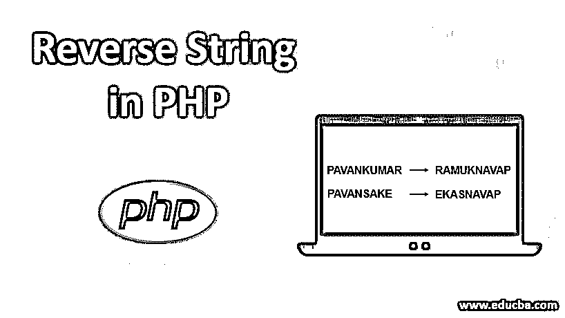

# 在 PHP 中反转字符串

> 原文：<https://www.educba.com/reverse-string-in-php/>




## PHP 中反向字符串的介绍

在本文中，我们将学习在 [PHP 中的反向字符串。字符串是从后面调用的字符的集合](https://www.educba.com/what-is-php/)。这些字符集合可用于反转 PHP 函数 strrev()或使用简单的 PHP 编程代码。例如，在反转时，PAVANKUMAR 将变成 RAMUKNAVAP

**逻辑:**

<small>网页开发、编程语言、软件测试&其他</small>

*   首先，将字符串赋给变量。
*   现在计算字符串长度。
*   现在创建一个新变量来存储反转后的字符串。
*   然后继续像 for 循环、while 循环和 do while 循环等循环..
*   在循环内部连接字符串。
*   然后显示/打印存储在中间创建的新变量中的反向字符串。

### 使用各种循环在 PHP 中反转字符串

各种循环，如 FOR 循环、WHILE 循环、DO WHILE 循环、递归方法等..为了反转 PHP 编程语言中的字符串。

#### 1.使用 strrev()函数

*   下面的示例/语法将使用已经预定义的函数 strrev()来反转原始字符串，以便反转该字符串。在本例中，创建了一个$string1 变量来存储字符串，我指的是原始字符串，然后使用 echo 语句在 strtev()函数的帮助下打印原始字符串和反转的字符串，然后通过连接两者来打印。
*   您可以检查以下程序的输出，以检查字符串是否反转。

**代码:**

```
<?php
$string1 = "PAVANKUMAR";
echo "Reversed string of the $string1 is " .strrev ( $string1 );
?>
```

**输出:**


#### 2.使用 For 循环

*   在下面的示例中，通过将 string1 变量的值指定为“PAVANSAKE”来创建“$string1”变量。然后创建$length 变量，以便使用 strlen()函数存储$string1 变量的长度。现在，for 循环与初始化、条件和增量值一起使用，如“$length1-1”、“$i1>=0”、“$ i1-”。然后使用初始化$i1 等于$length-1 从后台调用$string1 变量的索引值。
*   首先，FOR 循环将从“原始字符串-1”值的长度值开始。然后，循环通过检查条件“i1>=0”开始运行，然后向后调用原始字符串的索引。同样，循环将从每次迭代的后面打印每个索引值，直到条件为假。最后，我们将使用 FOR 循环得到字符串的反向。

**代码:**

```
<?php
$string1 = "PAVANSAKE";
$length1 = strlen($string1);
for ($i1=($length1-1) ; $i1 >= 0 ; $i1--)
{
echo $string1[$i1];
}
?>
```

**输出:**


#### 3.使用 While 循环在 PHP 中反转字符串

*   在下面的例子中，while 循环用于打印使用原始字符串“PAVANSAKEkumar”反转的字符串。
*   在下面的语法/php 程序中，首先，$string1 变量被赋予字符串值“PAVANSAKEkumar ”,然后我们计算$string1 变量的值的长度并存储在$length1 变量中。它总是一个整数。现在$i1 变量是字符串变量 value -1 的长度($length1-1)。
*   现在我们使用条件“$i1>=0”从 WHILE 循环开始，然后我们将从后面打印字符串的索引值，因为$i1 值是原始字符串的最后一个索引值。在此之后，将进行递减，以便反转原始字符串($i1=$i1-1)。

**代码:**

```
<?php
$string1 = "PAVANSAKEkumar";
$length1 = strlen($string1);
$i1=$length1-1;
while($i1>=0){
echo $string1[$i1];
$i1=$i1-1;
}
?>
```

**输出:**


#### 4.使用 do while 循环

*   下面列出了在 PHP 中使用 DO while 循环反转字符串的程序。就像 WHILE 循环一样。每个逻辑术语都与 WHILE 循环相同，但后面的有点不同，它将首先打印输出，而不是首先检查条件。
*   所以即使你打印输出，即使条件结果为假。

**代码:**

```
<?php
$string1 = "PAVANSAKEkumaran";
$length1 = strlen($string1);
$i1=$length1-1;
do{
echo $string1[$i1];
$i1=$i1-1;
}
while($i1>=0)
?>
```

**输出:**


#### 5.使用递归技术和 substr()

*   在下面的例子中，使用递归技术和 substr()函数来反转字符串。Substr()函数将有助于获取原始字符串的子串。这里还定义了一个名为 Reverse()的新函数，它作为参数与字符串一起传递。
*   在每一次递归调用中，substr()方法用于提取参数字符串的第一个字符，它作为 Reverse()函数再次被调用，只是绕过参数的剩余部分，然后从当前调用中在字符串末尾连接第一个字符。查看以下内容，了解更多信息。
*   reverse()函数的创建是为了通过递归技术使用一些代码来反转一个字符串。创建$len1 是为了存储指定字符串的长度。然后，如果变量的长度等于 1，即一个字母，那么它将返回相同的值。
*   如果字符串不是一个字母，那么 else 条件的工作方式是使用“length –-”从后面一个接一个地调用字母，同时回调函数，以便使用函数进行递归循环(使用 PHP 的库函数调用 function 中的函数)。$str1 变量将原始字符串存储为变量。现在打印与字符串相反的函数结果。

****代号:****

```
<?php
function Reverse($str1){
$len1 = strlen($str1);
if($len1 == 1){
return $str1;
}
else{
$len1--;
return Reverse(substr($str1,1, $len1))
. substr($str1, 0, 1);
}
}
$str1 = "PavanKumarSake";
print_r(Reverse($str1));
?>>
```

**输出:**


#### 6.不使用 PHP 的任何库函数反转字符串

*   下面的语法/程序示例是通过使用 for 循环交换索引的字符来完成的，比如第一个字符的索引被最后一个字符的索引替换，然后第二个字符被倒数第二个字符替换，依此类推，直到我们到达字符串的中间索引。
*   下面的例子没有使用任何库函数。在下面的示例中，$i2 变量被赋予原始字符串的长度-1，而$j2 值被存储为值“0”，然后循环将通过检查条件“$j2

**代码:**

```
<?php
function Reverse($str2){
for($i2=strlen($str2)-1, $j2=0; $j2<$i2; $i2--, $j2++)
{
$temp2 = $str2[$i2];
$str2[$i2] = $str2[$j2];
$str2[$j2] = $temp2;
}
return $str2;
}
$str2 = "PAVANKUMARSAKE";
print_r(Reverse($str2));
?>
```

**输出:**


### 结论

我希望您理解了反转输入字符串的逻辑概念，以及如何使用各种技术反转一个字符串，每个技术都有一个示例和解释。

### 推荐文章

这是一个在 PHP 中反转字符串的指南。在这里，我们讨论反转输入字符串的逻辑，以及如何使用各种循环和相应的示例来反转字符串。您也可以浏览我们的其他相关文章，了解更多信息——

1.  [PHP 中的日期函数](https://www.educba.com/date-function-in-php/)
2.  [在 JavaScript 中反转字符串](https://www.educba.com/reverse-string-in-javascript/)
3.  [在 C++中反转字符串](https://www.educba.com/reverse-string-in-c-plus-plus/)
4.  [在 C#中反转字符串](https://www.educba.com/reverse-string-in-c-sharp/)


