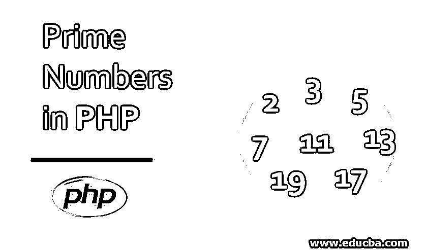
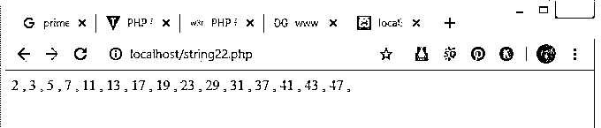
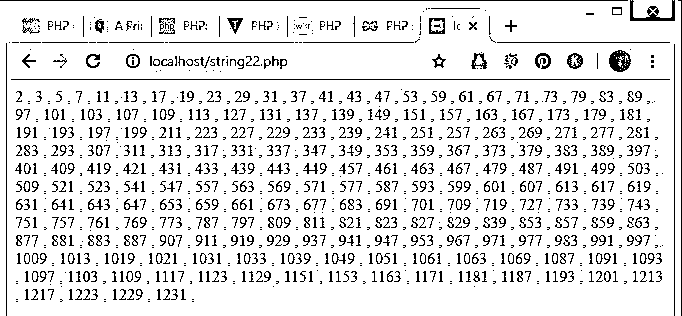
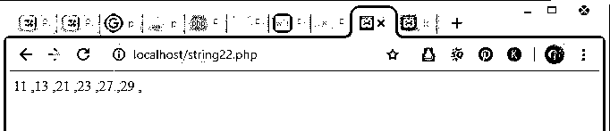
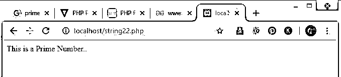
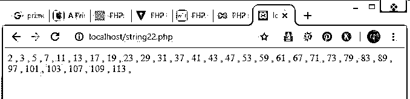
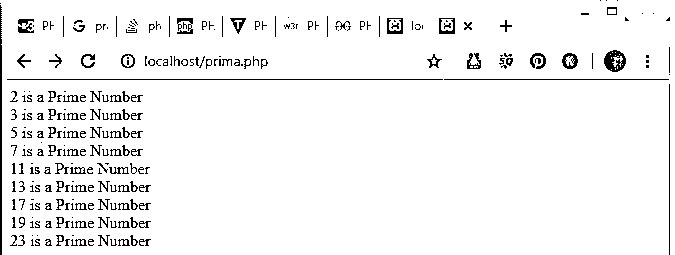

# PHP 中的质数

> 原文：<https://www.educba.com/prime-numbers-in-php/>




## PHP 中素数的介绍

PHP 中的质数与其他数列相比总是独一无二的。无论[编程语言](https://www.educba.com/what-is-a-programming-language/)可能是什么，逻辑对于所有类型的编程语言都是一样的，这些语言目前在全球的互联网世界中。只有编程语言的语法不同。

### 素数背后的逻辑

质数/质数是唯一只能被 1 和它本身整除的数。质数的数列包括 2，3，5，7，11，13，17 等等。上述序列中的数字 2 是一个偶数素数，也是数字 1 之后的自然数。在数字 2 之前的数字 1，0 根本不是质数。所以为了在程序中首先执行这个，我们必须处理这个循环来检查每个数字，每个数字都从 2 开始，到所需的数字本身。有时，当涉及到编程语言时，与一般的逻辑术语相比，逻辑可能是不同的。

<small>网页开发、编程语言、软件测试&其他</small>

### 如何用各种方法在 PHP 中求质数？

(For 循环、While、do-while、foreach 等..,):

#### 示例#1

这是一个 for 循环的例子，展示了我们需要的质数

**语法:**

```
<?php
//For loop prime numbers program with only initialization and incrementation parameters
$count1 = 0;
//Number 0 is assigned to the variable count1
$number1 = 2;
//Number 2 is assigned to the variable number1
for($count1=0;$count1 < 22; )
//For loop with the condition to print only first 22 prime numbers at first
{
$div_count1=0;  //Number 0 is assigned to the variable div_count1 variable
for ( $i1=1; $i1<=$number1; $i1++)
//For loop with the initialization i1 =1 , condition - i1<=number1 and with invrement i1=i1+1
{
if (($number1%$i1)==0)
//Condition if number1 divides with changing i1 values and leaves remainder = 0 then the following below conditions will run
{
$div_count1++;  //assigning div_count1 = div_count1+1
}
}
if ($div_count1<3)// Condition ( div_count1 < 3 ) to proceed the programme
{
$b=$count1+1;//adding 1 to the count1 variable
echo $b." Prime Number:".$number1." , "; //echo to print the prime numbers as we need
echo "</br>"; // line break statement
$count1=$count1+1;  //incrementing the count1 variable's value
}
$number1=$number1+1;
//incrementing the number1 variable's value
}
?>
```

**输出:**


#### 实施例 2

这是一个质数的例子，它将打印前 15 个质数。此处使用 While 循环。

**语法:**

```
<?php
$count1 = 0;
//Number 0 is assigned to the variable count1
$number1 = 2;
//Number 2 is assigned to the variable number1
while ($count1 < 15 )
//While loop with the condition ( count1 < 15 ) to break the loop to print first 15 prime numbers ( series of prime numbers from 2 to 47 , )
{
$div_count1=0;
//Number 0 is assigned to the variable div_count1
for ( $i=1; $i<=$number1; $i++)
//For loop with the initialization i =1 , condition - i<=number1 and with invrement i=i+1
{
if (($number1%$i)==0)
//Condition if number1 divides with changing i values and leaves remainder = 0 then the following below conditions will run
{
$div_count1++;
//assigning div_count1 = div_count1+1
}
}
if ($div_count1<3)
// Condition ( div_count1 < 3 ) to proceed the programme
{
echo $number1." , ";
//Printing the Prime number and then , will be printed
$count1=$count1+1;
//assigning variable count1 = count1 + 1
}
$number1=$number1+1;
//assigning variable number1 = number1 +1
}
?>
```

**输出:**




#### 实施例 3

DO WHILE 循环素数程序示例，其语法和输出如下所示。

**语法:**

```
<?php
//DO WHILE PHP program
$count12 = 0 ;
$number12 = 2 ;
do
{
$div_count12=0;
for ( $i=1;$i<=$number12;$i++) //For loop to check each number for prime numbers in the natural number list
{
if (($number12%$i)==0)
{
$div_count12++;
}
}
if ($div_count12<3)
{
echo $number12." , ";
$count12=$count12+1;
}
$number12=$number12+1;
}while ($count12 <202 ); //while loop to print 202 prime numbers
?>
```

**输出:**




#### 实施例 4

为每个程序打印素数，从数组列表 nums_list

**语法:**

```
<?php
//Program to Print Prime numbers from the list of arrays using foreach()
$nums_list = array( 10, 11, 13, 12 , 18, 21, 22, 23, 26, 28, 27, 29);
foreach($nums_list as $prima){
//foreach() function her will list the array values into prima variable
//I(Pavan Kumar Sake) mentioned conditions below to check whether the prime numbers are available in the above mentioned array or not. If yes then prime numbers from the array list will be printed.
if($prima%2==0){
if($prima%3==0){
if($prima%5==0){
if($prima%7==0){
break;
}
}
}
}
else{
echo $prima. " ,";
}
}
?>
```

**输出:**




#### 实施例 5

这是一个 PHP 程序，用来检查输入的数字是质数还是非质数。

**语法:**

```
<?php
function IsPrime1($n1)
//Here  defining a IsPrime() function with the parameter n variable
{
for($x1=2; $x1<$n1; $x1++)
//For loop to check each number to know the prime numbers
{
if($n1 %$x1 ==0) // if n divides by x values i.e., from the number 2 to the number itself (natural number series)
{
return 0;
//returns 0 value if the above condition becomes true value
}
}
return 1;
//returns value 1 if the above IF condition fails i mean remainder is not 0 , it will be 1 so is the prime number
}
$a1 = IsPrime1(3); // assigning a prime number to n variable in the function by calling it and to check
if ($a1==0) // if the variable gives 0 as output it will be declared as non prime number
echo 'This is not a Prime Number.....'."\n";
else
// If the a variable value is non zero then it will be declared as a prime number
echo 'This is a Prime Number..'."\n";
?>
```

**输出:**




#### 实施例 6

这是一个打印小于 123 的质数的例子。请检查下面程序的语法和输出

**语法:**

```
<?php
$number2 = 2 ;
while ($number2 < 123 )
{
$div_count2=0;
for ( $i=1;$i<=$number2;$i++)
{
if (($number2%$i)==0)
{
$div_count2++;
}
}
if ($div_count2<3)
{
echo $number2." , ";
}
$number2=$number2+1;
}
?>
```

**输出:**




#### 实施例 7

打印小于数字“25”的质数/值的示例

**语法:**

```
<?php
//List of Prime Numbers which are below 25
function primea1($n1){
for($k=1;$k<=$n1;$k++){  //To check prime values/numbers
$countera1 = 0;
for($l=1;$l<=$k;$l++){ //for accessing all divisible factors
if($k % $l==0){
$countera1++;
}
}
//prime requires/follows 2 rules/suggestions ( it is either divisible by 1 and then by itself)
if($countera1==2){
print $k." is a Prime Number <br/>";
}
}
}
primea1(25);  //finds the prime numbers from 1-25
?>
```

**输出:**




### 推荐文章

这是一个 PHP 质数指南。在这里，我们讨论基本概念，素数背后的逻辑，如何在 PHP 中使用各种方法和示例代码找到素数。您也可以阅读以下文章，了解更多信息——

1.  [PHP 数组搜索](https://www.educba.com/php-array-search/)
2.  [Python 中的质数](https://www.educba.com/prime-numbers-in-python/)
3.  [Java 中的质数](https://www.educba.com/prime-numbers-in-java/)
4.  PHP 中的质数


