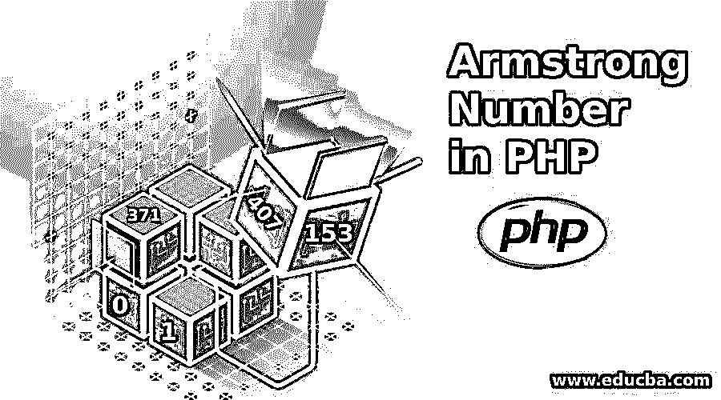
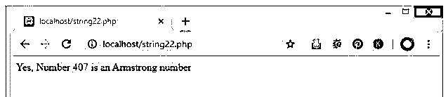
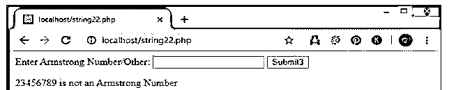
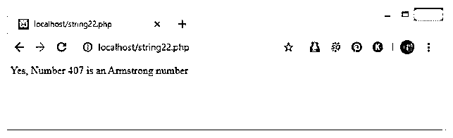
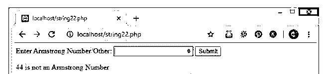
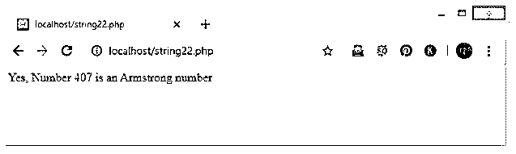
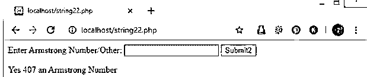

# PHP 中的阿姆斯特朗数

> 原文：<https://www.educba.com/armstrong-number-in-php/>




## PHP 中阿姆斯特朗数的介绍

阿姆斯特朗数是一种数，其值/数等于每个数字的立方之和。这些类型的数字被称为阿姆斯特朗数。阿姆斯特朗的一些数字是 0，1，153，371，407，471 等。

阿姆斯特朗数背后的逻辑:

<small>网页开发、编程语言、软件测试&其他</small>

*   首先你要把数字作为输入，检查是不是阿姆斯特朗。
*   将该数字存储在一个变量中。
*   现在用这个变量求和。
*   现在用 10 个值除这个数，直到商为 0。
*   对余数求立方。
*   比较 sum 变量和 number 变量值(如果两个数字相同，则为 Armstrong 数)。

### PHP 中检查阿姆斯特朗数的例子

下面是使用各种方法的例子，例如:for，while，do-while。

#### 示例 1:在 PHP 中使用 For 循环

这个程序使用 For 循环来检查这个数是否是阿姆斯特朗数。在下面的 PHP 程序中，输入的数字存储在 armnum2 变量中，并将 0 赋给 total3 变量。现在，通过将 Armnum2 变量赋给 x3 作为初始化的起始数，条件为 x3，在 For 循环中使用初始化、增量和条件为新变量“x3”赋值！=0 以退出循环，增量是将 x3 除以 10 并存储在 x3 值中。

Rem3 变量的作用是获取余数值。现在，在 For 循环中对余数值进行立方运算，以使用 For 循环的初始化、增量和条件值来获得所有余数值，因为作为逻辑，输入数字和数字的立方应该等于确认为阿姆斯特朗数。

**代码:**

```
<?php
$armnum2=407;
$total3=0;
for($x3=$armnum2;$x3!=0;$x3=$x3/10)
{
$rem3=$x3%10;
$total3=$total3+$rem3*$rem3*$rem3;
}
if($armnum2==$total3)
{
echo "Yes, Number $armnum2 is an Armstrong number";
}
else
{
echo "No, Number $armnum2 it is not an armstrong number";
}
?>
```

**输出:**




#### 示例 2:使用 HTML 表单和 For 循环程序

这里表单的基本概念是在 For 循环的帮助下包含用户输入。用户可以在运行 PHP form for loop 脚本后，借助浏览器中的可视提示输入他想输入的任何输入值。检查使用下面的代码和知道。

这是一个带有 HTML 表单的 For 循环程序，使用 Post 方法从用户那里获得直接的用户输入。Form 方法有 post，输入参数为 number，使用 submit，Number 是将输入的数字传递给程序，检查数字/变量值是否为 Armstrong 数。在同一个循环之后，上面的程序继续检查阿姆斯特朗号。所有的项目也是如此。

**代码:**

```
<html>
<body>
<form method="post">
Enter Armstrong Number/Other:
<input type="number" name="number3">
<input type="submit" value="Submit3">
</form>
</body>
</html>
<?php
if($_POST)
{
//It is to get the number1 value entered
$number3 = $_POST['number3'];
$sum3 = 0;
//Loop with the condition of quotient =0
for($a3 = $number3;$a3!=0;$a3=$a3/10)
{
$rem3 = $a3 % 10; //finds the reminder
$sum3 = $sum3 + ( $rem3 * $rem3 * $rem3 ); //sum by cubing the reminder values and stored in other variable
}
//if and else to check whether it is an armstrong number or not
if( $number3 == $sum3 )
{
echo "Yes $number3 an Armstrong Number";
}else
{
echo "$number3 is not an Armstrong Number";
}
}
?>
```

**输出:**




#### 示例 3:在 PHP 中使用 While 循环

这是 While 循环程序，用来检查数字是否是阿姆斯特朗数。当 x1 不等于 0 时，从循环中出来的条件包含在 While 循环中。Rem1 变量被赋值以获得余数值。通过使用余数值及其立方，直到条件 x1 等于 0。然后 x1 是输入数除以 10 并存储在 x1 变量中，以使用 While 循环获得所有余数。同样的事情也适用于 [Do While 循环](https://www.educba.com/php-do-while-loop/)程序。

**代码:**

```
<?php
$armnum=407;
$total1=0;
$x1=$armnum;
while($x1!=0)
{
$rem1=$x1%10;
$total1=$total1+$rem1*$rem1*$rem1;
$x1=$x1/10;
}
if($armnum==$total1)
{
echo "Yes, Number $armnum is an Armstrong number";
}
else
{
echo "No, Number $armnum it is not an armstrong number";
}
?>
```

**输出:**




#### 示例 4:使用 HTML 表单和 While 循环程序

这里表单的基本概念是包含用户输入。用户可以输入他想输入的任何输入值。检查下面的代码就知道了。

**代码:**

```
<html>
<body>
<form method="post">
Enter Armstrong Number/Other:
<input type="number" name="number1">
<input type="submit" value="Submit">
</form>
</body>
</html>
<?php
if($_POST)
{
//It is to get the number1 value entered
$number1 = $_POST['number1'];
//Now storing the entered number in number1 variable
$a1 = $number1;
$sum1 = 0;
//Loop with the condition of quotient =0
while( $a1 != 0 )
{
$rem1 = $a1 % 10; //finds the reminder
$sum1  = $sum1 + ( $rem1 * $rem1 * $rem1 ); //sum by cubing the reminder values and stored in other variable
$a1  = $a1 / 10; //finding quotient. if 0 loop continues
}
//if and else to check whether it is an armstrong number or not
if( $number1 == $sum1 )
{
echo "Yes $number1 an Armstrong Number";
}else
{
echo "$number1 is not an Armstrong Number";
}
}
?>
```

**输出:**




#### 例 5:在 PHP 中使用 DO-While 循环

**代码:**

```
<?php
$armnum1=407;
$total2=0;
$x2=$armnum1;
do
{
$rem2=$x2%10;
$total2=$total2+$rem2*$rem2*$rem2;
$x2=$x2/10;
}
while($x2!=0);
if($armnum1==$total2)
{
echo "Yes, Number $armnum1 is an Armstrong number";
}
else
{
echo "No, Number $armnum1 it is not an armstrong number";
}
?>
```

**输出:**




#### 示例 6:使用 HTML 表单和 Do While 循环

这里表单的基本概念是包含用户输入。用户可以输入他想输入的任何输入值。

**代码:**

```
<html>
<body>
<form method="post">
Enter Armstrong Number/Other:
<input type="number" name="number2">
<input type="submit" value="Submit2">
</form>
</body>
</html>
<?php
if($_POST)
{
//It is to get the number1 value entered
$number2 = $_POST['number2'];
//Now storing the entered number in number1 variable
$a2 = $number2;
$sum2 = 0;
//Loop with the condition of quotient =0
do
{
$rem2  = $a2 % 10; //finds the reminder
$sum2  = $sum2 + ( $rem2 * $rem2 * $rem2 ); //sum by cubing the reminder values and stored in other variable
$a2 = $a2 / 10; //finding quotient. if 0 loop continues
}while( $a2 != 0 );
//if and else to check whether it is an armstrong number or not
if( $number2 == $sum2 )
{
echo "Yes $number2 an Armstrong Number";
}else
{
echo "$number2 is not an Armstrong Number";
}
}
?>
```

**输出:**




### 推荐文章

这是一个用 PHP 编写的阿姆斯特朗数指南。这里我们讨论意义，阿姆斯特朗数背后的逻辑，例子以及代码实现和输出。您也可以看看以下文章，了解更多信息–

1.  [PHP 中的逻辑运算符](https://www.educba.com/logical-operators-in-php/)
2.  [PHP 调用函数](https://www.educba.com/php-call-function/)
3.  PHP 中的质数
4.  [c#中的阿姆斯特朗数](https://www.educba.com/armstrong-number-in-c-sharp/)


