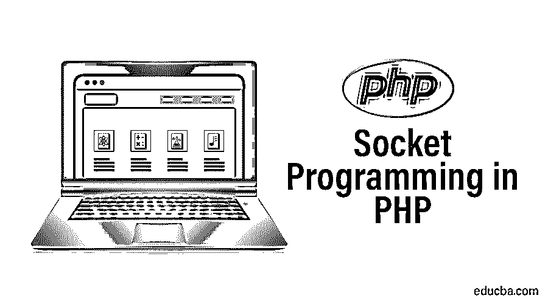

# PHP 中的套接字编程

> 原文：<https://www.educba.com/socket-programming-in-php/>




## PHP 套接字编程简介

所有的编程语言都提供了实现服务器和客户端通信的机制。按照这种机制，应用程序使服务器和客户机能够在它们之间交换数据。与其他编程语言类似，PHP 也为我们提供了这种机制。套接字编程可以被定义为将服务器和客户端作为应用程序的编程方法，其中必须在它们之间建立连接以促进它们之间的通信。就 PHP 而言，它还让我们实现了套接字编程的概念。在本文中，我们将学习如何使用 PHP 编程语言实现这个套接字编程。

### 套接字类方法

套接字类方法是让我们实现套接字编程的特殊函数。为了实现[套接字编程的功能而必须编写的程序使用](https://www.educba.com/socket-programming-in-c-plus-plus/)预定义的套接字函数。这些函数由在套接字编程中执行实际角色的语句组成。下面是一些套接字函数。

<small>网页开发、编程语言、软件测试&其他</small>

*   **Socket_accept:** 这是一个非常常见的套接字函数，用于接受套接字连接。这个函数的主要作用是在请求命中时让连接被接受。
*   **Socket_addrinfo_bind:** 该函数用于将提供的信息添加到 Socket 中。接受的信息必须分配给套接字，以便于实现。
*   **Socket_clear_error:** 该函数用于清除套接字上的错误。除此之外，这个函数还清除最后一个代码中的错误。
*   **Socket_close:** 顾名思义，这个函数用来关闭属于套接字的资源。
*   **Socket_connect:** 该方法用于创建套接字连接。在套接字编程中，程序从连接的建立开始，这可以使用这个函数来完成。
*   **Socket_create:** 这个方法与套接字的创建有关。使用此方法创建的套接字用作连接的端点。
*   **Socket_create_listen:** 这个函数用来让套接字打开接受连接的指定端口。顾名思义，它有助于打开套接字进行监听。
*   **Socket_create_pair:** 该方法通常用于需要使用[套接字编程的复杂部分](https://www.educba.com/socket-programming-in-python/)的应用中。它有助于创建不可区分的套接字，这些套接字存储在数组中。
*   **Socket_get_option:** 该方法用于获取套接字的选项。插座由几个选项组成，这些选项必须根据应用来使用。通过使用这种方法，我们可以获得套接字拥有的所有选项。
*   **Socket_getsockname:** 该方法用于查询所选 Socket 的本地区域，作为回报，它可以获得与主机/端口或者 [Unix 文件系统路径](https://www.educba.com/unix-file-system/)相关的详细信息。无论结果如何，都完全取决于类型。

### 套接字客户端示例

本节将看到用于实现客户端套接字编程的代码。下面提到的例子将有 post 和主机细节，这些细节将用于创建套接字连接。一旦建立了连接，它就交换一些消息，并期待来自服务器的响应。

```
<?php
$port_number    = 1230;
$IPadress_host    = "127.0.0.1";
$hello_msg= "This is server";
echo "Hitting the server :".$hello_msg;
$socket_creation = socket_create(AF_INET, SOCK_STREAM, 0) or die("Unable to create connection with socket\n");
$server_connect = socket_connect($socket_creation, $IPadress_host , $port_number) or die("Unable to create connection with server\n");
socket_write($socket_creation, $hello_msg, strlen($hello_msg)) or die("Unable to send data to the  server\n");
$server_connect = socket_read ($socket_creation, 1024) or die("Unable to read response from the server\n");
echo "Message from the server :".$server_connect;
socket_close($socket_creation);
?>
```

在上面的例子中，程序试图连接的端口号是 1230。主机的 IP 地址将是本地主机的 IP。如果有人愿意与远程服务器交互，他们可以提及服务器的 IP 地址。然后，消息将被发送到服务器，并显示在响应页面上。套接字创建将在以后处理。在这个程序中，有一个适当的机制通过使用 die 方法来处理错误。如果出现任何问题，在这种情况下，die 方法将被撤销，并且弹出其中给出的消息。

### 套接字服务器示例

本节中详细描述的例子将会使用 PHP 代码来实现服务器端的套接字编程。上一个示例中使用的 IP 和端口号的详细信息在本示例中也将保持不变。这个例子的主要区别是它与客户端套接字编程语言的核心区别。让 process 来理解服务器端套接字编程的 PHP 代码。

```
<?php
$port_number    = 1230;
$IPadress_host    = "127.0.0.1";
set_time_limit(0);
$socket_creation = socket_create(AF_INET, SOCK_STREAM, 0) or die("Unable to create socket\n");$socket_outcome = socket_bind($socket_creation, $IPadress_host , $port_number ) or die("Unable to bind to socket\n");
$socket_outcome = socket_listen($socket_creation, 3) or die("Unable to set up socket listener\n");
$socketAccept = socket_accept($socket_creation) or die("Unable to accept incoming connection\n");
$data = socket_read($socketAccept, 1024) or die("Unable to read input\n");
$data = trim($data);
echo "Client Message : ".$data;
$outcome = strrev($data) . "\n";
socket_write($socketAccept, $outcome, strlen ($outcome)) or die("Unable to  write output\n");
socket_close($socketAccept);
socket_close($socket_creation);
?>
```

在上面的例子中，程序被开发为在本地主机上工作。这里说的 IP 地址属于本地主机，端口号可以在那上面运行 TCP 和 UDP 服务。第一步总是创建套接字，因为它将在整个程序中使用。后来，插座被绑定到指定的值，这将有助于功能。该程序中使用的方法具有预定义的含义，可用于特定目的。一旦一切顺利，程序将相应地工作，并最终关闭套接字连接。

### 结论 PHP 中的套接字编程

套接字编程语言用于让应用程序在服务器和客户机模型上工作。这种编程方法让我们可以在服务器和客户端之间建立连接，从而方便数据的交换。为了使套接字编程简单方便， [PHP 提供了](https://www.educba.com/php-constants/)预定义的方法，其中所有的方法都分配了一些独特的任务。

### 推荐文章

这是一个 PHP 套接字编程指南。在这里，我们讨论让我们实现套接字编程的方法，以及它如何使服务器和客户机在它们之间交换数据。您也可以查看我们的其他相关文章，了解更多信息——

1.  [PHP 中的封装](https://www.educba.com/encapsulation-in-php/)
2.  [PHP 中的构造函数](https://www.educba.com/constructor-in-php/)
3.  [PHP 魔法常数](https://www.educba.com/php-magic-constants/)
4.  [Java 中的套接字编程](https://www.educba.com/socket-programming-in-java/)


