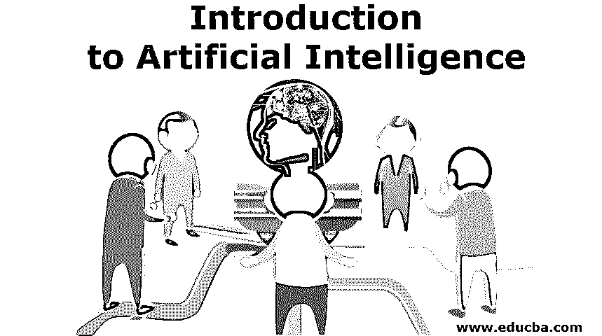
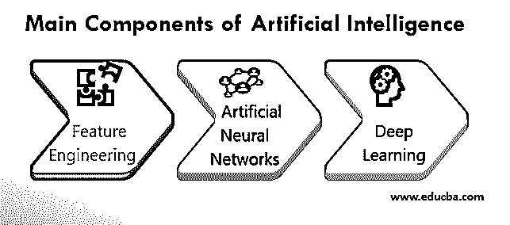

# 人工智能导论

> 原文：<https://www.educba.com/introduction-to-artificial-intelligence/>

## 人工智能导论

下面的文章提供了人工智能导论的大纲。人工智能是设计智能机器或开发自学软件应用程序的能力，这些应用程序模仿人类思维的特征，如推理、解决问题、规划、最佳决策、感官知觉等。人工智能方法在知识发现方面超越人类行为的能力得到了全世界商业和研究界的关注，并且该研究领域在过去二十年中取得了快速进展。

### 人工智能的主要组成部分和特点

下面给出了对各种智能系统的实现做出主要贡献的组件或框架，如下所示:

<small>Hadoop、数据科学、统计学&其他</small>

#### 1.特征工程

从所提供的数据集中识别信息要素或属性的最小集合的过程称为要素提取。通过适当选择一组有意义的特征，可以提高[机器学习过程](https://www.educba.com/careers-in-machine-learning/)的性能。

高效的特征提取过程确保:

*   在根据所选特征对数据集进行分类时，降低无序度(称为熵)。换句话说，这个最优的特征集最大化了信息增益。
*   特征之间零相关，从而实现特征集的独立性和极小性。这一目标是使用诸如主成分分析(PCA)、Gram-Schmidt 正交化过程等技术来实现的。

#### 2.人工神经网络

神经网络包括在连续层的一组计算节点之间的加权互连。在学习阶段，通过按照公共权重共享策略并根据从所实现的反向传播算法接收到的反馈来调整连接的最优权重，从而推导出连接的最优权重。从技术上讲，每个节点计算传播到其输入的值的加权和。前馈到下一层的计算值的标准由激活函数调节。在构成前馈和反向传播阶段的一系列时期之后，权重和其他网络参数收敛到最优值，最终得到最合适的模型。

最常用的人工神经网络有:

*   [卷积神经网络(CNN)](https://www.educba.com/convolutional-neural-networks/) 将接收到的输入与学习到的空间滤波器/模式进行卷积，以识别卷积层的特征。这些信号被前馈到完全连接的下一层，以执行识别任务。
*   卷积对平移变化的鲁棒性有效地促进了特征的识别或标记，并且这种方法广泛用于图像识别应用中。
*   递归神经网络(RNN)使用长期短期记忆(LTSM)从给定的一系列过去数据中智能估计未知值。

#### 3.深度学习

与人工神经网络相比，深度学习架构在输入和输出层之间具有更多隐藏层。这种架构变化有助于[深度学习框架](https://www.educba.com/what-is-deep-learning/)在分类学习的同时执行自动特征提取。这些模型采用监督学习来训练良好标记的数据集。尽管具有大量隐藏层的体系结构具有内在的复杂性，但通过使用高性能并行计算 GPU，模型的学习时间可以大大减少。

### 人工智能的应用

所以现在我们正在讨论与 AI 革命相关的所有领域的理论和方法，包括零售、金融、太空研究、医疗保健、消费电子、汽车等。

一些应用程序的详细信息如下:

#### 1.伦理基因编辑

通过精确理解患者的基因蓝图，实现了治疗由基因突变引起的疾病或障碍的个性化医疗护理的概念。识别核苷酸顺序的分析称为基因组测序。随着基因组测序的深入，易感突变将被识别出来，从而为患者开出特定的治疗方案。

#### 2.智能灾难响应系统

现代救援系统使用人工智能驱动的无人机、机器人和传感器来快速收集关于破坏程度、被困受害者的确切位置以及危机时期地形细节的精确信息。智能系统帮助救援人员在从受灾地区疏散人员时确定最近和最安全的集合点。配备人工智能的灾难管理模块有效地模拟灾难演习，以识别潜在的脆弱位置，规划预防措施，无缝地监控和管理资源分配。

#### 3.推荐系统

最佳推荐系统基于项目的简档和对用户行为的推断来识别或预测用户对项目的偏好。用户对各种项目的意愿被表示为效用矩阵中的用户-项目对。

发现用户对项目的响应的两种方法是:

*   基于内容的推荐根据对一些项目的评分/反馈来理解用户的兴趣，并向他们推荐类似的项目。
*   协同过滤侧重于识别相似用户，并推荐相似用户偏好的项目。

在数学上，所表示的效用矩阵是稀疏的，并且推荐算法旨在使用聚类算法和矩阵分解方法，如奇异值分解(SVD)等，从少数已知值中推断未知/遗漏的条目。

### 人工智能的优势

下面给出的是人工智能的优势:

*   **最少的人工干预:**人工智能驱动的系统是人类生命更有可能面临风险的环境中的最佳解决方案。这种场景的几个例子是太空探索、像拆除炸弹这样的防御行动、以酷热为特征的工作场所、矿物开采等。
*   **更快更准确:**训练有素的人工智能应用程序的性能极大地降低了人为错误的发生几率。这些人工智能版本被证明在计算昂贵的任务上更快，特别是在科学研究领域和耗时的任务上。大多数例行、琐碎和重复的任务都可以通过适当的人工智能实现自动化，推动技术提高运营效率。

### 挑战

下面是提到的挑战:

#### 1.需要海量数据语料库

一般来说，智能系统在作为现实世界的解决方案部署之前，会在大量数据的帮助下学习优化的模型，同时进行训练和验证。海量数据的可用性和处理它们的能力是传统系统和软件应用程序发展为人工智能版本的主要限制。迫切需要能够使用有限的数据样本以高精度估计模型参数的复杂建模技术。

#### 2.多模态交互

通过利用同时解释和处理多种模式数据的能力，可以提高包含计算机视觉方法的基于感知的识别应用的效率和精度。这使得识别范式能够理想地模拟与各种感觉(如触觉、视觉、听觉等)协同工作的人类智能。

#### 3.超出人类的控制

凭借人工智能技术以更快的速度理解和学习庞大信息库的非凡能力，很少有人工智能框架获得情商并超越人类逻辑思维极限的威胁实例。在这种不受监管的情况下，人工智能系统的异常行为将导致不可挽回的灾难。

### 推荐文章

这是一本介绍人工智能的指南。这里我们讨论了人工智能的特点、应用和优势。您也可以阅读以下文章，了解更多信息——

1.  [人工智能的用途](https://www.educba.com/uses-of-artificial-intelligence/)
2.  [人工智能职业](https://www.educba.com/careers-in-artificial-intelligence/)
3.  [人工智能的未来](https://www.educba.com/future-of-artificial-intelligence/)
4.  [人工智能子集](https://www.educba.com/subsets-of-artificial-intelligence/)

