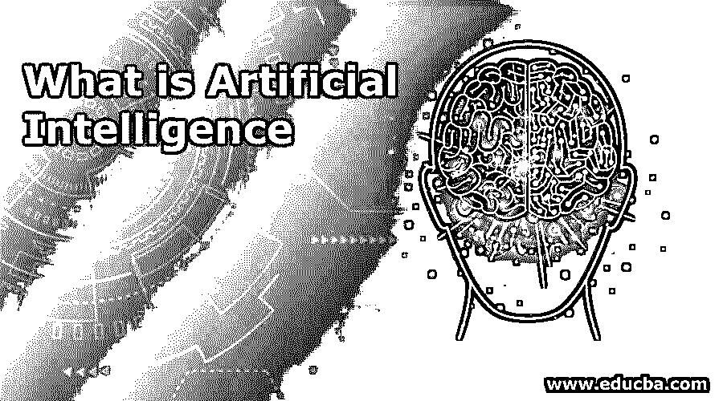
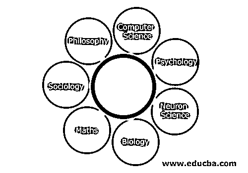

# 什么是人工智能

> 原文：<https://www.educba.com/what-is-artificial-intelligence/>

## 人工智能导论

机器表现出的与人类的自然智能相当的智能被称为人工智能。计算机程序是按照人类的方式来学习、思考和行动的。所以我们可以说，我们正在让机器变得智能。最好的例子是语音识别和图像识别。不同类型的人工智能包括反应机器、有限记忆、心理理论和自我意识。约翰·麦卡锡被称为人工智能之父，因为他首先提出了这个术语。由于人工智能，系统可以分析和解释数据，从数据中学习，并从数据中得出结论。

### 什么是人工智能？

根据人工智能之父约翰·麦卡锡的说法，“制造智能机器，尤其是智能计算机程序的科学和工程”定义了人工智能。

<small>Hadoop、数据科学、统计学&其他</small>

顾名思义，人工智能是将智能传递给机器，以便机器像人类一样操作。人工智能是计算机科学中强调创造像人类一样工作、操作和反应的智能机器的领域。人工智能用于机器考虑实时场景的决策。人工智能机器读取实时数据，理解业务场景，并做出相应的反应。

人工智能机器被设计用于的一些活动是:

*   语音识别
*   学问
*   规划
*   解决问题

人工智能现在已经成为信息技术中非常重要的一部分。这个分支旨在创造智能机器。人工智能有着高度技术化和专业化的研究。

人工智能的最大问题包括对计算机进行编码和编程，以实现某些功能，如:

*   知识
*   论证
*   解决问题
*   感觉
*   学问
*   规划
*   操纵能力

将计算机转变为计算机控制的机器人或设计完全按照人类思维方式思考和反应的软件的过程就是人工智能的全部。

为了使用人工智能开发智能系统，有必要了解人类大脑的功能。大脑在解决问题时是如何思考、学习、决策和操作的，有待深入研究。然后，这样获得的结果必须应用到软件中，以便开发智能系统。

AI 研究的核心概念是知识工程。只有当机器提供足够多的与商业和世界相关的信息时，它们才能像人类一样行动、操作和反应。因此，重要的是，人工智能能够访问关于对象、类别、属性以及所有业务用例之间的关系的所有信息，以便机器能够有效地实现知识工程。然而，让机器具备常识、决策、推理和解决问题的能力是相当困难和乏味的。

### 人工智能哲学

这个人使用计算机系统已经有一段时间了。虽然机器总是帮助人类，但人类总是越来越多地考虑探索这些奴隶。这种好奇心促使人类提出疑问，“能让机器像人一样思考和操作吗？”

因此，为了制造像人类一样操作和反应的机器，人工智能发展了起来。

### 人工智能的目标

以下是提到的目标:

*   创建智能的&专家系统:开发开始制造展示智能行为的系统。这些机器的预期功能是学习、演示、解释和建议用户。
*   向机器灌输人类智能:创造系统和开发软件，让它们像人类一样理解、思考、学习和行为。

### 什么促成了人工智能？

人工智能本质上是科学和技术——基于不同的学科。计算机科学、生物学、心理学、语言学、数学和工程学等研究领域。

人工智能的主要目标和主要挑战是开发与人类智能等属性相关的计算机功能，包括推理、学习、反应、决策和解决问题。

上面提到的一个或多个属性可用于开发智能机器。

机器学习是人工智能的核心部分和子集。让机器在没有任何监督的情况下学习是非常困难的，因此需要理解数据的能力，比如识别输入流中的模式。这和有监督的学习是很不一样的。有监督的学习包括分类和数值回归等行为。分类是确定对象属于哪个类别的过程。回归过程处理获得一组数字输入，从而发现能够为相应输入生成合适输出的函数。

计算学习理论是理论计算机科学的一个非常明确的分支，它使用使用机器学习算法完成的[数学分析。机器的感知、反应和决策完全取决于机器使用来自各种传感器的输入来推断环境的各个方面的能力。例如，计算机视觉分析视觉输入，面部识别、物体识别和手势识别是整体分析的子集。机器人技术是另一个与人工智能有点关系的主要领域。机器人处理的各种任务是导航和物体操纵。子问题是定位、映射和运动规划。](https://www.educba.com/machine-learning-algorithms/)

### 有无人工智能的编程

下面给出了一个系统的基本编程，以及它们在使用和不使用人工智能时的不同之处:

| **无人工智能** | **与艾** |
| 系统只能解决具体问题，回答已经馈入系统的具体问题。 | 使用人工智能构建的系统可以在一般情况下活跃，并使用信息，权衡选项，然后做出决定。 |
| 对编写的程序或信息的任何修改或更改都会显著改变应用程序的结构。 | 而具有人工智能的程序可以通过集成高度独立的信息片段来访问各种数据以做出明智的决策，从而轻松适应新的变化和修改。因此，即使修改程序的一小段信息也不会影响它的结构。 |
| 与预期相反，修改并不容易和快速。微小的变化可能会对程序产生不利影响，从而导致故障。 | 相反，在人工智能程序中进行修改是非常容易和快速的。这些程序适应性很强，做出改变不会影响程序的运行。 |

### 人工智能面临的挑战

每个硬币都有两面。人工智能也带来了自己的挑战。理论上，这可能看起来更简单，实时购买，AI 有一定的挑战性和知识性，程序有其不受欢迎的属性。

这些包括:

*   它的体积是巨大的，超出了人们的想象。
*   该计划和指导方针根本不是组织良好或格式良好。因此，很难有效地使用它。
*   它一直在不断变化。因此，我们必须不断更新。

### 什么是人工智能技术？

为了克服这些挑战，使用了人工智能技术。

这是一个组织和有效利用知识的过程，以便:

*   信息的提供者应该能够感知它。
*   对数据和程序进行修改应该很容易，并且应该很容易修改以纠正错误。
*   即使程序不准确或不完整，它在多种情况下应该是有用的。
*   鉴于使用人工智能的程序非常复杂，这些人工智能技术应该提高这些程序的执行速度，从而优化效率。

### 人工智能的应用

我们已经看到，在使用和操作实时数据的程序中，使用人工智能有许多优势。人工智能已经被使用，并且在需要读取和操作实时数据的各种领域中占主导地位，

比如:

#### 1.赌博

国际象棋、扑克和井字游戏等战略游戏需要评估实时数据。机器应该能够考虑各种可能的行动，应该能够权衡这些选项，并根据启发式知识做出决定。人工智能在这些战略游戏中扮演着至关重要的角色。

#### 2.自然语言处理

为了使程序有效运行，有必要让机器适应不同用户的语言。这台机器不仅要适应各种语言，还要适应各种方言和口音。人工智能被证明在这样的用例中非常有用。

#### 3.专家系统

智能机器的主要功能是决策。这些机器需要软件接受信息作为输入，理解它，权衡各种选择，并得出结论。这些机器被用来对给定的情况进行推理。这种软件向用户提供解释和建议以做出明智的决定。

#### 4.视觉系统

视觉输入是至关重要且难以解释的信息形式。因此，集成了智能的系统必须阅读、理解、解释和领会视觉输入，并根据这些信息做出决策。

### 这些应用的一些例子

*   无人驾驶飞机、间谍相机或间谍飞机拍摄照片和视频，用于理解该地区的地图或计算空间信息。
*   临床专家系统使用体内的摄像机，并且通常被医生用来诊断患者。
*   在警方调查中使用计算机软件进行面部识别。这个程序可以通过在警察系统中建立一个名为肖像模式的记录来识别嫌疑人的脸，该记录带有证人给法医艺术家的描述。

#### 1.语音识别

一些具有人工智能的系统被设计成能够听到声音和理解语言，以理解单词的意思。这种理解不仅仅是对单词的理解，还包括句子、句子的意思以及人们用各种语言对系统说话时的语气。该软件可以识别不同的口音，方言，俚语，背景噪音，声音调制的变化，疼痛，寒冷等引起的声音变化。

#### 2.手写识别

这种软件是为阅读正文而设计的。这篇文章可以用钢笔或铅笔写在纸上。文本也可以在屏幕上用鼠标或手写笔书写。它可以读取文本，识别字母和数字的形状，然后将其转换为可以操作、更改和存储的可编辑文本，从而提高处理速度。

#### 3.智能机器人

机器人是被编程为奴隶的机器，被建造来执行主人命令的任务。它们装有各种传感器。这些传感器从真实世界读取物理数据作为输入。这种物理数据的形式是光、热和温度、运动和压力、声音、障碍物、空间坐标和凹凸。它们安装了高效的处理器、多个传感器和巨大的存储内存。所有这些都是为了展示智慧而安装的。此外，他们能够适应不断变化的环境，并从错误中学习。

### 人工智能的优势和劣势

以下是人工智能的优缺点:

#### 优势:

*   与人类相比，错误率要低得多。
*   人工智能系统工作的精确性、准确性和速度令人难以置信。
*   可以在恶劣的环境中同样高效地工作。
*   完成对人类构成挑战的危险任务，在不伤害人类身体的情况下完成像探索太空这样的任务成为可能。
*   使用这种机器后，采矿和挖掘燃料变得容易了。
*   重复、单调、乏味的任务可以在不损失效率的情况下完成。
*   预测和决策。
*   检测欺诈变得更加容易，尤其是在基于卡的系统中。
*   组织和管理记录。
*   机器人宠物可以被制造出来与人互动，帮助减少抑郁和不活动。
*   像机器一样不带感情地进行逻辑思考，做出理性的决定。

#### 缺点:

*   建筑、重建和修理需要熟练的专业人员，并且花费大量的金钱和时间。
*   存储很贵。
*   从内存中访问和检索数据的效率可能不如人工系统。
*   机器可以被编程学习并变得更好，但不如人类。
*   它们的操作范围仅限于编写的程序。
*   他们永远无法获得人类所拥有的创造力。
*   由于智能机器的发展，失业是最大的威胁。
*   尽管人类很懒，但他们可能会变得过于依赖机器，而没有充分利用他们的智力。
*   机器如果落入坏人之手，很容易导致毁灭。

### 结论

这是一篇关于被大肆宣传的“人工智能”的短文。除了优势，人工智能也带来了一定的挑战和劣势。应该由企业来评估投资这些技术是否必要和有利可图。

### 推荐文章

这是一本关于什么是人工智能的指南。这里我们讨论了人工智能的应用、工作、优点和缺点。您也可以浏览我们推荐的其他文章，了解更多信息——

1.  [人工智能面试问题](https://www.educba.com/artificial-intelligence-interview-questions/)
2.  [人工智能类型指南](https://www.educba.com/types-of-artificial-intelligence/)
3.  [顶级人工智能工具](https://www.educba.com/artificial-intelligence-tools/)
4.  [人工智能的重要性](https://www.educba.com/importance-of-artificial-intelligence/)

