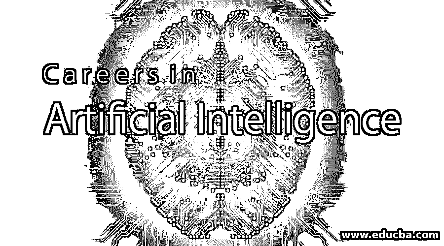

# 人工智能职业

> 原文：<https://www.educba.com/careers-in-artificial-intelligence/>

## 人工智能职业介绍

[人工智能](https://www.educba.com/what-is-artificial-intelligence/)已经从一个小众技术/计算领域变成了一个主流的计算机科学工程工具包。它在硅谷造成了混乱，谷歌、脸书、LinkedIn 和其他许多 It 巨头都在大力投资人工智能职业。人工智能伴随着“未来是自动化”的口号，新手也开始使用这些技术，因为市场对企业级的东西来说非常新。预计人工智能职业将成为自动化、DevOps 平台、互联网 Chabot 和机器人等领域新 It 发展的核心。人工智能职业是一个快节奏和具有挑战性的领域，正在明显侵入我们的日常生活。

### 人工智能职业所需的教育

由于人工智能和机器产生了大量新兴的多学科支持选择，对未来毕业生的要求将会改变。几乎不需要做简单和/或重复性工作的员工。今天，工厂工人的数量已经在不断减少，人类越来越成为机器的控制机制。许多生产步骤已经完全自动化的汽车工业是这方面的先驱。因此，基础教育也要考虑在内。

<small>Hadoop、数据科学、统计学&其他</small>

1.  要从事人工智能，你至少应该有一个 CS 学位和扎实的编程基础。
2.  你应该对人工智能研究的逻辑、哲学和认知基础有坚实的理解。
3.  你应该对主要的人工智能技术有一个很好的概述，并深入了解如何在多智能体系统、推理或认知处理中的至少一个领域应用这些技术。

此外，你应该有能力在学术或 R&D 环境中进行人工智能研究，并识别人工智能技术如何为公司和组织的 IT 问题提供智能解决方案。

### 人工智能的职业道路

人工智能(AI)将在未来几年对全球劳动力市场产生根本性影响。因此，讨论将基于法律、经济和商业问题，如未来劳动力市场和公司结构的变化，对工作时间、薪酬和工作环境的影响，新的就业形式以及对劳资关系的影响。智能算法和生产机器人会导致大规模失业吗？除了公司、雇员、律师和社会之外，教育系统和立法者也面临着迎接不断进步的技术带来的新挑战的任务。因此，为了定义人工智能领域的职业，我们有两种类型的职业，它们如下:

1.  学术生涯:为了在人工智能领域拥有学术生涯，人们通常会去做研究或攻读博士学位，因为这给他们带来了巨大的学习动力和在研发部门证明自己能力的舞台&。
2.  职业生涯:拥有一个垂直不同的“行业生涯”是大多数人最感兴趣的，因为它为他们带来了一个社会和趋势用例，企业利用这些用例来改善自己。从事这种职业的人通常会达到顶峰和额外津贴。他们也可以在面向代理的软件公司或专门使用代理智能技术的公司找到工作。他们的任务可能包括开发新产品和新应用或指导此类活动。其他可能的机会包括咨询或在新兴市场创建新公司。

### 就业岗位

**垂直领域**:针对人工智能的领域如下:

*   **医学**:包括医学图像的解读、诊断、辅助 GPs 的专家系统、重症监护室的监控、修复术的设计、药物的设计。
*   **机器人学**:包括视觉、运动控制、学习、规划、语言交流、合作行为。
*   **工程**:故障诊断、智能控制系统、智能制造系统、智能设计辅助工具、用于销售、设计、生产、维护的集成系统、专家配置工具(例如，确保销售人员不出售无法工作的系统。
*   **信息管理**:这包括在[数据挖掘](https://www.educba.com/what-is-data-mining/)，网页抓取，邮件过滤等方面使用人工智能。例如，加州的一家公司使用人工智能来帮助零售商通过筛选在互联网上购买商品的人的年龄、邮政编码和购买习惯来挖掘消费者数据。谷歌是一套应用人工智能平台，能够‘学习’。
*   太空(Space):由于传输延迟，对离地球太远而无法由地球上的人类直接操纵的太空交通工具和自主机器人的控制。美国宇航局使用人工智能来帮助计划和安排航天飞机的维护。
*   **军事活动**:这可能是花费资金最多的领域。了解细节也不容易。
*   **营销**:人工智能正被用来开发更有针对性、相关性和及时性的营销计划，以提高客户流失率。

根据员工可能需要处理的信息的敏感性，其中一些垂直职位可能需要在雇用前进行安全审查。人工智能专业人员从事的具体工作包括:

*   软件分析师和开发人员。
*   计算机科学家和计算机工程师。
*   算法专家。
*   研究科学家和工程顾问。
*   使用机器人工具的外科技师。
*   使用假肢、假肢、助听器和视力恢复设备的医疗卫生专业人员。
*   军事和航空电工使用飞行模拟器、无人驾驶飞机和武器。
*   技术和贸易学校、职业中心和大学的大专教授。

### 薪水

“人工智能硕士”的平均年薪从研究科学家的大约 77602 美元到机器学习工程师的 135260 美元不等。

“人工智能工程师”的平均工资从 R&D 工程师的大约 93，625 美元/年到机器学习工程师的 135，260 美元/年不等。

其余的取决于候选人和他/她的目标领域。

### 结论

现代信息技术和人工智能(AI)驱动的机器的出现已经强烈影响了 21 世纪的工作世界。计算机、算法和软件简化了日常工作，很难想象如果没有它们，我们的大部分生活将会怎样。然而，是不是也无法想象在没有人力的情况下如何管理大多数流程步骤，如果是这样，那么人工智能肯定会成为 it 行业的短期趋势？

### 推荐文章

这是人工智能领域的职业指南。在这里，我们讨论了人工智能的简介、所需的教育技能以及工作职位、工资和职业前景。您也可以阅读以下文章，了解更多信息——

1.  [交换职业](https://www.educba.com/swap-careers/)
2.  [机器学习领域的职业](https://www.educba.com/careers-in-machine-learning/)
3.  [人工智能的重要性](https://www.educba.com/importance-of-artificial-intelligence/)
4.  [人工智能技术](https://www.educba.com/artificial-intelligence-techniques/)

