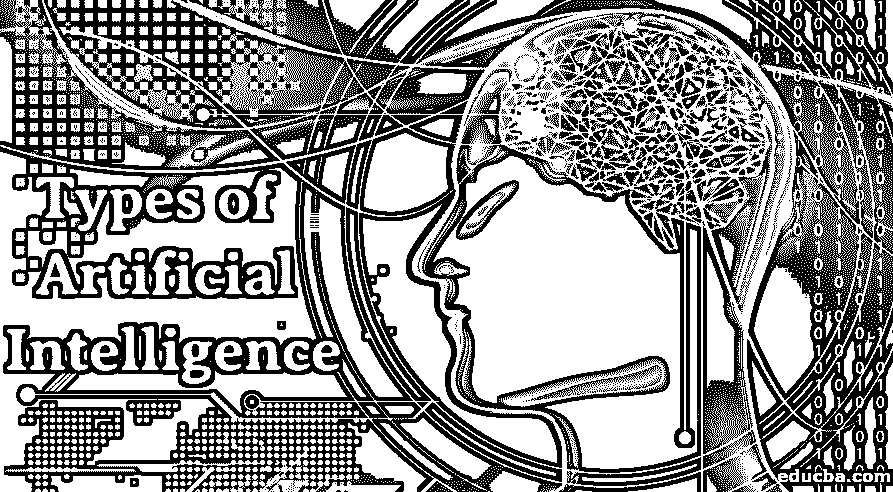
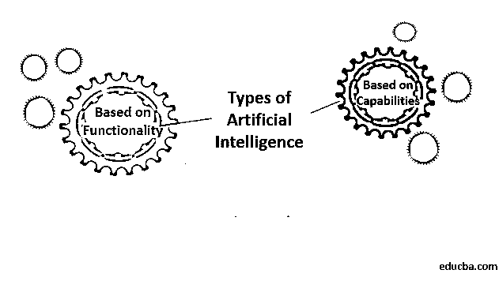
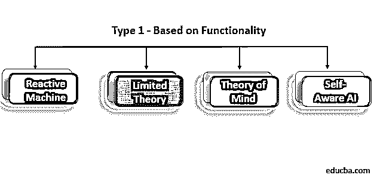
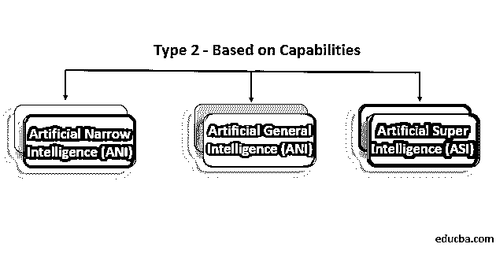

# 人工智能的类型

> 原文：<https://www.educba.com/types-of-artificial-intelligence/>

## 人工智能类型介绍

下面的文章为最重要的人工智能类型提供了一个概要。人工智能的主要目标是让机器执行类似人类的功能。因此，人工智能的主要分类方式是基于它复制类似人类行为的能力。总的来说，人工智能可以分为两种类型，这两种类型都是基于它复制人脑的能力。一种类型的分类是“基于功能”，根据它们与人类思维的相似性以及它们像人类一样思考和感觉的能力来对人工智能进行分类。第二种分类方式在科技行业更为突出，即人工智能相对于人类智能的“基于能力”。

### 不同类型的人工智能

基于功能和能力的人工智能主要有两种类型:

<small>Hadoop、数据科学、统计学&其他</small>

#### 类型 1-基于功能

##### 1.反应式机器

它们是最基本和最古老的人工智能类型。它们复制了人类对不同种类刺激的反应能力。这种类型的人工智能没有记忆能力，因此它们缺乏利用先前获得的信息/经验来获得更好结果的能力。因此，这些类型的人工智能不具备像我们现在遇到的这些人工智能那样的自我训练能力。

IBM 的象棋超级计算机深蓝就是这类机器的完美例子。它因在 20 世纪 90 年代末击败国际特级大师加里·卡斯帕罗夫而闻名。深蓝可以识别棋盘中不同的棋子以及每个棋子的移动方式。它能为自己和对手识别所有可能的合法行动。根据选项，它选择最佳可能的移动。然而，它没有能力从过去的动作中学习，因为这些机器没有自己的记忆。

##### 2.有限理论

这种类型的人工智能，以及反应式机器的能力，具有记忆能力，因此它们可以使用过去的信息/经验来做出更好的未来决策。我们周围大多数常见的应用程序都属于这一类。这些人工智能应用程序可以通过大量的训练数据进行训练，这些数据存储在参考模型的内存中。

**举例:**有限记忆技术在很多自动驾驶汽车使用中使用。它们存储 GPS 位置、附近汽车的速度、障碍物的大小/性质等数据，以及上百种其他数据，以便像人类一样驾驶。

##### 3.心理理论

心理理论是人工智能的下一个层次，它在我们的日常生活中非常有限，甚至不存在。这些类型的人工智能大多处于“进展中的工作”阶段，并且通常局限于研究实验室。这些类型的人工智能，一旦开发出来，将对人类的思想有非常深刻的理解，包括他们的需求、喜欢、情感、思维过程等等。基于对人类思想和他们的奇思妙想的理解，人工智能将能够改变自己的反应。

**例子:**研究员温斯顿在他的研究中展示了一个机器人的原型，它可以和其他从相反方向过来的机器人一起在小走廊里行走；人工智能可以预见其他机器人的运动，并可以右转、左转或以任何其他方式转弯，以避免与即将到来的机器人发生碰撞。按照威尔逊的说法，这个机器人根据它对其他机器人将如何移动的“常识”来决定它的行动。

##### 4.自我意识人工智能

这是 AI 的最后阶段。它目前的存在只是假设，只能在科幻电影中找到。这些类型的人工智能可以理解和唤起人类的情感，并拥有自己的情感。这种人工智能距离实现还有几十年，如果不是几个世纪的话。像埃隆·马斯克这样的人工智能怀疑论者所警惕的正是这种人工智能。这是因为一旦它有了自我意识，人工智能就可以进入自我保护模式；它可能认为人类是一个潜在的威胁，并可能直接或间接地试图终结人类。

#### 类型 2——基于能力

##### 1.人工狭义智能

我们周围看到的所有现有的人工智能应用都属于这一类。ANI 包括一个人工智能系统，可以像人类一样执行严格定义的特定任务。然而，这些机器无法执行事先没有编程的任务，因此它们无法执行前所未有的任务。基于上述分类，该系统是所有反应式和有限记忆人工智能的组合。我们在当今世界中用来执行最复杂的预测建模的人工智能算法就属于这一类人工智能。

##### 2.人工通用智能

AGI 有能力像正常人一样训练、学习、理解和执行功能。这些系统将具有跨越不同领域的多功能能力。这些系统将更加敏捷，在面对前所未有的场景时，会像人类一样做出反应和随机应变。没有这种人工智能的真实例子，但是在这个领域已经取得了很大的进展。

##### 3.人工超级智能(ASI)

人工超级智能将是人工智能发展的最高端。ASI 将是这个星球上有史以来最强有力的智能形式。由于其超强的数据处理、记忆和决策能力，它将能够比人类更好地完成所有任务。一些研究人员担心 ASI 的出现将最终导致“技术奇点”。这是一种假设的情况，在这种情况下，技术的增长将达到一个不可控制的阶段，导致人类文明发生不可想象的变化。

目前，很难预见当一种更灵巧的人工智能形式实现时，我们的未来会是什么样子。然而，可以肯定的是，我们距离达到那个阶段还有很长的距离，因为我们只是处于高级人工智能发展的非常初级的阶段。对于人工智能的支持者来说，我们可以说我们只是触及了表面，以挖掘人工智能的真正潜力，而对于人工智能的怀疑者来说，对技术奇点感到恐惧还为时过早。

### 推荐文章

这是人工智能类型的指南。在这里，我们详细讨论主要基于功能和能力的不同类型的人工智能。您也可以浏览我们推荐的其他文章，了解更多信息——

1.  [人工智能的优势](https://www.educba.com/advantages-of-artificial-intelligence/)
2.  [人工智能简介](https://www.educba.com/introduction-to-artificial-intelligence/)
3.  [人工智能技术指南](https://www.educba.com/artificial-intelligence-technology/)
4.  [人工智能公司](https://www.educba.com/artificial-intelligence-companies/)

