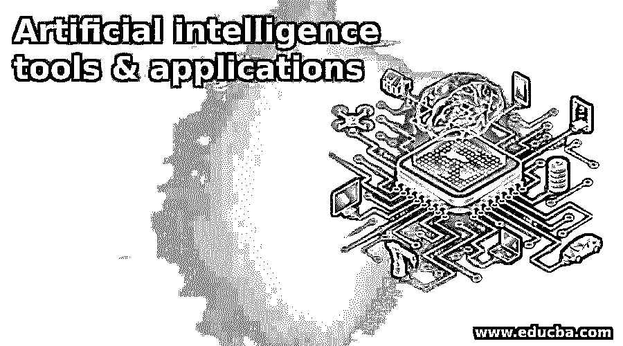

# 人工智能工具应用

> 原文：<https://www.educba.com/artificial-intelligence-tools-applications/>

## 人工智能工具应用简介

许多科学家和研究人员的梦想，人工智能是计算机科学的一个领域。它被定义为对[智能代理](https://www.educba.com/intelligent-agents/)的研究和设计，其中智能代理是一个能够理解其环境并因此采取所需行动以最大化行动成功机会的系统。智能手机和计算机领域的快速进步有助于让人工智能之旅变得更快、更顺畅。今天，人工智能能够识别语音，在国际象棋中击败人，并在复杂的情况下采取行动。然而，人工智能领域仍然存在障碍，即它们仍然无法吸收知识、规划、学习、交流、感知以及移动和控制物体的能力等品质。

人工智能工具 &应用的目的是开发机器，使它们比人类更好地执行任务。人工智能工具&应用程序也应该理解其他人、动物和机器的行为，从而获得许多重要性和意义，特别是在工程、机器人和科学领域。人工智能是由约翰·麦卡锡创造的，是一个技术和专业领域，也可以对其他领域产生很大影响。该领域中一些流行的方法包括统计方法、计算智能和传统的符号人工智能，而一些工具包括逻辑、基于概率的方法和经济学等。

<small>Hadoop、数据科学、统计学&其他</small>

在过去的几年里，人工智能确实取得了长足的进步。随着 IBM 超级计算机沃森(Watson)在危险游戏中击败冠军，自动驾驶汽车能够行驶超过 30 万英里无事故里程(在某些州甚至是合法的)，统计学习技术可以获得对消费者利益的重要见解，物品智能的世界正在快速变化，并有能力完全重新定义我们目前生活的世界。关键的人工智能工具和应用基本上存在于拥有大量信息和数据的领域。有时，处理如此多的数据会被证明是极其困难和具有挑战性的。

与此同时，重要的是要记住，从这些人工智能工具和应用程序来源获得的见解和信息很容易为人类所理解。图像识别就是这样一个例子。这是通过对图像特征进行严格的、重复的、低水平的计算来实现的。这有助于创建像谷歌这样的服务，用户可以拍摄一个地点的图像，这项服务将试图识别相同的图像。这一切都是增强现实的开始。这种技术是人工智能的重要组成部分，可以为生物研究等领域提供大量机会，以增强和增强他们的专业领域。脑成像是这项技术能够产生深远影响的另一个领域。

### 人工智能的趣事

这些年来，人工智能工具和应用程序不断进步和变化。这里有一些关于人工智能的有趣概念。

1.  **人工智能可以追溯到很久以前**:很多人认为人工智能是一个最近的概念，是与拟人化的机器和机器人有关的东西。事实上，许多古希腊神话都有机器人的概念，比如赫菲斯托斯的金色机器人。此外，中世纪炼金术的故事对放置人脑无生命物体给予了很大的压力。许多宗教团体也相信雕像拥有人类的思想和情感，这意味着传递人类的情感和思想是科学家和研究人员长久以来一直在思考的事情。
2.  艾伦·特纳对人工智能产生了巨大影响:1950 年，艾伦·特纳发表了一篇名为《计算机械与智能》的论文。在这篇论文中，他试图找出一台机器能否在他所谓的模仿游戏中打败一个人。这个测试也有一台电脑，它也可以告诉玩家的性别。此外，论文还介绍了转向试验，本文被认为是人工智能领域的一项重大工作。
3.  人工智能领域的正式研究始于 20 世纪 50 年代:虽然许多研究甚至在 20 世纪 50 年代之前就开始了，但人工智能领域的正式研究始于 1956 年的达特茅斯会议之后。此外，人工智能这个名字是由会议组织者约翰·麦卡锡提出的。他继续在人工智能领域工作，并对该领域提出了许多有价值的见解，直到他在 2011 年去世。
4.  人工智能的一个关键是自然语言处理:人工智能的一个主要挑战是，研究人员必须创造一种方法，使计算机一方面能够理解人类语言，另一方面能够以有效的方式与人类交流。这个领域被称为自然语言处理，这就是为什么计算机/设备必须能够理解不同的语言(如英语、西班牙语、法语)并以类似的语言提供相同的见解是重要的。
5.  **自动驾驶汽车受益于人工智能**:人工智能领域的技术进步可以彻底变革交通领域。在过去的几年里，像谷歌的无人驾驶汽车和无人驾驶飞机这样的车辆进步已经席卷了运输行业，如果没有人工智能领域的一些进步，这是不可能的。
6.  **许多新的人工智能公司越来越出名，有许多投资者正在寻求资助他们**:人工智能是一个即将到来的领域，这个领域存在着近乎无限的机会。这就是为什么有许多投资者非常愿意支持那些希望在人工智能领域进行研究的创新公司。事实上，根据 CB Insights 的数据，人工智能工具&应用领域的新创业公司的数量在过去几年中肯定有所增长，一些公司如 Sentient Technologies 在成立几年后就已经通过融资筹集了超过 1 亿美元。这意味着，对于那些想要探索人工智能新动态的人来说，这个领域存在着多重机会。
7.  大型科技公司正在寻求投资人工智能领域:不仅是投资者希望支持在人工智能领域有经验的公司，许多大公司也在寻求将资源投资于人工智能领域。为此，谷歌以近 4 亿美元收购了人工智能初创公司 DeepMind，而脸书最近收购了 Wit.ai。这意味着几乎每一家创新公司都意识到了人工智能的重要性，这将成为主要部门和行业的未来。人工智能工具&的应用不仅有潜力解决跨领域的重大挑战，还有助于发现迄今为止隐藏的新机遇。考虑到人工智能领域的进步和发展方式，可以毫不夸张地说，世界各地的主要行业和经济体都将受益于对人工智能的投资。
8.  人工智能驱动的机器人可以一起思考:CoCoRo 或集体认知机器人是在欧洲开发的。他们开发了具有人工智能的机器人，它们可以协同工作。这些机器人可以搜索一个区域，扫描一个环境，甚至相互发送见解和信息。这是一个很大的进步，因为这些机器人可以帮助各部门获得对各种行业和公司的见解。这些机器人可以帮助公司获得关于各种活动的深入知识，并为他们提供有益的见解和信息。
9.  机器人可以彻底改变社交领域:人工智能工具&应用领域的进步已经完全改变了这个领域，尤其是像 Kismet 这样的发展。Kismet 是由 Cynthia Breazeal 在 20 世纪 90 年代开发的，是一个可以识别人类肢体语言和语调的机器人。这意味着通过理解人类行为，这些机器人可以完全改变我们理解人类行为和心理的方式。
10.  人工智能领域正在两极分化:很少有技术像人工智能一样有争议。一方面，许多组织认为人工智能是许多行业的未来，这就是为什么许多投资者乐于将资金投入人工智能的研究和开发。另一方面，许多知名人士，如比尔·盖茨和埃隆·马斯克，认为人工智能可能是人类的末日。不管情况如何，不可否认的是，人工智能有巨大的潜力，尽管也有一些障碍。

### 人工智能工具和应用

不可否认，人工智能是一个非常令人兴奋的领域，可以对所有行业产生影响。从医疗到数据输入，人工智能肯定会继续存在，这里有几个领域继续看到人工智能的巨大接受度，并且在未来的使用中也有很大的潜力。通过人工智能应用的例子，可以真正增长的五个主要行业包括:

#### 1.新闻工作

人工智能正在通过获取和收集信息的新方法改变新闻业。现在许多新闻文章不是由人类撰写，而是被卸载到人工智能源。这些来源能够辨别信息，并能以一种完全可以理解和理智的方式来组织文章。这意味着文章可以由人工智能来源撰写，目前它们仅限于撰写商业文件报告，但随着时间的推移，它们也可以扩展到其他来源。虽然人类仍然比其他人有优势，但对于业内人士来说，人工智能无疑更加简单。这是令人惊讶的领域之一，人工智能可能会有长期持久的影响。

 

图片来源:pixabay.com

#### 2.运输行业

交通部门是最重要的部门之一，可以通过人工智能的兴起而受到影响。在某个时候，人类将把钥匙交给电脑，因为无人驾驶汽车很快就会成为现实。但人工智能的影响远不止于此，因为很快商业卡车公司、航空公司和火车就可以很快变成无人驾驶，这是一个巨大的进步，因为它将大幅释放资源和时间。虽然这可能会导致大规模失业，但它在减少交通流量、减少燃料浪费和增加通勤时间方面有很大的好处，让生活变得更轻松，不那么紧张。

#### 3.应急无线电通信业务

处理紧急服务有时会耗费很多生命，例如在消防部门。想象一下，随着人工智能的引入，这种情况会发生怎样的变化。这意味着在发生火灾的情况下，人类的生命不需要处于危险之中，因为通过机器人，在没有消防员牺牲的情况下拯救生命将变得更加容易。毕竟，金属机器不仅可以承受高温，它们不受烟雾问题的影响，还可以使用激光和雷达，以便获得生命源，使它们成为有效的工具。此外，还有许多其他领域，如驾驶救护车、清理危险的泄漏和溢出物，人工智能可以以有效的方式提供帮助。

#### 4.客户服务

许多品牌和公司正在采用人工智能来满足他们的客户服务需求。自动化在线助手已经席卷了许多类别，很快，自然语言处理技术将成为现实。这意味着呼叫中心将很快成为过去。虽然这些事情可能需要一些时间才能成为现实，但人工智能真的会一直存在下去！

总之，人工智能应用的例子正在迅速改变我们生活的世界。今天正在开发的人工智能一点也不像我们很久以前想象的阴郁的电子人，它比我们想象的更迷人、更创新、更令人惊讶，甚至更好。

### 推荐文章

这是人工智能工具应用的指南。这里我们已经讨论了基本概念。人工智能中一些有趣的东西的 top 3 应用程序。您也可以看看以下课程，了解更多信息——

1.  [人工智能职业](https://www.educba.com/careers-in-artificial-intelligence/)
2.  [群体智能应用](https://www.educba.com/swarm-intelligence-applications/)
3.  [情商技能](https://www.educba.com/emotional-intelligence-skills/)
4.  [人工智能 vs 商业智能](https://www.educba.com/artificial-intelligence-vs-business-intelligence/)

