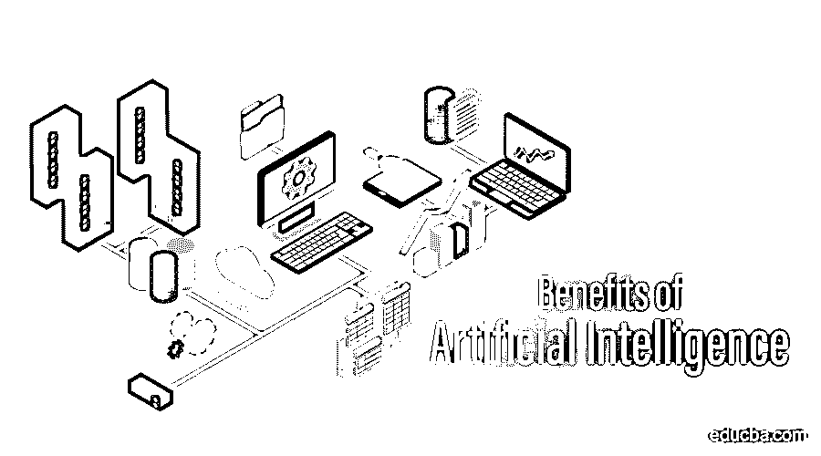

# 人工智能的好处

> 原文：<https://www.educba.com/benefits-of-artificial-intelligence/>

## 人工智能概述

人工智能不再局限于科幻小说和研究实验室。它的主流采用已经开始收获果实。它去年为经济贡献了超过 2 万亿美元，根据普华永道的报告，这一数字到 2030 年将达到 15.7 万亿美元。人工智能每天都与数百万人的生活息息相关，它通过智能手机、个人电脑和其他智能设备与我们互动，为医疗保健、制造、运输、零售、教育、信息技术、营销等各个领域带来巨大的好处。

### 人工智能的主要优势

以下是人工智能的好处:

<small>Hadoop、数据科学、统计学&其他</small>

#### 1.减少人力密集型劳动

通过利用智能自动化，人工智能在减少人力密集型劳动方面发挥了重要作用。根据 2019 年 6 月的牛津经济报告，全球部署了超过 225 万台机器人(比过去十年增长了三倍)。现在，在许多工厂中，所有繁重的起重、搬运、运输和其他日常活动都由人工智能机器人完成。这节省了大量的人力，可以更好地用于更有成效的活动。

例子:亚马逊在其履行中心部署了超过 10 万个基于人工智能的 Kiva 机器人。人工智能机器人的使用不仅减少了人类从事体力密集型工作的工作量，如将大量库存从一个货架搬到另一个货架，而且还提高了工作场所的安全性。这些电子人可以在不到 30 分钟的时间内装卸一整拖车的货物，而人类工人需要几个小时才能完成。

#### 2.提高制药行业的效率

人工智能已经成为制药和医疗保健行业的福音。根据麻省理工学院的研究，只有 13%的药物通过了临床试验阶段，此外，制药公司要花费数百万美元才能让任何药物通过临床试验。因此，制药公司为了确保更好地利用他们的 R&D 预算，部署了人工智能来增加他们的药物通过临床试验的机会。不同的[机器学习算法](https://www.educba.com/machine-learning-algorithms/)通过分析与基因、化学反应和其他属性相关的历史数据，帮助科学家找到药物中不同盐的正确组成。

**例子:**领先的制药公司诺华(Novartis)一直在使用机器学习算法来找出哪种化合物最能对抗受检的病变细胞。以前，这种程序需要对每个样本进行人工显微镜检查，既耗时又容易出现人为错误。通过基于机器学习的算法，他们可以运行实时模拟，并更快地获得更准确的结果。

#### 3.改造金融部门

大多数金融应用都围绕着分析过去的数据来获得更好的结果。毫不奇怪，USP 正在分析过去数据的人工智能在金融领域取得了巨大成功。人工智能在金融行业有广泛的应用，包括风险评估、欺诈检测、基于算法的交易、金融咨询和金融管理等。

**举例:** Paypal 一直在使用先进的[深度学习算法](https://www.educba.com/deep-learning-algorithms/)来检测欺诈交易。Paypal 处理海量的交易数据，它处理了超过 1.7 亿用户完成的 40 亿笔交易中超过 2350 亿美元的支付。Paypal 使用深度学习算法来分析大规模数据，并将交易与存储在其数据库中的欺诈交易模式进行比较。基于这种模式比较，它可以从正常交易中检测出欺诈交易。

#### 4.使用人工智能聊天机器人提供更快更简单的客户服务

早期版本的聊天机器人交互非常耗时且令人沮丧。这些机器人过去常常陷入循环，只能帮助完成预定义的任务。使用自然语言处理的人工智能聊天机器人对人类互动有更好的理解，可以自主学习，因此在为客户提供适当的回应方面更加娴熟。

美国银行的虚拟助理 erica 就是一个人工智能聊天机器人的例子。自 2018 年 6 月推出以来，它已经帮助了 700 万客户。Erica 使用人工智能、预测分析和人工神经网络为去年收到的 5000 多万个客户请求提供服务。该请求包括从银行余额信息、账单支付等常规银行任务到投资规划和预算建议等复杂任务**。**

#### 5.加强道路安全

根据世界卫生组织的报告，每年有 100 多万人死于交通事故。人工智能在减少此类死亡事故方面发挥着重要作用。许多公司已经开始使用人工智能来记录和分析不同司机驾驶模式的每一分钟细节，包括车道纪律，交通规则遵守情况，与道路上其他车辆保持的距离。人工智能应用程序将收集到的详细信息用于向驾驶员提供安全建议，并帮助汽车公司推出更安全的车辆。

**例子:**微软一直在试验 HAMS(利用汽车安全)来提高印度道路的安全性。它考虑了两个因素-驾驶员的状态和他/她的车辆相对于其他车辆的位置。它利用安装在驾驶员座椅前方的前后摄像头。前置摄像头用于通过检测眼球运动和打哈欠频率来衡量司机的身体状态，如疲劳。这些是使用嘴部纵横比检测的。后置摄像头分析车道规则和与其他车辆的距离。所有这些数据都使用基于边缘处理的人工智能应用程序进行分析，并实时生成基于安全的建议警报。

#### 6.预测并实现更快的灾难响应

面对灾难，人工智能已经成为我们的一线希望。如今，人工智能应用正被部署来使用不同的模式识别算法来预先制止自然灾害。它还被用于通过协助救灾工作来减轻灾害后的损失。AIDR(人工智能救灾)广泛用于这一目的。

**例如:** AIDR 参与了 2015 年尼泊尔地震后的救援工作。在 AIDR 的帮助下，志愿者和救援人员能够迅速接触到受影响的受害者。AIDR 使用社交媒体分析对所有带标签的推文进行分类。这些推文中的见解不仅帮助救援人员快速到达受灾地区，还帮助他们根据紧急程度对地区进行分类，以更好地引导救援工作。

### 结论

人工智能具有巨大的潜力，它已经开始在所有领域显示出切实的成果。在利用潜力方面，我们只是触及了表面，在我们利用人工智能的真正力量之前，还有很长的路要走。

### 推荐文章

这是人工智能好处的指南。这里我们已经讨论了人工智能的基本概念和主要优势，并给出了相应的例子。您也可以浏览我们的文章，了解更多信息——

1.  [人工智能简介](https://www.educba.com/introduction-to-artificial-intelligence/)
2.  [人工智能工具](https://www.educba.com/artificial-intelligence-tools/)
3.  [人工智能公司](https://www.educba.com/artificial-intelligence-companies/)
4.  [人工智能中爬山的特点](https://www.educba.com/hill-climbing-in-artificial-intelligence/)

