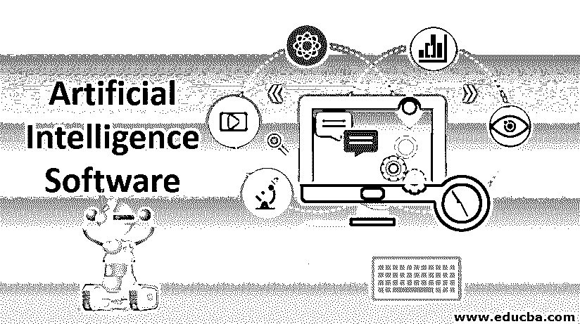

# 人工智能软件

> 原文：<https://www.educba.com/artificial-intelligence-software/>

## 人工智能软件介绍

[人工智能](https://www.educba.com/what-is-artificial-intelligence/) (AI)平台是为从零开始构建应用程序而打造的。内置公式可用于此用途。拖放方法使它对用户友好。聊天机器人是一种流行的软件，它提供参与对话的人。深度学习软件也参与了语音和图像识别。机器学习软件是一种让计算机利用可用信息进行学习的方法。人工智能是科学和计算机的结合属性，它使系统或程序或任何机器执行人类的智能和想象功能，独立地解决问题，能够做出决策。

人工智能软件系统的主要目标是拥有发现能力，这使得人们随着时间的推移提高他们的性能和生产率。[人工智能工具](https://www.educba.com/artificial-intelligence-tools/)包括机器学习和深度学习，它给出分析报告，以增加规划、推理、思考、解决问题以及学习的清晰度。

<small>Hadoop、数据科学、统计学&其他</small>

### 人工智能软件的类型

以下是不同类型的人工智能软件:

#### 1.谷歌云机器语言

这个软件有助于训练系统的用户。这些元素包括 Google 云平台控制台、gcloud 和 REST API。谷歌云有助于分析、培训和修改用户的系统。开发和设计的系统部署在用户基础设施中。用户将接收预测，并且对预测的监控将能够管理用户设计及其相关版本。Google Cloud ML 有三个组件，包括 Google Cloud 平台控制台、gcloud 和 Rest API，用于设计、分析和部署用户界面。它提供稳定和坚实的支持。

#### 2.Azure 机器学习工作室

该工具用于部署用户设计，因为云中的 web 应用程序在独立的平台上工作，并且能够使用可用的数据源。它为基于浏览器的问题提供解决方案，可扩展、简单且易于使用。这里不需要编程技能，并且可以与开源技术集成。

#### 3.张量流

这是一个开源系统中的数值计算工具。这是一个用于研究和开发的 ML 知识库。这些解决方案可以部署在 CPU、TPU、GPU、移动电话集群和台式机上。它提供了良好的通信支持和常规功能。初学者和有经验的人都可以通过[张量流](https://www.educba.com/what-is-tensorflow/)使用 API 进行开发。但是了解它的完整过程需要时间。

#### 4.艾

该软件用于银行、医疗保健、保险、营销等。这是开源的，它允许用户应用像 [R 和 Python](https://www.educba.com/r-vs-python/) 这样的编程语言来设计系统。这里包括 AutoML 功能，并支持许多技术，如梯度增强机器和深度学习。这个程序提供了一个线性平台，并执行分布式存储结构。

#### 5.科尔塔纳

它是一个虚拟助手，通过设置提醒和给出问题的解决方案来同时运行许多任务。它可以在 Windows、iOS、Android 和 Xbox 操作系统上运行。它还可以执行一个简单的任务，从关闭空调到订购蛋糕。它使用 Bing 搜索引擎，除了英语之外，它还支持葡萄牙语、中文、意大利语和西班牙语。它通过语音控制操作，以节省时间。但这里的主要缺点是一些 Fitbit 场景只在美国可用。

#### 6.IBM 沃森

它就像一个 Q 和一个会话，在 Apache Hadoop 的框架下为 SUSE Linux 服务器提供服务。如果用户用 Watson 设计他的系统，就有可能从该设备获得高度的理解和高效的输出。它从微小的信息中收集知识，并使用 API 进行应用程序开发。这是一个强大的系统，使更聪明的业务。

#### 7.销售力量爱因斯坦

它作为一个智能客户关系管理系统，用于营销、销售、商业、分析，并通过添加新实体来提供更多关于可用机会的信息，从而捕获和处理数据。它通过优先化基于历史运行。它建议最好的产品。图像识别可让您更深入地了解特定产品。它不需要数据准备和系统管理。

#### 8.Infosys Nia

它通过解决复杂的任务来促进企业发展，并有助于改善系统以增强业务能力。核心组件是数据平台、知识平台和自动化平台。它为编程任务提供了对话界面和自动化。认知和预测自动化依赖于自动化平台。知识平台用于获取、处理和重用数据。数据平台服务于机器学习平台和数据分析。

#### 9.亚马逊 Alexa

类似于 Cortana 可以听懂英语、德语、法语、意大利语、日语。这是一项基于云的服务，可以使用 Alexa 语音服务与现有产品集成。它可以连接数以百万计的设备和蓝牙设备，如娱乐系统、相机、灯等。

#### 10.谷歌助手

它是谷歌的虚拟助手，可以在智能家居设备和手机上使用。Android、iOS 和 KaiOS 都支持操作系统。许多语言可用，如英语，德语，日语，意大利语，荷兰语，葡萄牙语，俄语等。它被用作双向对话。它可以做所有的服务，如设置闹钟，显示谷歌账户信息，事件安排，还可以对设备进行硬件设置，用于识别物体，歌曲和学习视觉信息。它可以安装在汽车、电话、扬声器、手表、笔记本电脑上。

### 人工智能软件中的工具

包括的一些附加工具有:

*   Ayasdi 是一个人工智能工具，特别适用于金融、医疗保健和公共部门。
*   Scikit learn 是一款[数据分析工具](https://www.educba.com/data-analysis-tools/)，可作为开源软件使用，用于分类、对象分组、回归和降维。这里的编程语言是 python。
*   Meya 用于开发人员的认知平台，用于设计、构建、测试和部署他们的系统或产品。
*   Viv 是 Siri 的个人助理，为开发者发布产品提供支持。
*   区块链是数字银行的钱包，用于发送、保存和收集数字货币。

### 结论

在日常生活中，人工智能在我们周围的通信、时间管理、教育、认知、健康、安全措施、交通控制、采购、营销、购物和规划等方面得到实施并成功发展。人工智能在科学中用于设计实验、训练资源、解释数据、降低复杂性。

### 推荐文章

这是人工智能软件的指南。在这里，我们讨论了不同类型的人工智能软件以及附加工具的简要概述。您也可以浏览我们推荐的其他文章，了解更多信息——

1.  [人工智能职业](https://www.educba.com/careers-in-artificial-intelligence/)
2.  [人工智能面试问题](https://www.educba.com/artificial-intelligence-interview-questions/)
3.  [人工智能公司](https://www.educba.com/artificial-intelligence-companies/)
4.  [人工智能中的智能体](https://www.educba.com/agents-in-artificial-intelligence/)

