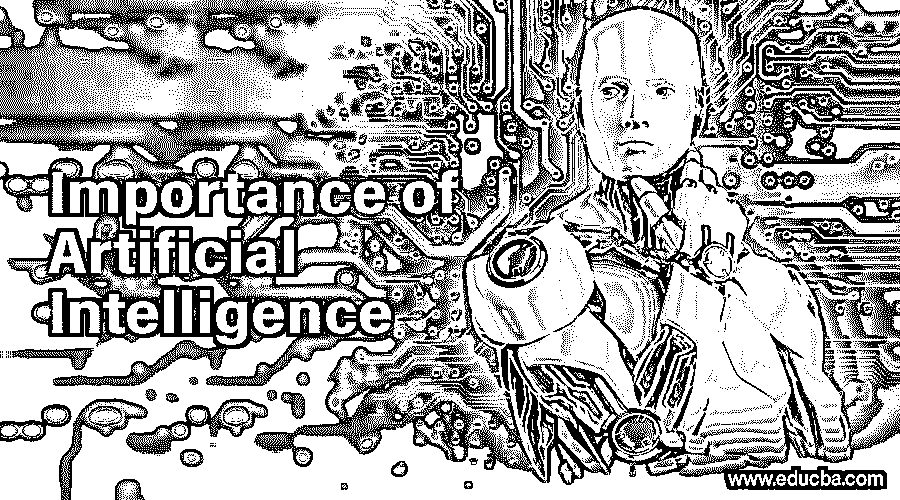

# 人工智能的重要性

> 原文：<https://www.educba.com/importance-of-artificial-intelligence/>

## 人工智能重要性介绍

在计算机科学和计算机领域，单词[人工智能](https://www.educba.com/what-is-artificial-intelligence/)发挥了非常突出的作用，最近，由于人工智能和机器学习领域的最新进展，该术语变得更加流行。机器学习是人工智能的一个领域，机器负责结束日常家务，被认为比人类更聪明。机器人技术以及与[物联网设备](https://www.educba.com/iot-devices/)的集成已经使机器的思维和工作达到了一个全新的水平，在这个水平上，它们凭借其认知能力和聪明程度超越了人类。众所周知，它们学习、适应和表现的速度比人类应该做的和被编程的要快得多。在这篇文章中，我们将读到人工智能的巨大重要性。

### 人工智能的重要性

下面我们将读到人工智能的巨大重要性:

<small>Hadoop、数据科学、统计学&其他</small>

*   人工智能及其后续组件的重要性在相当长的时间内就已经为人所知。它们被视为让这个世界变得更美好的工具和技术。这并不是说你必须去使用这些新奇的科技产品才能使用它们。你可以简单地四处看看，我敢肯定你的大多数任务都是由人工智能来完成的。
*   它的重要性在于让我们的生活更轻松。这些技术对人类来说是一笔巨大的财富，并且被编程为尽可能地减少人类的努力。他们倾向于拥有以自动化方式工作的能力。因此，在操作与该技术相关的部件时，手动干预是最不可能要求或看到的。
*   这些机器往往会加快你的任务和过程，同时保证一定程度的精度和准确性，因此，这就是为什么他们是一个有用的和重要的工具。除了通过简单的日常技术使世界成为一个没有错误的地方，这些技术和应用不仅与我们的日常生活相关。它还对其他领域产生影响并具有重要性。

### 人工智能的四大用途

以下是人工智能的重要用途:

#### 1.在医学领域

*   人工智能对医疗行业产生了巨大的影响，因此改变了医疗行业的面貌。已经有各种机器学习算法和模型有效地工作来预测各种关键用例，例如基于症状和健康记录和历史来确定特定患者是否患有恶性或良性癌症或肿瘤。它还被用于未来的预测，患者被告知他们健康状况的恶化，以及他们应该采取的预防措施，以恢复正常健康的生活。
*   人工智能创造了一种虚拟护理私人助理，它是专门为人们的需求而构建的，被广泛用于监控和研究不同类型的病例，并分析过去的病例及其结果。它还通过预测可以改进的地方并让自己变得更聪明，来提高他们的模型和助理的效率。
*   医疗保健机器人的使用是医疗行业在医疗领域采取的另一个有效举措，众所周知，医疗机器人可以提供 24/7 的援助，并承担管理预约的不太重要的工作。如果没有这些基于智能人工智能的机器的干预，这是不可能的。

#### 2.在航空运输领域

*   世界上主要的系统运输之一是航空运输，因此迫切需要优化其运营方式。这里出现了人工智能的参与，机器参与规划航线，以及航班着陆和起飞图表。
*   导航地图和滑行路线，以及对整个驾驶舱面板的快速检查，以确保每个组件的正确工作，已经在许多飞机上使用人工智能来执行。这已经产生了非常有希望的结果，因此被非常频繁地采用。人工智能在航空运输领域的最终目的是给人类带来轻松和更舒适的旅程。

#### 3.在银行和金融机构领域

*   人工智能在管理金融交易以及处理银行中的许多其他活动方面一直扮演着重要的角色。银行的日常工作，如交易和金融业务、股票市场资金及其管理等。正在被这些机器学习模型以一种更简单有效的方式处理。
*   监控可疑金融交易并向监管机构报告的反洗钱等使用案例是在银行和金融行业使用[人工智能](https://www.educba.com/artificial-intelligence-ethics/)的经典案例。其他使用案例包括在信用卡公司中流行的信用系统分析，其中在地理级别上跟踪可疑的信用卡交易，并基于各种参数进行处理和解决。

#### 4.在游戏和娱乐领域

*   从虚拟现实游戏到今天的现代游戏，这是人工智能取得最大飞跃的一个行业。机器人总是和你一起玩，因此你不需要有第二个人来玩。
*   由于人工智能的出现，个人细节和图形的水平也成为可能，并将这个行业带到了一个不同的水平。

### 结论

人工智能比这篇文章中读到的有着更高的意义和重要性。这将在未来继续增长。不要错过，参与进来，尽可能地享受技术带来的乐趣。一定要写信告诉我们你对这篇文章的看法。请继续关注我们的博客。

### 推荐文章

This is a guide to the Importance of Artificial Intelligence. Here we discuss the basic concept, importance of Artificial Intelligence along with its uses. You can also go through our other suggested articles to learn more –

1.  [人工智能类型介绍](https://www.educba.com/types-of-artificial-intelligence/)
2.  [人工智能的优势| 7 大优势](https://www.educba.com/advantages-of-artificial-intelligence/)
3.  [顶级惊人的人工智能工具&amp；应用程序](https://www.educba.com/artificial-intelligence-tools-applications/)
4.  [人工智能的未来|四大领域](https://www.educba.com/future-of-artificial-intelligence/)
5.  [人工智能使用指南](https://www.educba.com/uses-of-artificial-intelligence/)

