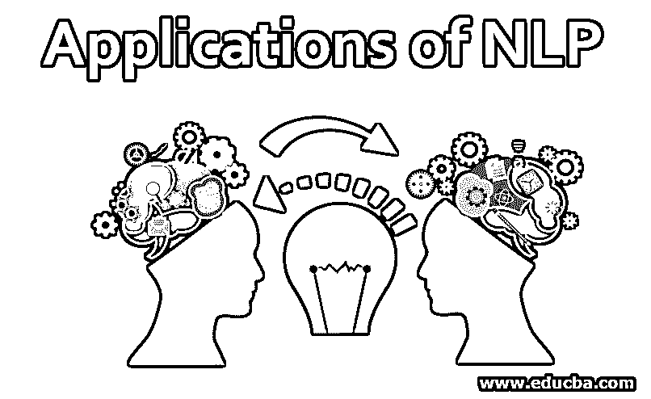
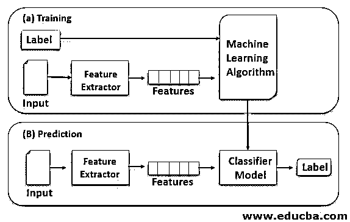
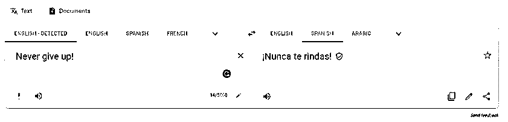
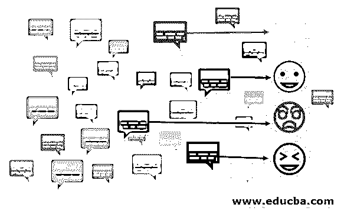
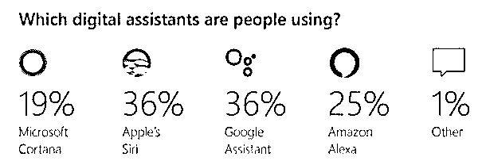

# 自然语言处理的应用

> 原文：<https://www.educba.com/applications-of-nlp/>

## 自然语言处理应用介绍

在这个世界上数以百万计的物种中，只有智人具有口语能力。从洞穴绘画到网络交流，我们走过了漫长的道路！随着我们向人工智能迈进，向机器人传授人类天生的语言和交流技能似乎是合乎逻辑的。这就是 NLP 作为人工智能的一个子集来构建能够理解语言的系统的地方。再加上机器学习(另一个令人敬畏的人工智能子集)，瞧，我们可以建立能够理解语言、学习并随着时间的推移而改进的系统，而无需显式编程。

### 自然语言处理的不同应用

下面给出了 NLP 的不同应用。

<small>Hadoop、数据科学、统计学&其他</small>

#### 1.文本分类

文本是非结构化数据的一种形式，其中包含非常丰富的信息。文本分类器对我们目前使用的几乎任何形式的文本进行分类和组织。由于文本是非结构化的，对它们进行分析、排序和分类可能非常困难和耗时，有时甚至是人类的乏味工作，更不用说人类在这个过程中容易犯的所有错误了。这就是文本分类在 picture 中的位置，它的目的是以更高的可伸缩性和准确性执行上述任务。

当用一些基本规则训练机器学习分类器时，文本分类更有效。使用深度学习的方法，如 CNN 和 RNN，结果只会随着我们生成的文本数据的增加而变得更好。也可以使用“文字云”使其具有视觉吸引力。文本分类可以应用于从垃圾邮件过滤到品牌监控的一系列任务。对于企业来说，一个重要的关键和反馈是他们的产品如何打动他们的目标消费者，文本分类通过对人们对所述品牌、价格和功能的意见进行分类来回答商业问题。

#### 2.机器翻译

实现多语言往往是一项艰巨的任务，所以为了让我们的生活更容易，至少在交流方面，机器翻译来了。在 50 年代初，IBM 推出了一个只有 250 个单词的机器翻译系统，将化学领域精心挑选的 49 个俄语句子翻译成英语。近几年来，随着实现[神经网络](https://www.educba.com/what-is-neural-networks/)的资源投入，机器翻译的质量有了显著提高，语言之间的翻译就像在现有的智能手机或平板电脑上按下按钮一样简单。谷歌翻译支持 100 多种语言，甚至可以翻译多达 37 种语言的语言图像。

Google translate translating English to Spanish.

这种类型的机器翻译是通过使用[递归神经网络(RNN)](https://www.educba.com/recurrent-neural-networks-rnn/) 实现的。RNN 可以作为

*   “固定顺序”，其中输入以图像的形式给出(固定大小)，并且经过适当的训练，机器输出相同的合适标题。
*   “序列对序列”，输入以序列的形式给出(比如语言 1)，输出以另一组序列的形式给出(比如语言 2)。
*   “序列到固定”，其中输入作为序列给出，输出是固定大小的。这通常应用于接下来要探讨的情感分析。

#### **3。**情感分析

反馈是良好沟通的基本要素之一。无论是一部全新的电影还是最近推出的尖端技术，目标观众的反应是决定他们成败的关键。因此，分析人们对产品的情感比以往任何时候都重要。

单词袋(BOW)方法在情感分析中非常流行，在该方法中，单词的原始顺序被丢失，但是被观察的句子被简化为实际上有助于确定情感的单词。这种方法使用统计方法对单词进行分组，语言处于次要地位。蝴蝶结可以被认为是一本巨大的字典，每个单词都有自己独特的价值，有助于总结情感。

#### 4.聊天机器人

如今，几乎所有其他网站都由一个旨在让我们的体验更好、更简单的机器人支持。聊天机器人是专为使用人工智能技术与人类或其他机器进行互动而设计的机器人。聊天机器人的设计考虑到了人与人之间的互动。聊天机器人的使用可以追溯到 1966 年，当时麻省理工学院设计了第一个名为“伊莱扎”的聊天机器人。伊莱扎可以和与之互动的人保持流畅的对话。这导致了聊天机器人的发展，它可以对患有心理问题的人产生积极的影响。

1995 年，伊莱扎发明了“爱丽丝”,使用启发式模式匹配规则与用户保持对话，之后，爱丽丝在 20 世纪的剩余时间里变得非常受欢迎，也是苹果 SIRI 和电影的灵感来源。最近，一个名为“JOY”的聊天机器人被开发出来，旨在跟踪和改善心理健康。Joy 每天至少检查你一次，问你过得怎么样，并根据你的回答拦截你的情绪，看你是开心、悲伤还是焦虑。近年来，利用 IBM 的 Watson 和 Google 的 dialog flow 等 API，设计一个简单的聊天机器人变得比以往任何时候都容易。

#### 5.虚拟助手

从设置闹钟到在你感到无聊时制作购物清单来娱乐你，虚拟助理在我们的日常生活中发挥了巨大的作用。它们被设计成接受用户的语音命令并执行委托给它们的任务。虚拟助手旨在以非常人性化的方式与人类互动；他们的大多数反应会让你感觉像是从朋友或同事那里得到的反应。除了 NLP，虚拟助手还专注于自然语言理解，以便跟上用户输入背后不断增长的俚语、情感和意图。

虚拟助理从人工神经网络中学习，可以比聊天机器人保持更长时间的任何对话。它们甚至作为语音到文本转换和文本到语音转换的经典例子。虚拟助手也可以被赋予更复杂的任务，如决策，它们随着每次交互而成熟，可以提供更个性化的体验。

### 结论

使用 NLP 的应用程序的增长只是在过去几年中取得的进展，并且还将继续下去。语言在我们的历史中一直扮演着举足轻重的角色，随着最先进的机器翻译，我们正在慢慢打破曾经限制我们与其他人和文化互动的语言障碍。无论是在家里还是在外面，我们都在依赖这种先进的技术来完成日常任务。现在是探索 NLP 能提供给我们的所有可能性的最佳时机。

### 推荐文章

这是自然语言处理的应用指南。在这里，我们讨论了自然处理语言的介绍和各种应用，并详细解释。您也可以看看以下文章，了解更多信息–

1.  [机器学习编程语言](https://www.educba.com/machine-learning-programming-languages/)
2.  [Linux 代理服务器](https://www.educba.com/linux-proxy-server/)
3.  [人工智能应用](https://www.educba.com/artificial-intelligence-applications/)
4.  [深度学习算法](https://www.educba.com/deep-learning-algorithms/)

