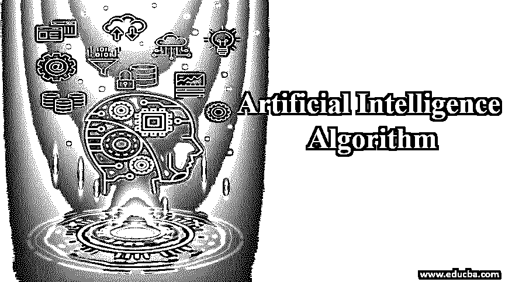
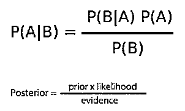

# 人工智能算法

> 原文：<https://www.educba.com/artificial-intelligence-algorithm/>

## 什么是人工智能算法？

人工智能算法是一个研究领域，我们希望计算机做人类做的事情。显然，计算机在计算和分析能力方面更快，但是计算机不能自己做决定，也就是说它们没有能力做决定。赋予计算机以自己的智能做出决定的能力，就是人工智能。

现在的问题是，如何做到这一点？

<small>Hadoop、数据科学、统计学&其他</small>

这里我们遇到了人工智能算法。这些特殊的算法能够发现模式，并提出决策过程。这些人工智能算法应用于广泛的领域，如机器人、营销、商业分析、农业、医疗保健等。

### 人工智能算法的类别

人工智能算法是一个由机器学习算法和深度学习算法组成的广阔领域。这些算法的主要目标是让计算机能够自主学习并做出决定或找到有用的模式。人工智能算法从数据本身学习。从广义上讲，学习可以分为 3 类:

*   **监督学习**:输入输出时，两个标签都是已知的，模型从数据中学习，对相似的输入数据预测输出。
*   **无监督学习**:当输出数据未知，或者需要在给定的数据中寻找模式时，这种类型的学习就是无监督学习。
*   **强化学习:**算法从经验中学习执行一个动作。在这里，算法通过反复试验来学习，哪种行为会产生最大的回报。目标是选择在给定时间内最大化预期回报的行动。

根据人类遇到和解决的问题，这些算法可以分为三类，以执行相同的操作。

1.  **分类:**人类确实基于分类做决策；比如这件衬衫穿在我身上会不会好看？所以在这里，人类的大脑会用之前的经验(数据)处理一些算法，然后输出是或者不是，同理，这些分类算法会取一些输入数据并以此为基础。它将预测是或否。这些算法的一些例子是朴素贝叶斯，逻辑回归，SVM 等。
2.  **回归:**这里，输出是连续的；没有具体的类别。例如，明天的温度是多少？人类的大脑会想起前几天的季节和温度，并预测一些数字。这些算法的一些例子是线性回归、梯度推进、随机森林等。
3.  **聚类:**有时候，我们不需要对给定的输入做出决定，而是要区分出奇数个。例如，隔离不同的人种白人和黑人，或者看到一幅画，发现不同的图案。这些算法的一些例子是 K-均值聚类、层次聚类等。

我们将讨论每个类别中的一种算法:

#### 1.朴素贝叶斯

*   它用于分类问题，并且假设预测器是独立的，并且具有一个不影响另一个预测器特征的特征。
*   例如，橙色可以被认为是橙色、圆形、直径约 6 厘米。所有这些变量并不相互依赖，也可能不依赖于另一个变量的存在，但所有这些特征独立地促成了水果是一个橙子的事实，这就是它被称为“幼稚”的原因。
*   朴素贝叶斯模型用于非常大的数据集。它很简单，也胜过高度复杂的分类模型。
*   朴素贝叶斯分类器基于贝叶斯概率，用于计算后验概率(处理新证据并在每一步完善假设)。在朴素贝叶斯中，计算每个独立变量的概率，然后用贝叶斯方法预测结果。

#### 2.随机森林

*   随机森林是集成学习的一个版本，用于回归问题，尽管它也可以用于分类问题。
*   集成学习:多次采用多个算法或同一算法，然后它将它们放在一起，做出比单个决策树强大得多的东西。
*   在随机森林中，我们用许多决策树来预测产量。然后，我们使用集成算法对它们进行集成，该集成算法将进一步从所有决策树中获取输出的计数/平均值，并预测最终结果。
*   集成算法更稳定，因为数据集中的任何变化都会影响决策树，但对它们来说，影响树的森林远比给模型带来稳定性更困难。

#### 3.k 均值聚类

这是一种用于无监督学习的算法。k 是我们想要的聚类数。我们可以通过 5 个基本步骤来理解它:

1.  对于 K 个簇，我们选择 K 个随机数据点，称为初始质心。
2.  找出从数据点到质心的欧几里德距离，并将每个数据点分配到最近的质心。(取平均值，赋给数据点)。
3.  重新计算从新聚类位置到所有数据点的欧几里德距离。
4.  取平均值并将其指定为新的聚类质心。
5.  不断重复，直到满足收敛。

当算法达到迭代预算时，可以终止算法。K-means 对数据的规模很敏感，因此建议在运行此算法之前对数据集进行标准化。

### 结论

人工智能算法是一个由机器学习算法和深度学习算法组成的广阔领域。人工智能算法赋予机器做出决策、识别模式并得出有用结论的能力，这基本上意味着模仿人类智能。在上面的文章中，我们探索了学习方法(监督、非监督和强化学习)的广阔领域，其中这些算法用于得出结论。此外，这些算法根据问题的类型分为三类，即:分类、回归和聚类方法。我们已经讨论了用于分类的朴素贝叶斯算法、用于回归的随机森林算法以及用于聚类问题的 K-means 聚类算法。

### 推荐文章

This is a guide to the Artificial Intelligence Algorithm. Here we discuss the Introduction to Artificial Intelligence Algorithm along with its categories. You can also go through our other suggested articles to learn more –

1.  [人工智能的种类](https://www.educba.com/types-of-artificial-intelligence/)
2.  [人工智能的优势](https://www.educba.com/advantages-of-artificial-intelligence/)
3.  [人工智能 vs 人类智能](https://www.educba.com/artificial-intelligence-vs-human-intelligence/)
4.  [人工智能的未来](https://www.educba.com/future-of-artificial-intelligence/)

