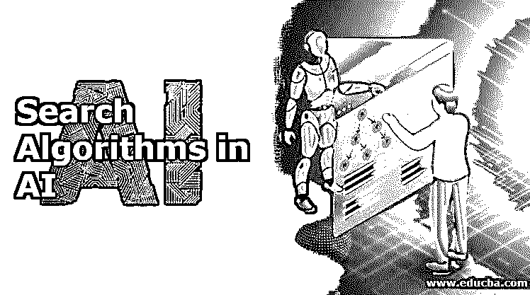
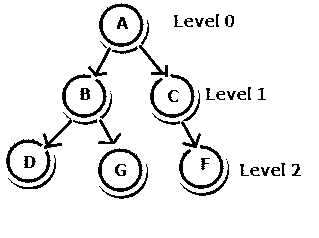
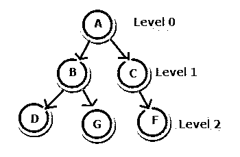
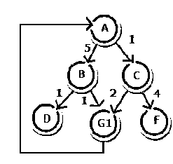
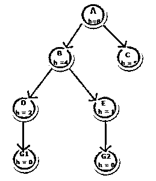

# 人工智能中的搜索算法

> 原文：<https://www.educba.com/search-algorithms-in-ai/>

## 人工智能中的搜索算法简介

[人工智能](https://www.educba.com/what-is-artificial-intelligence/)基本上是通过计算机系统或机器对人类智能的复制。它是通过知识或信息的获取和信息所使用的规则的添加即学习，然后利用这些规则得出结论(即推理)再自我修正的过程来完成的。

### 搜索算法的属性

*   **完整性:**如果对于任何特定的输入，至少存在一个解决方案，则当搜索算法返回该输入的解决方案时，该搜索算法是完整的。
*   **最优性:**如果算法推导出的解是最佳解，即具有最低的路径成本，则该解被认为是最佳解。
*   **时间和空间复杂度:**时间复杂度是一个算法完成其任务所需的时间，空间复杂度是搜索操作过程中需要的最大存储空间。

### 搜索算法的类型

下面解释了两种类型的搜索算法:

<small>Hadoop、数据科学、统计学&其他</small>

*   无知的
*   见多识广的

#### 1.不知情的搜索算法

不知情的搜索算法没有任何领域知识。它以强力方式工作，因此也被称为[强力算法](https://www.educba.com/brute-force-algorithm/)。它不知道目标节点有多远，它只知道如何遍历并区分叶节点和目标节点。它在没有任何先验知识的情况下检查每个节点，因此也称为盲搜索算法。

不知情搜索算法主要有三种类型:

*   广度优先搜索(BFS)
*   深度优先搜索
*   [统一成本搜索](https://www.educba.com/uniform-cost-search/)

##### 广度优先搜索(BFS)

*   在广度优先搜索中，树或图是横向遍历的，即它从称为搜索关键字的节点开始，然后在该深度优先搜索关键字的所有相邻节点，然后移动到下一级节点。它是使用基于先进先出(FIFO)概念的队列数据结构实现的。这是一个完整的算法，因为如果有解，它会返回一个解。
*   [广度优先搜索](https://www.educba.com/breadth-first-search/)的时间复杂度是 b d 其中 b(分支因子)是任何给定节点的平均子节点数，d 是深度。
*   这种算法的缺点是它需要大量的内存空间，因为它必须为下一级存储每一级的节点。它还可以检查重复的节点。
*   **示例:**如果搜索从根节点 A 开始到达目标节点 G，那么它将遍历 A-B-C-D-G。它逐级遍历，即首先探索最浅的节点。

##### 深度优先搜索

*   在深度优先搜索中，树或图是以深度方式遍历的，即，它从称为搜索关键字的节点开始，然后沿着分支探索所有节点，然后回溯。它是使用基于后进先出(LIFO)概念的堆栈数据结构实现的。
*   广度优先搜索的时间复杂度是 b d ，其中 b(分支因子)是任何给定节点的平均子节点数，d 是深度。
*   它以线性方式存储节点，因此需要的空间更少。
*   主要缺点是该算法可能会陷入无限循环。
*   **示例:**如果搜索从根节点 A 开始到达目标节点 G，那么它将遍历 A-B-D-G。它沿深度方向遍历，即首先探索最深的节点。

##### 统一成本搜索

*   统一成本搜索不同于 DFS 和 BFS。在这种算法中，成本会考虑在内。可能有不同的路径来达到目标，因此具有最小成本(成本的累积和)的路径是最优的。它以成本递增的顺序遍历路径。如果每次转换的成本相同，这类似于广度优先搜索。
*   广度优先搜索的时间复杂度是 b d ，其中 b(分支因子)是任何给定节点的平均子节点数，d 是深度。

*   **举例:**如果搜索从图的节点 A 开始到达目标节点 G，那么它将遍历 A-C-G1。费用是 3 英镑。

#### 2.知情搜索算法

知情的搜索算法具有领域知识。它包含问题描述以及额外的信息，比如目标节点有多远。它也被称为启发式搜索算法。它可能不会总是给出最优解，但它肯定会在合理的时间内给出一个好的解。它比不知情的人更容易解决复杂的问题。

它主要有两种类型:

*   贪婪最佳优先搜索
*   A*搜索

##### 贪婪最佳优先搜索

在这个算法中，我们扩展了离目标节点最近的节点。通过启发式函数 h(x)粗略计算接近因子。当 f (n) = h (n)时，节点被扩展或浏览。该算法通过优先级队列实现。这不是一个最佳算法。它会陷入循环。

*   **举例:**如果我们需要使用贪婪搜索找到从根节点 A 到任何具有最小成本的目标状态的路径，那么解决方案将是 A-B-E-H **。**它会从 B 开始，因为它的成本比 C 小，然后是 E，因为它的成本比 D 小，然后是 G2。

##### A*搜索

A*搜索是贪婪搜索和统一成本搜索的组合。在该算法中，由 f(x)表示的总代价(启发式)是由 g(x)表示的均匀代价搜索的代价和由 h(x)表示的贪婪搜索的代价之和。

f (x) = g (x) + h (x)

其中 g(x)是后向成本，它是从根节点到当前节点的累积成本，h(x)是前向成本，它是目标节点和当前节点的距离的近似值。

### 结论

在本文中，结合实例详细解释了各种人工智能搜索算法。AI 正在快速增长并获得市场，搜索算法是人工智能的重要组成部分。

### 推荐文章

这是人工智能中搜索算法的指南。这里我们讨论人工智能中搜索算法的介绍、属性和类型。您也可以看看以下文章，了解更多信息–

1.  [在数据结构中搜索](https://www.educba.com/searching-in-data-structure/)
2.  [深度学习算法](https://www.educba.com/deep-learning-algorithms/)
3.  [机器学习算法的类型](https://www.educba.com/types-of-machine-learning-algorithms/)
4.  [用 Python 发送邮件](https://www.educba.com/send-mail-in-python/)
5.  [不知情搜索指南](https://www.educba.com/uninformed-search/)

