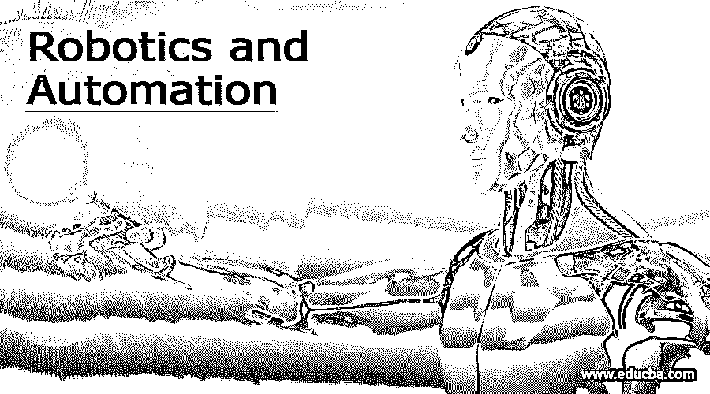

# 机器人和自动化

> 原文：<https://www.educba.com/robotics-and-automation/>

## 机器人和自动化的定义

“机器人”是指我们可以创建来完成任务和使用机器人机器的软件。自动化使工作自动发生，并被用于各种行业和商业。机器学习模型、自然语言处理(NLP)、字符和图像识别等高级人工智能技能现在可能会被纳入 RPA 机器人。

### 机器人与自动化导论

机器人学是工程学的一个分支，涉及机器人的设计和制造，以及使用计算机来操纵和重用它们。在制造业中，机器人被用来加速生产过程。RPA 非常适合拥有大量人力资源、it 和财务部门的大公司，因为它自动化了劳动密集型工作流、基础架构和后台程序。机器人是工业自动化的一个子类，因为机器人只不过是一组传感器和处理器，通过它们可以完成工业任务，就像 PLC 一样。软件机器人，也称为工作站自动化或机器人过程自动化，是将虚拟操作而不是物理操作自动化的计算机程序。

<small>Hadoop、数据科学、统计学&其他</small>

软件自动化和工业自动化是两种最常见的自动化类型。用于实现各种形式的自动化的应用领域和技术各不相同。软件自动化是一种软件程序，它被编程为使用人类在使用计算机应用程序时使用的相同逻辑来执行重复的家务。让我们想象一下，我们需要加快我们的生产运作，需要更快地组装产品。一个机器人也许能帮上忙。如果我们想让重复的管理活动更加有效，软件驱动的过程自动化会更适合。控制和维护物理过程是工业自动化的核心。亚马逊的全自动化制造就是一个很好的例子:
亚马逊的仓库有机器人:这或许可以解释为什么 FBA 的运输时间如此之短。工业自动化中有各种不同种类的机器。例如，在工业部门，通常使用数控机床。机器人是唯一一种机器。

### 机器人和自动化之间的直接比较(信息图表)

以下是机器人和自动化之间的 9 大区别:

### 机器人和自动化的主要区别

尽管“机器人”和“自动化”这两个词有时可以互换使用，但这两个词之间还是有一些重要的区别，以及它们所代表的含义。

1.机器人更好地定义为自动化的一个子类，它包括不需要任何硬件的软件代理。
2。它由一套编程和机电一体化控制，允许它执行各种复杂的系列动作。自动化因使用的组件而异。
3。另一方面，制造商每天都在与机器人和自动化打交道，因为他们创造的电气产品让我们的生活变得更加轻松。
4。当谈到自动化系统或机器在短时间内完成任务，并以最大的精度，机器人和自动化齐头并进。两者都是机械工作的工业机器。
5。机器人并不用于所有的自动化领域，也不是所有的机器人都是为过程自动化而制造的。然而，大多数机器人正是用于这一目的——尤其是在工业环境中。例如，一个玩具循线机器人可以独立地跟随画在地板上的线。但是，它不是自动化，因为它没有执行一项明确的职责。这种循线机器人将被认为是自动化的，而不是在医院里运送药物。
6。自动化和机器人的目标不是从工作场所消灭所有人类工人。它们只是用来加速生产和减少可能发生的错误。自动化有许多不同的种类，从完全机械的到完全虚拟的。它们的难度也从简单到令人难以置信不等。协作机器人配药系统是结合两者的一个很好的例子。
7。许多自动化将不包括机器人作为组件。机器人只是一件工业设备，可以组合起来形成半自动或全自动系统。
8。RPA 的主要目标是减少员工，而其他自动化技术旨在减少处理时间。非技术人员可以使用 RPA 技术来提高生产力，让他们专注于无法自动化的更重要的任务，而传统的自动化只适用于技术用户。

### 比较机器人和自动化

|  | **机器人技术** | **自动化** |
| **定义** | 机器人工程包括机器人设计和开发中的软件、硬件、传感器和其他设备。需要人类的参与 | 设计和开发软件、机器和其他技术来执行通常由人类执行的工作被称为自动化工程。它需要一个重复运动的信号。 |
| **编程技巧** | RPA no longer necessitates programming expertise to automate any application. | 自动化就像绘制流程图或图表一样简单，但是用户必须学会如何使用自动化功能。 |
| **用途** | 机器人 | 使用微处理器和计算机设备。 |
| **工具** | 尽管 RPA 现在不被用作测试技术，但将来可能会被用作测试技术。 | 各种自动化技术，如硒，QTP 和 Jmeter，被用来进行专门类型的测试。 |
| **类型** | 软件机器人，工业机器人 | 软件和工业自动化。自动化专注于独一无二的已完成工作。自动驾驶机器人将对自己的行为有更多的控制。 |
| **Advantages** | Adaptability and flexibility.有更广泛的概念。 | 

它能以最有效的方式精确地适应一个过程。因此，制造速度通常可以提高。

是自动化的一个子类。

 |
| **可扩展性** | 具有良好的处理能力。 | 需要编程方法来执行。 |
| **成本** | 成本高。 | 降低了操作过程的成本。 |
| **应用程序** | 受雇于核科学、海洋勘探、传输电信号维护和生物医疗设备设计 | 医药、军事、农业。 |

### 结论

到本文结尾时，我们已经看到了其中的区别，并探索了协作机器人如何彻底改变了传统机器人和生产的世界。我们只能得出结论，在这两种技术中，用来使机器或装置自动化的小工具和仪器是不同的。与自动化相比，机器人技术是一种更先进的技术。

### 推荐文章

这是机器人和自动化指南。这里我们分别讨论信息图和比较表的主要区别。您也可以看看以下文章，了解更多信息–

1.  [POP3 vs SMTP](https://www.educba.com/pop3-vs-smtp/)
2.  [什么是机器人？](https://www.educba.com/what-is-robotics/)
3.  [【xubuntu vs kubuntu】](https://www.educba.com/xubuntu-vs-kubuntu/)
4.  [pCloud vs Google Drive](https://www.educba.com/pcloud-vs-google-drive/)

