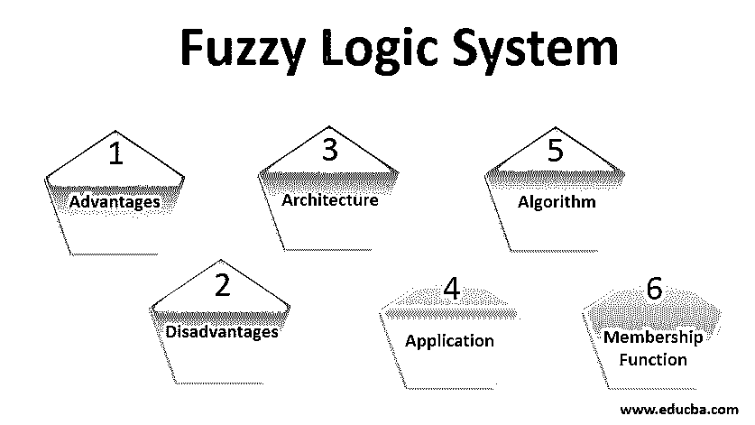
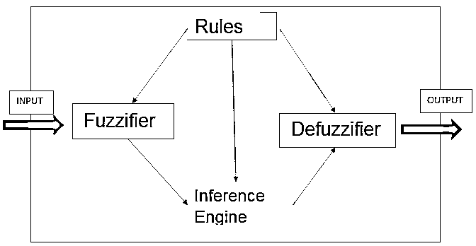

# 模糊逻辑系统

> 原文：<https://www.educba.com/fuzzy-logic-system/>

## 模糊逻辑系统导论

模糊逻辑是一种基于“真实度”的计算方法，并不限于布尔“真或假”“模糊”这个词的意思是模糊或不十分清楚的东西。模糊逻辑系统适用于难以将状态分类为二进制“真或假”的情况模糊逻辑可以包含中间值，如部分真和部分假。它可以在从小型微控制器到大型 It 系统的各种设备上实施。它试图模仿类似人类的决策，这种决策可以将真假之间的所有值结合起来。

### 一种模糊逻辑系统的体系结构

模糊逻辑系统有四个主要组件，下面的架构图对此进行了解释:

<small>Hadoop、数据科学、统计学&其他</small>

*   **规则:**规则库由一大组规则组成，这些规则由专家编程和提供，用于管理模糊系统的决策。规则是一组“If-Then”语句，根据条件决定事件的发生。
*   **模糊化:**模糊化将传感器测得的原始输入转换成模糊集。这些转换后的输入被传递到控制系统进行进一步处理。
*   **推理引擎:**它有助于将规则映射到输入数据集，从而决定将哪些规则应用于给定的输入。这是通过计算给定输入的规则匹配百分比来实现的。
*   **去模糊化:**是模糊化的反义词。在这里，模糊集被转换成清晰的输入。这些清晰的输入是模糊逻辑系统的输出。

### 隶属函数

隶属函数定义了模糊系统的输入如何映射到 0 和 1 之间的值。输入通常被称为 Universe (U ),因为它可以包含任何值。隶属函数定义为:

μ A:X → [0，1]。

这里 X 代表宇宙，Y 代表 0 到 1 之间的任意值。三角形隶属函数是最常用的隶属函数。其他隶属函数包括梯形、高斯和 Singleton。

### 为什么以及何时使用模糊逻辑？

当你想在控制系统中模仿人类思维时，模糊逻辑特别有用。比起精确的推理，它更注重可接受的推理，这与现实世界的运行方式非常接近。它被设计用来处理不确定性，并且擅长从结论中找出推论。

#### 模糊逻辑系统算法

1.  定义将作为模糊系统输入的所有变量和术语
2.  为系统创建隶属函数(如上定义)
3.  创建将映射到每个输入的规则库
4.  将正常输入转换为模糊输入，并将其提供给隶属函数
5.  评估隶属函数的结果
6.  组合从单个规则集中获得的所有结果
7.  将输出模糊集转换为清晰输入(去模糊化)

### 模糊逻辑系统的应用

所有主要行业都在采用模糊逻辑，但汽车仍是主要采用者。下面列出了它的一些应用:

*   日产正在使用模糊逻辑来控制制动系统，以防发生危险。模糊逻辑使用速度、加速度、动量等输入来决定刹车强度。
*   日产还使用模糊逻辑根据发动机转速、温度和负载能力等输入来控制燃油喷射量和点火。
*   它用于卫星和飞机的高度控制。
*   三菱正在使用模糊逻辑，通过将客流量作为输入来提高电梯管理的效率。
*   新日铁使用模糊逻辑来决定不同水泥类型的混合比例，以制造更耐用的水泥。
*   模糊逻辑在化学工业中用于管理不同的过程，如 pH 控制、干燥过程和蒸馏过程。
*   模糊逻辑可以与人工神经网络(ANN)相结合来模拟人脑的工作方式。模糊逻辑聚合数据并将其转换为更有意义的信息，这些信息被用作模糊集。

### 模糊逻辑系统的优势

下面是模糊逻辑系统的五个优点:

*   模糊逻辑可以处理任何类型的输入，即使它是非结构化的、失真的、不精确的或包含噪声。
*   模糊逻辑结构非常容易阅读和理解，因为它密切模仿人类思维作出决定的方式。
*   模糊逻辑的细微差别包括使用集合论和概率等关键数学概念，这使得它易于解决人类面临的各种日常挑战。
*   [模糊逻辑可以为不同行业的复杂问题提供](https://www.educba.com/applications-of-fuzzy-logic/)高效的解决方案。
*   模糊逻辑系统需要非常少量的数据来准备一个鲁棒的模型。因此，它的执行只需要有限的内存。

### 模糊逻辑系统的缺点

以下是模糊逻辑系统的四大缺点:

*   没有通过模糊逻辑解决问题的标准方法；因此，不同的专家可能对一个问题有不同的解决方案，从而导致歧义。
*   由于模糊逻辑系统处理精确和不精确的数据，有时其准确性会受到影响。
*   模糊逻辑系统不能从过去的错误或失败中学习，因为它不具有像机器学习和神经网络那样的自学习能力。
*   由于缺乏标准化，对于给定的问题，没有一种固定的方法来寻找规则和隶属函数。因此，有时很难为某些问题找到精确的规则和隶属函数。

### 结论

模糊逻辑提供了一种替代方法来处理计算世界中的现实问题。它可以很容易地应用于不同的应用和控制系统，这可以获得长期的好处。鉴于它能够很好地处理“真实程度”，它打开了现代计算的许多大门。然而，它不是解决所有问题的灵丹妙药，因为它在准确性方面有严重的局限性，并且无法从失败中学习，就像机器学习一样。

### 推荐文章

这是模糊逻辑系统的指南。在这里，我们讨论为什么和什么时候使用模糊系统，与架构，应用，最后与优点和缺点。您也可以浏览我们的其他相关文章，了解更多信息——

1.  [什么是模糊逻辑？](https://www.educba.com/what-is-fuzzy-logic/)
2.  [模糊测试](https://www.educba.com/fuzz-testing/)
3.  [物联网公司](https://www.educba.com/iot-companies/)
4.  [R 数据帧](https://www.educba.com/data-frames-in-r/)

