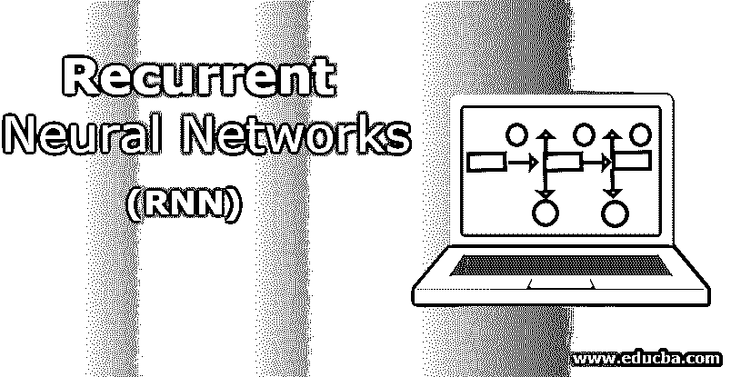
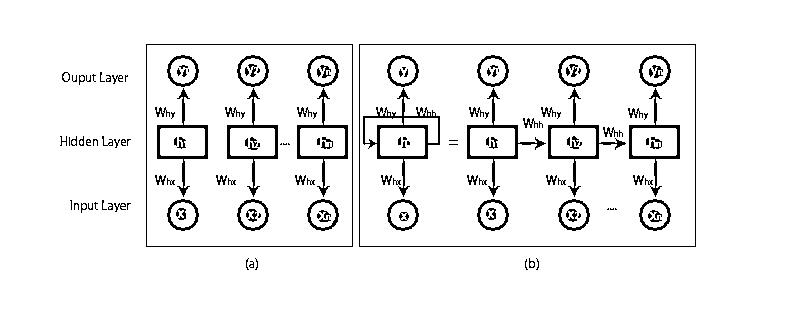
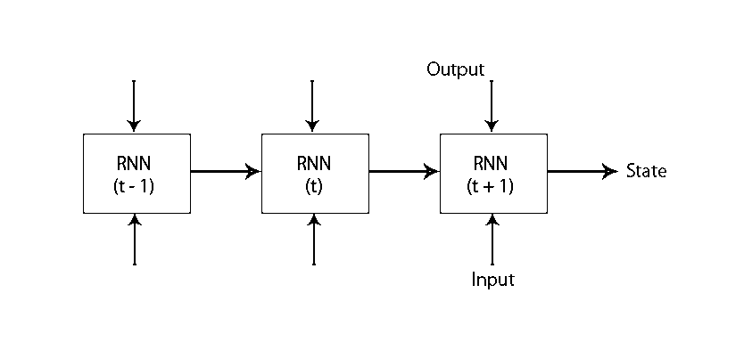
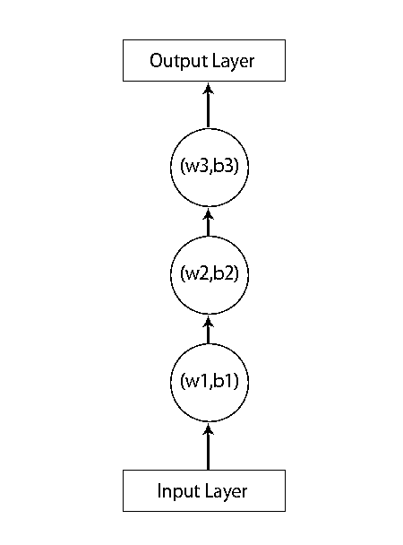
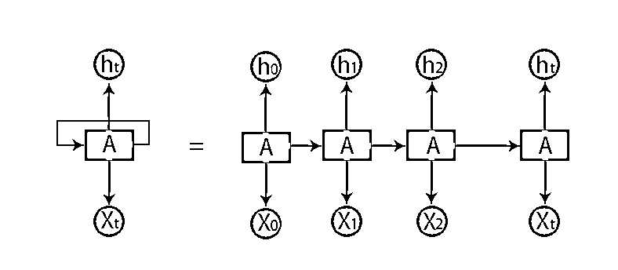

# 递归神经网络(RNN)

> 原文：<https://www.educba.com/recurrent-neural-networks-rnn/>

## 递归神经网络导论(RNN)

下面的文章提供了递归神经网络(RNN)的大纲。递归神经网络是人工神经网络(ANN)的一种，用于自然语言处理(NLP)和语音识别的应用领域。RNN 模型旨在识别数据的序列特征，然后使用这些模式来预测未来的情景。

### 递归神经网络的工作

当我们谈到传统的神经网络时，所有的输出和输入都是相互独立的，如下图所示:

<small>Hadoop、数据科学、统计学&其他</small>

但是在递归神经网络的情况下，来自先前步骤的输出被馈入当前状态的输入。例如，为了预测任何单词的下一个字母或预测句子的下一个单词，需要记住前面的字母或单词并将它们存储在某种形式的存储器中。

隐藏层是记住序列的一些信息的层。一个简单的现实生活中的例子，我们可以联系到 RNN，当我们看电影时，在许多情况下，我们可以预测接下来会发生什么，但如果有人刚刚加入这部电影，他被要求预测接下来会发生什么呢？他的回答会是什么？他或她不会有任何线索，因为他们不知道电影之前的事件，而且他们对此没有任何记忆。

典型的 RNN 模型如下图所示:

RNN 模型有一个记忆，它总是记得在前面的步骤中做了什么和计算了什么。对所有输入执行相同的任务，RNN 对每个输入使用相同的参数。由于传统的[神经网络](https://www.educba.com/what-is-neural-networks/)具有独立的输入和输出集，它们比 RNN 更复杂。

现在让我们借助一个例子来理解递归神经网络。

假设我们有一个具有 1 个输入层、3 个隐藏层和 1 个输出层的神经网络。

当我们谈论其他或传统的神经网络时，它们在它们的隐藏层中会有它们自己的一组偏差和权重，如(w1，b1)用于隐藏层 1，(w2，b2)用于隐藏层 2，以及(w3，b3)用于第三隐藏层，其中:w1，w2 和 w3 是权重，b1，b2 和 b3 是偏差。

考虑到这一点，我们可以说每一层都不依赖于任何其他层，并且它们不记得关于先前输入的任何事情:

现在，一个 RNN 会做的是:

*   独立层将被转换为从属层。这是通过向所有层提供相同的偏差和权重来实现的。这也减少了递归神经网络中的参数和层数，并且它通过输出先前的输出作为下一个隐藏层的输入来帮助 RNN 记住先前的输出。
*   总而言之，所有的隐藏层可以被连接在一起成为一个单一的重现层，使得权重和偏差对于所有的隐藏层都是相同的。因此，递归神经网络将看起来像下面这样:

现在是时候处理一些 RNN 模型的方程了。

*   为了计算当前状态，

`ht= f (ht-1,xt),`

其中:

x t 为输入状态
h t-1 为前一状态，
h t 为当前状态。

*   为了计算激活函数

`ht= tanh (Whh ht-1+Wxh xt),`

其中:
W xh 为输入神经元的权重，

W hh 是递归神经元的权重。

*   用于计算输出:

`Yt=Whyht.`

其中，
Y t 是输出，
W hy 是输出层的权重。

### 训练递归神经网络的步骤

下面给出了训练递归神经网络的几个步骤:

*   在输入层中，初始输入被发送，所有输入具有相同的权重和激活函数。
*   使用当前输入和先前状态输出，计算当前状态。
*   现在当前状态 h t 将变成第二时间步的 h t-1 。
*   这样不断地重复所有的步骤，为了解决任何特定的问题，它可以不断地加入来自所有先前步骤的信息。
*   然后，通过最终状态的当前状态和所有其他先前步骤来计算最终步骤。
*   现在，通过计算实际输出和我们的 RNN 模型产生的输出之间的差异，产生了一个误差。
*   最后一步是当反向传播过程发生时，其中误差被反向传播以更新权重。

### 递归神经网络的优缺点

下面给出了提到的优点和缺点:

#### 优势:

*   RNN 可以处理任意长度的输入。
*   一个 RNN 模型被建模以记住整个时间中的每个信息，这在任何时间序列预测器中都非常有用。
*   即使输入大小更大，模型大小也不会增加。
*   权重可以跨时间步长共享。
*   RNN 可以使用它们的内部存储器来处理任意系列的输入，这与前馈神经网络的情况不同。

#### 缺点:

*   由于其循环性质，计算速度很慢。
*   训练 RNN 模特可能会很困难。
*   如果我们使用 relu 或 tanh 作为激活函数，那么处理非常长的序列就变得非常困难。
*   容易出现爆炸、渐变消失等问题。

### 结论——递归神经网络(RNN)

在本文中，我们看到了另一种类型的人工神经网络，称为递归神经网络；我们已经关注了使 RNN 从其他[类型的神经网络](https://www.educba.com/types-of-neural-networks/)中脱颖而出的主要区别，它可以被广泛使用的领域，例如语音识别和 NLP(自然语言处理)。此外，我们已经了解了用于构建稳健的 RNN 模型的 RNN 模型和函数的工作原理。

### 推荐文章

This is a guide to Recurrent Neural Networks. Here we discuss the introduction, how it works, steps, advantages, and disadvantages of RNN in detail. You can also go through our other suggested articles to learn more –

1.  [什么是神经网络？](https://www.educba.com/what-is-neural-networks/)
2.  [神经网络的实现](https://www.educba.com/implementation-of-neural-networks/)
3.  [神经网络应用|前三大应用](https://www.educba.com/application-of-neural-network/)
4.  [网络拓扑完整指南](https://www.educba.com/network-topologies/)

