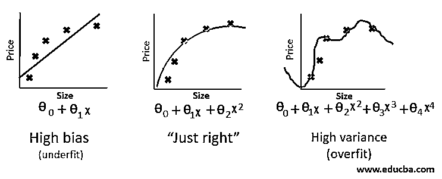

# 过拟合神经网络

> 原文：<https://www.educba.com/overfitting-neural-network/>

## 过拟合神经网络简介

神经网络是将用户输入展开成结构化神经网络中的神经元的过程。这是通过训练这些神经网络来根据问题调整它们的权重和偏差来实现的。深度神经网络由相互连接的输入和输出层之间的隐藏节点层组成。训练数据被传递到连续的层，并在最后被转换为输出层。该输出图层被视为该问题的结果。到目前为止，深度神经网络可以更好地为各种各样的问题提供解决方案。

### 什么是深度神经网络中的过拟合？

在数学和统计学中，每个问题都有一个函数形式。深度神经网络基本上用训练数据集来训练，以使神经网络与问题的函数形式相结合。慢慢地，在每个时期之后，深度神经网络概括了这个问题。当它最终准备好时，我们使用测试数据集测试它的准确性。理想的深度神经网络应该在训练和测试数据集中产生相似的结果。如果深度神经网络在训练和测试数据集上都表现不好，则它是欠拟合的，而如果深度神经网络在训练数据集上表现很好，但在测试数据集上失败；这就是所谓的过度拟合。虽然前者需要更多的训练，但后者需要更多的关注，因为过度拟合是深度神经网络的一个非常常见的问题。

<small>Hadoop、数据科学、统计学&其他</small>

 *过度拟合是由于过度训练导致模型精确地拟合训练集，而不是概括问题。现在很明显，过拟合降低了深度神经网络的准确性，我们需要在训练网络时采取一切预防措施来防止它。过去几年的广泛研究帮助我们使用以下技术来防止过度拟合。

### 避免神经网络过拟合的技术

以下是为防止过度配合而采取的预防措施。

#### 1.数据管理

除了训练和测试数据集，我们还应该将训练数据集的一部分分离到验证数据集中。验证数据集主要用于为问题选择更好的模型，也用作预测试数据集。这使得深度神经网络能够更好地进行概括。

#### 2.数据扩充

另一个常见的过程是向模型中添加更多的训练数据。给定有限的数据集，可以通过数据扩充来防止过度拟合。这是通过添加平移、缩放、垂直翻转、水平翻转、填充、旋转等来创建现有数据集的更多版本的过程。这种非常有效的方式已经成为行业标准，同时将训练数据集输入到神经网络模型中。可以在用小子集数据训练模型之前确定增加的百分比。

使用带反向传播的批量标准化–通过标准化扩展数据->提高学习速度并减少对数据的依赖。

#### 3.批量标准化

归一化是引入数据的均值和标准差以实现更好的泛化的过程。批量规范化在常规输入层的顶部添加一层，以将规范化应用于神经网络的每个节点。批量标准化还有额外的好处，如改善梯度流量、提高学习率等。此外，在反向传播过程中可以忽略批处理规范化，从而加快模型的训练速度。

#### 4.辍学者

辍学是另一个最近但快速适应的技术，以解决过度拟合。它是由现代神经网络之父杰弗里·辛顿亲自介绍的。这是一个在将激活函数传递到下一层之前，从每一层的最后一层随机丢弃激活的过程。事实证明，这可以减少过度拟合，有助于模型更好、更快地泛化。

#### 5.重量衰减

虽然体重衰减类似于辍学，但它们在实现上完全不同。神经网络的主要结构是不同神经元之间的权重和偏差。权重衰减使用选择性权重，该权重在向输出图层移动时减少。随着权重的衰减，过度拟合会降低泛化能力。

#### 6.提前停止

早期停止通过在验证损失上升时防止整个集合的模型训练来防止过度拟合，这是过度拟合的明确指示。虽然这是一个小调整，但在使用大型数据集进行训练时，它会有很大帮助。

#### 7.L1/L2 正规化

L1 是套索回归，而 L2 是岭回归。这些技术在模型中引入了一个惩罚系统来帮助控制特性。这对于训练具有大量特征的大型模型非常有帮助。有很多研究发生在为 CNN，RNN，LSTM 等定制的正规化的日期。

#### 8.递归特征消除

在训练特征丰富的模型时，这是另一种有用的方法。在训练数据集之后，我们开发了一个系统来计算每个特征的重要性，最不重要的特征被排除在传递到下一层之外。人们可以假设递归特征消除是大型模型的一种复杂的丢弃方法。

#### 9.测试时间增加

测试时间增加类似于数据增加，但发生在训练结束时。通过用不同版本的训练数据训练模型而获得的最终激活的平均值是模型的输出。尽管 TTA 只提供了 1%或 2%的改进误差，但它和其他防止过度拟合的技术一样重要。

### 结论

除了许多其他复杂的技术之外，上面讨论的每一种技术都在积极的研究中。这些实践为深度学习模型提供了前沿成果。我们需要记住，过度拟合只是深度神经网络可能遇到的许多问题之一。因此，在选择这里提供的一个或多个度量时，我们需要确保它符合网络的其他超参数和特征，从而在训练深度神经网络时提供集体优势。这些技术中的大部分已经在领先的深度学习/机器学习库中实现，以便开发人员可以快速利用它们，而不是从头开始实现。

### 推荐文章

这是一个过拟合神经网络的指南。这里我们讨论过拟合神经网络的介绍和它的技术，如数据管理，数据扩充，批量标准化等。您也可以浏览我们推荐的文章，了解更多信息——

1.  [十大数据库类型](https://www.educba.com/types-of-database/)
2.  [带功能的运行数据库](https://www.educba.com/operational-database/)
3.  [NoSQL 数据库的类型|前 7 名](https://www.educba.com/types-of-nosql-databases/)
4.  [AWS 数据库简介](https://www.educba.com/aws-databases/)

*