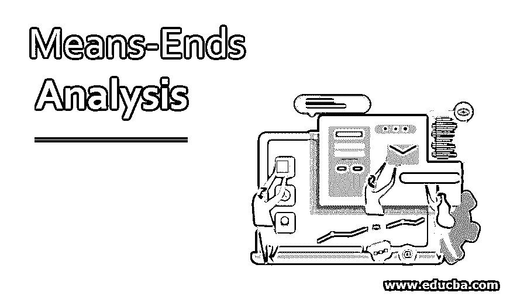
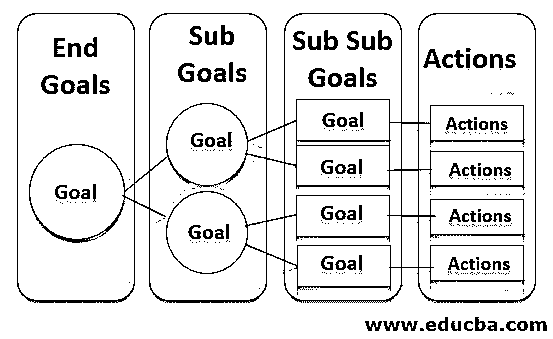

# 手段-目的分析

> 原文：<https://www.educba.com/means-ends-analysis/>

## 手段-目的分析导论

手段-目的分析是一种解决问题的技术，它以模块化的方式识别当前状态，定义最终目标，并确定达到最终状态的行动计划。最终目标被分解为子目标，子目标和行动计划首先实现子目标，然后逐步实现主目标。大部分的解题策略都会有向前的动作或者向后的动作。

但是 MEA 将在两个方向上混合行动计划，以模块化的方式解决问题，也就是说，它试图先解决主要问题，然后再解决次要问题，反之亦然。手段-目的分析(MEA)是一种解决问题的技术，它被用于人工智能编程、一般管理和心理学领域。让我们在本文中详细研究它的特性。

<small>Hadoop、数据科学、统计学&其他</small>

### 什么是问题解决？

解决问题在几种情况下有不同的含义。在计算机科学中，作为人工智能的[部分，它指的是应用算法、启发式和根本原因分析来寻找解决方案。在心理学中，它涉及通过内省、分析和实验从有问题的当前状态认知地达到期望的目标状态的逻辑。](https://www.educba.com/what-is-artificial-intelligence/)

解决问题的活动从通过调查收集问题数据、集思广益和找出差距开始。故障模式影响分析有助于识别系统中的潜在问题。下一步是使用鱼骨图、排列图等对收集的数据进行分析。，寻找解决办法。

### 用在哪里？

手段-目的分析用于以下学科:

*   MEA 是一种创造性的问题解决技术，在人工智能应用中使用了相当长的时间。从系统中可用的可能解决方案的搜索空间中，AI 通过应用正确的搜索策略或算法来选择最佳的可能解决方案。该算法处理初始状态和结束状态以及前进和后退方向上的动作计划和运动。这种递归算法优化了搜索操作，并以最小的努力实现了最终目标。
*   在一般管理领域，MEA 有助于组织规划以实现目标。目标被分解成目标，每个目标又被进一步分解成行动步骤。将目标分解成可操作的任务有助于管理层成功达到最终状态。
*   MEA 通过识别它是一个状态、定义状态并列出要开发的新业务流程来帮助实现业务转换项目。为了有效实施，这些新流程被进一步分解为子流程。
*   在个人生活中，人们也可以遵循我的方法来解决问题或达到特定的目标。它有助于通过清楚地了解当前状态的原因来管理势不可挡的情况，并通过执行计划的行动来达到最终状态。MEA 有助于避免挫折和精神抑郁，过平静的生活。

### 手段-目的分析是如何工作的？

让我们了解一下它是如何工作的。

*   衡量当前状态，并确定当前状态下面临的问题和棘手问题。
*   定义要达到的目标状态。
*   将目标分解为子目标，子目标分解为进一步的子目标。例如，长期目标可以分为短期目标和进一步的目标。
*   确定为达到目标状态而要执行的操作。
*   将每个子目标与可执行的行动联系起来。
*   包括所有中间步骤、解决当前状态下所面临问题的相关行动。
*   使这些步骤可被检测到，并设计方法和手段来跟踪实际状态和未来状态中甚至很小的变化。

在需要时采取纠正措施。MEA 步骤如下所示:

### 手段-目的分析算法

该算法提供了问题的最佳可能解决方案，并且它包含对给定问题的明确定义的逐步正确解决方案。人们将不得不盲目地遵循这个数学模板的步骤，并期望产生最终结果。这些算法可以用作开发计算机程序和实现解决方案的输入。可以为每一个都建立测试用例，并且每一个步骤和程序都可以在实现之前进行彻底的测试。该算法通过遵循逻辑步骤提供有保证的解决方案，而试探法在解决问题时遵循试错法、过去的优先顺序和判断方法，并且解决方案并不总是有保证的。

算法通常用在期望精确的结果和完成活动的时间不是主要标准的地方，而启发式算法用在需要在尽可能短的时间内完成活动的地方，并且很少会出现错误。算法被部署在计划的活动中(例如，组织计划)，而试探法被用于紧急活动中(例如，治疗病人的医生应该迅速决定治疗)。

MEA 的算法包括以下步骤:

*   **步骤 1:** 通过“照做”研究来衡量事物的当前状态，并在宏观和微观层面捕捉状态。
*   **步骤 2:** 捕捉当前状态中的不足和改进途径(愿望清单)并定义目标状态(目标状态)。在宏观层面和可能的微观层面定义未来状态。
*   **第三步:**比较当前状态和目标状态，如果处于同一水平，问题解决。
*   **第四步:**列出当前状态和目标状态在宏观和微观层面的区别。
*   **第五步:**将差异转化为对当前状态的删除/修改和新的添加。
*   **步骤 6:** 按照步骤 5 中的定义，定义实施变更的行动。
*   **第七步:**实施变革，用计划目标衡量实际结果。
*   **第八步:**做航向修正，达到最终目标。

人工智能应用程序、一般管理场景和生理学用例在实现最终目标时选择性地和递归地部署上述 MEA 算法步骤。

### 结论

手段-目的分析提供了一个合理的行动计划来克服一般管理和个人生活中的任何问题。在人工智能中，MEA 提供了一种优化搜索操作以节省时间和精力的方法。

### 推荐文章

这是手段-目的分析的指南。在这里，我们讨论它是如何使用，工作，手段和目的分析的算法。你也可以看看下面的文章来了解更多-

1.  [什么是人工智能？](https://www.educba.com/future-of-artificial-intelligence/)
2.  [人工智能算法的类别](https://www.educba.com/artificial-intelligence-algorithm/)
3.  [人工智能顶级公司](https://www.educba.com/artificial-intelligence-companies/)
4.  [人工智能中爬山的特点](https://www.educba.com/hill-climbing-in-artificial-intelligence/)

