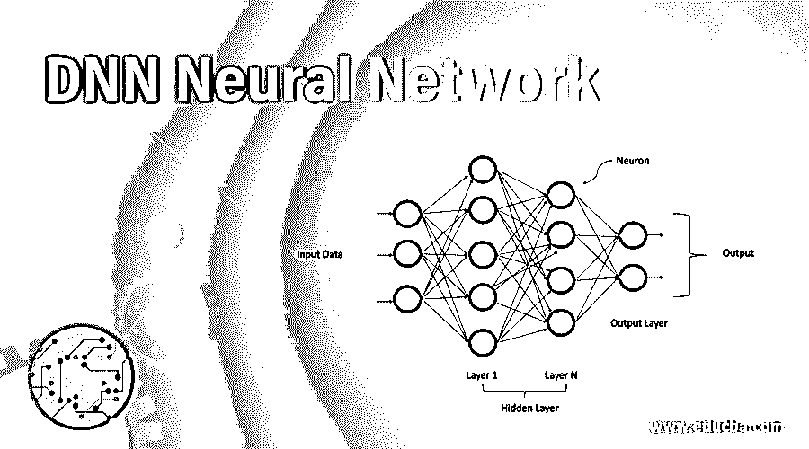
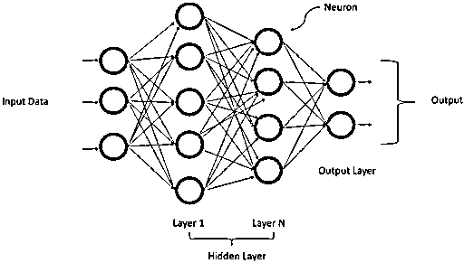
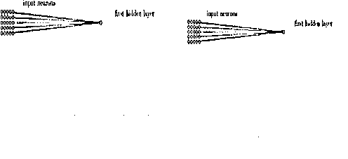
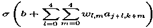
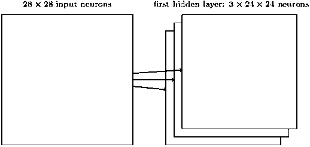
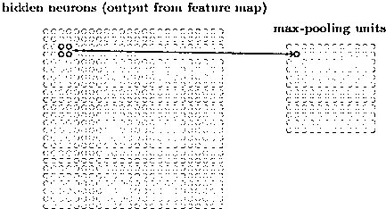

# DNN 神经网络

> 原文：<https://www.educba.com/dnn-neural-network/>

## DNN 神经网络简介

人工神经网络(ANN)可以是浅层的，也可以是深层的。当 ANN 的体系结构中有一个以上的隐藏层时，它们被称为深度神经网络。这些网络在数学建模的帮助下处理复杂数据。深度神经网络(DNN)也称为前馈神经网络(FFNNS)。在这种网络中，数据将向前流动，而不是向后流动，因此节点永远不会被再次访问。这些网络需要大量的数据来训练，它们有能力对数百万的数据进行分类。

### DNN 神经网络的结构

深度神经网络有一个输入层、一个输出层以及它们之间的几个隐藏层。这些网络不仅能够处理非结构化数据、未标记数据，还能够处理非线性数据。它们有一个类似于人脑的神经元层次结构。神经元根据接收到的输入将信号传递给其他神经元。如果信号值大于阈值，输出将被传递，否则将被忽略。如您所见，数据被传递到输入层，然后输出到下一层，依此类推，直到到达输出层，在输出层，它根据概率提供是或否的预测。一层由很多神经元组成，每个神经元都有一个功能，叫做激活功能。它们形成了将信号传递给下一个连接的神经元的网关。权重对下一个神经元以及最后一个输出层的输出有影响。最初分配的权重是随机的，但是随着网络被反复训练，权重被优化以确保网络做出正确的预测。

<small>Hadoop、数据科学、统计学&其他</small>

为了更好地理解，让我们以人脑为例，尽管人脑有两只眼睛，一个鼻子，两个耳朵，但却能识别不同的人。这些变化和偏差可以被大脑中的神经元学习，并结合所有这些差异，可以识别人。这些都是在几分之一秒内完成的。

通过使用数学方法，将相同的逻辑应用于深度神经网络。基于简单的规则，来自一个神经元的信号被转移到另一个神经元，类似于大脑学习的过程。当神经元的输出具有高值时，则与之对应的维度具有高重要性。同样，某一层的所有重要性都以偏差的形式被捕捉到，最后把所有的偏差结合起来并反馈给下一层。因此，系统直观地学习该过程。

### DNN 神经网络的学习

我们向网络提供输入数据，基于此，通过大量矩阵乘法的步骤，输出预测将是正确的或不正确的。基于输出，反馈被反馈到网络，系统通过调整它在各层之间的权重来学习。通过提供反馈和更新权重，这个过程被称为反向传播。这个训练网络的过程计算量很大，因为涉及到数据，现在它变得更受欢迎，因为最近技术的即兴发挥。

### DNN 神经网络的例子

下面是提到的例子:

#### 1.MNIST 数据

这些网络可以用三个概念来进一步解释，如局部感受野、共享权重和汇集，比如我们使用 28*28 平方的神经元，其值是强度。假设我们将隐藏层的一个神经元连接到 5 * 5 区域的输入层，如下图所示

#### 2.局部感受野

在上图中，这个小区域称为局部感受野。每个连接都有一个权重，通过层训练和学习与隐含层神经元相关联。它有 28 * 28 个输入图像，5 * 5 个局部感受野，然后它将 24 * 24 个神经元放入隐藏层。

在上图中，当本地 5 * 5 移动到附近区域时，步长为 1。当我们将局部感受区域向右移动 2 个像素时，我们说步幅是 2。步幅可以是不同的长度，并且可以被认为是超参数之一。

#### 3.共享重量

隐藏层中的每个神经元都有一个 5 * 5 的权重，并且偏向于其局部感受区域。这个偏差 b 对于所有隐藏层神经元都是相同的。这里 w(l，m)是共享权重，an (x，y)是该点的激活函数。这意味着神经元会学习一个相似的特征。这里，从输入层到隐藏层的映射称为特征映射。这些权重被称为共享权重；这里的偏差叫做共享偏差。权重和偏差被称为过滤器或内核。

局部感受野对应于一种单一的特征图。同样，我们需要大量的特征图来预测图像，上面显示的例子有三个特征图，每个都有一个偏差和 5 *5 个共享权重。这个样本概念在 LeNet 中使用，在 MNIST 数字分类中使用，有 30 多个特征地图。当使用共享权重时，网络学习的参数数量较少。

#### 4.汇集层

这些图层位于卷积图层之后，它们通常会压缩从要素地图生成的输出，换句话说，减少的信息在汇集图层之后出现。您还可以指定最大池的区域大小，例如，如果您有 2 * 2 区域，如果您使用最大池，您将在该 2 * 2 区域中获得最大输出激活。

同样，对于每个要素地图，您可以获得最大图层输出。另一种形式的联营被称为 L2 联营。这里，我们取 2 * 2 区域中激活总数的平方根，而不是取激活的最大值。

### 结论

因此，[深度学习网络](https://www.educba.com/deep-learning-networks/)在 5 月份被用于垂直行业，从检测癌症的医疗保健，优化的航空业，检测欺诈交易的银行业，到留住客户的零售业。随着用于复杂数据处理的 GPU 的出现，所有这些都成为可能。

### 推荐文章

这是 DNN 神经网络指南。在这里，我们讨论一个介绍，深度学习的结构，以及用适当的解释来实现的例子。您也可以浏览我们的其他相关文章，了解更多信息——

1.  [用 TensorFlow 进行深度学习](https://www.educba.com/deep-learning-with-tensorflow/)
2.  [自然语言处理应用](https://www.educba.com/applications-of-nlp/)
3.  [TensorFlow Models](https://www.educba.com/tensorflow-models/)
4.  [TensorFlow RNN](https://www.educba.com/tensorflow-rnn/)

