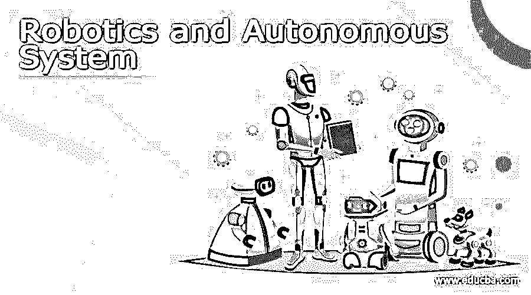
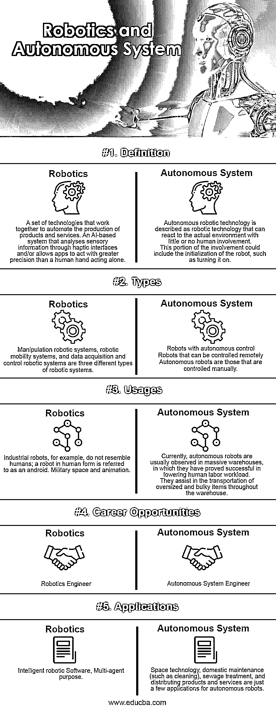

# 机器人和自主系统

> 原文：<https://www.educba.com/robotics-and-autonomous-system/>

## 机器人和自治系统的定义

机器人和自主系统是不同的科学和技术学科，专注于开发复杂的认知系统。工业制造、仓储、服务、精准农业、自动驾驶、太空探索和监视仅仅是机器人的几个应用领域。机器人是一种独立的机制，被创造和建造来模仿人类的情感。

### 什么是机器人和自主系统？

机器人和自治系统 RAS 并不总是能够物理自治，而是可能是一个软件代理，负责执行有利于人类的非物理或网络职责。学术界和科学界利用它们来强调系统的物理(机器人)和/或认知(自主)特征(或平台)。机器人以一种新的方式结合了科学、技术、工程和数学的主干支柱。

<small>Hadoop、数据科学、统计学&其他</small>

当机器人自主时，它利用周围的环境来判断自己在哪里，需要去哪里。这可以包括向机器人提供其周围环境的广泛多样的输入。然而，自主机器人与自动化机器人的区别在于它能够在不使用物理基础设施的情况下掌握环境，并决定去哪里。

基于以下两种情况，使用四个标准来确定 RAS 的功能和用途:

形容词（adjective 的缩写）**遥控系统**:由用户远程控制的设备。没有遥控元件，设备独立运行的能力受到限制。

b.自动系统(Automatic System):一个已经过预编程的系统，以基于规则的、确定性的方式对输入做出响应，并且可以在不需要额外人工输入的情况下执行其目的。

碳（carbon 的缩写）自主系统(Autonomic Systems):通过遵循一套预定义的标准并对刺激做出概率反应来执行人类定义的任务的系统。

自治系统可能需要人工输入来完成其功能或独立运行。

d.自治系统是独立的系统。系统规定了如何执行满足一组目标所需的任务。一个独立的系统能够以概率的方式改变它执行任务和响应输入的方式。

新的 IT 创新和研发、自操作机器以及各种其他自主和半自主系统正在成为当前环境的固有部分。

### 机器人和自主系统之间的正面比较(信息图)

以下是机器人和自主系统之间的 5 大区别:

### 机器人和自主系统的主要区别

在机器人领域，理解机器人和自主机器人之间的显著差异至关重要。让我们来看看不同之处。

1.根据控制规模，机器人可以是半自动或全自动的。第一种类型通常由机器人外部的局部控制机构处理，而后者具有内置控制系统。

2.感兴趣的工业、户外和外层空间应用领域包括危险和恶劣条件下的机器人技术。先进的机器人技术对于自主系统在没有人类干预的情况下实现目标是必要的。

3.机器人系统必须是可靠的，独立操作将大大提高效率。自主机器人配备了光学传感器，使它们能够“看到”周围的环境。在机器人和自主系统中，保持所有三个基本组件(传感器、处理器和执行器)的定期通信至关重要。

4.机器人通常有预编程的程序，允许它们在遵守某些限制的同时执行一组任务。另一方面，创造的人工智能机器人可以自己完成观察和处理物品等任务。例如，网络爬虫是软件机器人，可以快速探索整个互联网并整理数据。

5.自主系统和机器人(ASR)技术领域正在创新系统架构、方法和软件工具方面取得重大进展，以确保未来动态结构的长期可行性。这些新兴的创新充当顾问、复杂的自动化和智能机器人，可以适应新的环境、专业知识和限制。

6.自主机器人可以在危险的环境中航行，这些环境对人类来说是危险的，而且通常是不可接近的。同时，机器人系统的安全措施相对较少。

7.这种自主机器人的根本缺点是，一旦经过训练，即使任务发生变化(在紧急情况下)，它也会继续运行。能够独立完成一系列复杂活动的机器人系统，尤指计算机可以编程的系统。

### 机器人与自治系统的比较

下表显示了机器人和自主系统之间的比较。

| **比较的基础** | **机器人系统** | **自治系统** |
| **定义** | 一组协同工作以自动化产品和服务生产的技术。一个基于人工智能的系统，通过触觉界面分析感官信息和/或允许应用程序比人手单独行动更精确地行动。 | 自主机器人技术被描述为能够在很少或没有人类参与的情况下对实际环境做出反应的机器人技术。参与的这一部分可以包括机器人的初始化，例如打开**。** |
| **类型** | 操纵机器人系统、机器人移动系统以及数据采集和控制机器人系统是三种不同类型的机器人系统。 | Robots with autonomous control可以远程控制的机器人自主机器人是那些手动控制的机器人。 |
| 用途 | 例如，工业机器人不像人类；人形机器人被称为机器人。军事空间和动画。 | 目前，自主机器人通常在大型仓库中观察到，在这些仓库中，它们已被证明在降低人类劳动工作量方面是成功的。它们有助于在整个仓库中运输超大和笨重的物品。 |
| **职业机会** | 机器人工程师 | Autonomous System Engineer |
| **应用程序** | 智能机器人软件，多代理目的。 | 空间技术、家庭维护(如清洁)、污水处理以及分发产品和服务只是自主机器人的几个应用。 |

### 结论

因此，正如我们所见，我们现在对自主系统如何发展和影响机器人业务有了更好的理解。我们有自主权，因为我们有能力做出复杂的决定。我们在处理信息、制定决策和执行各种管理活动方面拥有完全的自主权。类似的能力区分了自主机器人。如果机器人能够观察其周围环境并根据先前的决策启动运动，那么它就是自主的。

### 推荐文章

这是机器人和自治系统指南。这里我们分别讨论信息图和比较表的主要区别。您也可以看看以下文章，了解更多信息–

1.  [POP3 vs SMTP](https://www.educba.com/pop3-vs-smtp/)
2.  [什么是机器人？](https://www.educba.com/what-is-robotics/)
3.  [【xubuntu vs kubuntu】](https://www.educba.com/xubuntu-vs-kubuntu/)
4.  [pCloud vs Google Drive](https://www.educba.com/pcloud-vs-google-drive/)

