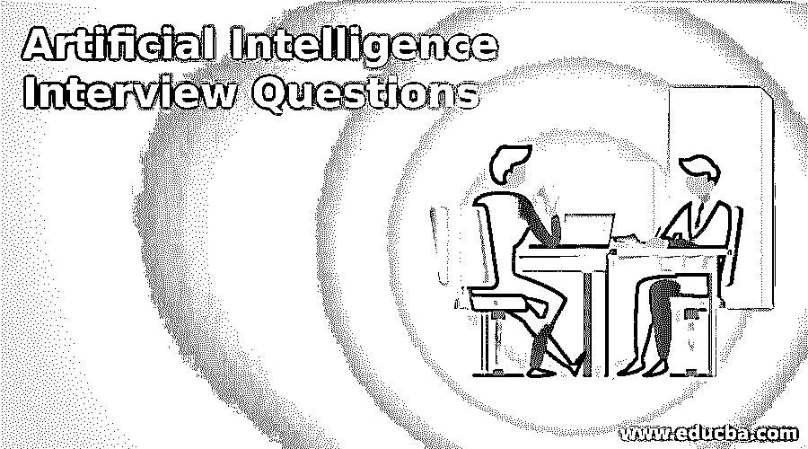
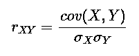
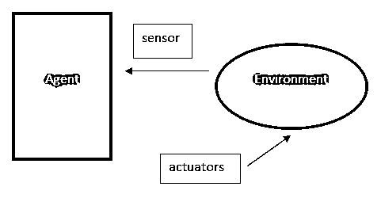

# 人工智能面试问题

> 原文：<https://www.educba.com/artificial-intelligence-interview-questions/>

## 面试准备:人工智能

下面这篇文章提供了人工智能面试问题的大纲。人工智能正在慢慢塑造现代生活；它帮助华尔街决定股票市场交易，帮助网飞推荐电影和许多其他应用。人工智能是一门复制或模仿人类行为的科学。[人工智能技术描述了](https://www.educba.com/artificial-intelligence-technology/)如何对计算机进行编程，使其在智能和决策方面表现出像人类一样的功能。读者朋友们很想见证一些关于科技行业最新热门话题的事实。

*   目前只有 15%的企业在使用人工智能。
*   45%的成熟组织(科技巨头)拥有先进且明确的人工智能战略。
*   只有 33%的消费者认为他们正在以其他一些方式使用 AI，但实际情况是，他们中有 77%的人正在使用它。
*   38%的人认为人工智能将增强客户服务。
*   61%的人相信人工智能会让世界变得更聪明、更美好。
*   印度在人工智能的研究中排名第三。

现在，如果你想找一份与人工智能相关的工作，那么你需要准备 2022 年的人工智能面试问题。的确，每个面试都因不同的职位而不同。在这里，我们准备了重要的人工智能面试问题，这些问题将帮助你在面试中获得成功。

<small>Hadoop、数据科学、统计学&其他</small>

这篇 2022 人工智能面试问题文章将呈现 14 个最重要和最常用的 AI 面试问题。

### 第 1 部分-人工智能面试问题(基础)

这第一部分涵盖了基本的人工智能面试问题和答案:

#### Q1。AI 是什么？

**答案:**

人工智能是计算机科学的一个分支，它强调并找到一种创造智能机器的方法，这种机器具有像人类一样工作、思考和反应的能力。

#### Q2 **。**您认为自己在使用人工智能设备和服务方面的意识如何？

**答案:**

就像我说的，AI 无处不在，并对我们的周围产生了深刻的影响。我们可以在下面列出的东西中看到 AI touch:

*   智能手机
*   智能汽车和无人机
*   社交媒体源
*   媒体播放机
*   视频游戏和更多领域

#### Q3 **。**你认为 AI 影响较大的领域有哪些？

**答案:**

人工智能对许多领域都有很大的影响。

目前，它是:

*   计算领域
*   语音识别
*   生物信息学
*   人形机器人
*   航天和航空学
*   天气预报

#### Q4 **。**AI 首选哪些编程语言？

**答案:**

以上是面试中常见的人工智能面试问题。人工智能首选的编程语言是 Python、R、Lisp、Prolog 和 Java。

#### Q5 **。**叙述逻辑回归系数的公式？

**答案:**

逻辑回归由下式给出:

*   **πI****=****Pr****(****易****=****1****|****Xi****=****Xi**【T22)=**exp****(****β****0**

 **#### Q6。算法过拟合和欠拟合是什么意思？

**答案:**

*   过度拟合和欠拟合是性能不佳的原因。
*   过度拟合在训练数据上表现良好，但对其他数据的泛化能力较差。
*   欠拟合在训练数据上表现不佳，而在其他数据上表现良好。

#### Q7 **。**解释树形拓扑？

**答案:**

顾名思义，“树”拓扑有几个相连的元素，就像树的分支一样排列。该结构在层次结构中至少有三个特定级别。这些是可扩展的，在故障排除时可以访问，因此是首选。这种拓扑结构的一个常见缺点是主节点的阻碍或故障。

### 第 2 部分-人工智能面试问题(高级)

现在让我们来看看高级人工智能面试问题和答案:

#### Q8 **。**叙述 AI 的一些分支？

**答案:**

人工智能有以下几个分支:

*   自动程序设计
*   约束满足
*   贝叶斯网络
*   知识表示
*   机器学习
*   自然语言处理
*   [神经网络](https://www.educba.com/what-is-neural-networks/)
*   机器人学
*   语音识别

#### Q9 **。**解释卡尔·皮尔逊相关系数？

**答案:**

卡尔·皮尔逊相关系数是两个变量之间线性关联强度的度量。用 r 或 r xy 表示(其中 x 和 y 是涉及的两个变量)。这种相关方法通过两个变量的数据画出一条最佳拟合线。
皮尔逊相关系数(r)的值表明所有这些数据点离这条最佳拟合线有多远。

公式:

在哪里，

* cov(X，Y):是 X 和 Y 之间的协方差。

#### Q10 **。**如何在基于树的模型中选择最佳超参数？

**答案:**

在基于树的模型中有两个最佳超参数:

*   根据训练数据衡量绩效。
*   测量验证数据的性能。

在与测试结果进行比较时，我们必须考虑验证结果，因此答案是 b。

#### Q11。你对 AI 中的代理了解多少？告诉我关于它的所有相关细节？

**答案:**

在我的理解中，首先，我们有一个代理公式。

**代理=架构+代理程序**

让我们看一个代理的实际例子。在我们的人体中，三个是眼睛、耳朵，它们充当传感器，腿、手和其他身体部位充当致动器。

因此，一个人工智能系统是由一个主体和它的环境组成的。一个代理人总是在其环境中行动。

因此，只要具备以下条件，任何事物都可以被视为代理:

*   用它的传感器感知环境。
*   使用致动器在相关环境下行动或表现。

#### Q12 **。**列出 AI 最常用的技术或算法？

**答案:**

一般来说，某些算法是最常用的，或者我们可以说它们是第一批接近理解复杂场景的算法。

*   神经网络
*   遗传算法
*   [强化学习](https://www.educba.com/what-is-reinforcement-learning/)

#### Q13 **。**解释 AI 的搜索算法中使用的客观及相关术语？

**答案:**

这些是面试中最常被问到的人工智能面试问题。搜索是人工智能问题技术中使用的通用技术。该算法用于搜索特定位置。

每个搜索术语都有一些组成部分。

*   **问题空间:**这是搜索发生的环境。
*   **问题实例:**是初始状态+目标状态的一个结果。
*   **问题空间图:**这个用来表示一个问题状态。
*   **一个问题的深度:**在这里，我们可以定义最短路径长度。
*   **空间复杂度:**我们可以通过内存中存储的最大节点数来计算。
*   **时间复杂度:**定义为创建的最大节点数。
*   **容许性:**这是用于寻找最优解的算法的属性。
*   **分支因子:**这可以通过问题空间图中的平均子节点数来计算。
*   **深度:**是从开始到目标状态的最短路径的长度。

以下是一些搜索算法:

*   广度优先搜索
*   深度优先搜索
*   [双向搜索](https://www.educba.com/bidirectional-search/)
*   [统一成本搜索](https://www.educba.com/uniform-cost-search/)

#### Q14 **。**列出一些最好的人工智能软件平台？

**答案:**

以下是最好的人工智能软件平台:

*   张量流
*   Azure 机器学习
*   阿亚萨迪
*   支付
*   销售力量爱因斯坦
*   云机器学习

### 推荐文章

这是人工智能面试问题和答案列表的指南，以便候选人可以轻松地打击这些人工智能面试问题。在本帖中，我们研究了在面试中经常被问到的顶级人工智能面试问题。您也可以阅读以下文章，了解更多信息——

1.  十大测试面试问题。
2.  [Java 春季面试问题。](https://www.educba.com/java-spring-interview-questions/)
3.  [人工智能公司](https://www.educba.com/artificial-intelligence-companies/)
4.  [人工智能的重要性](https://www.educba.com/importance-of-artificial-intelligence/)

**