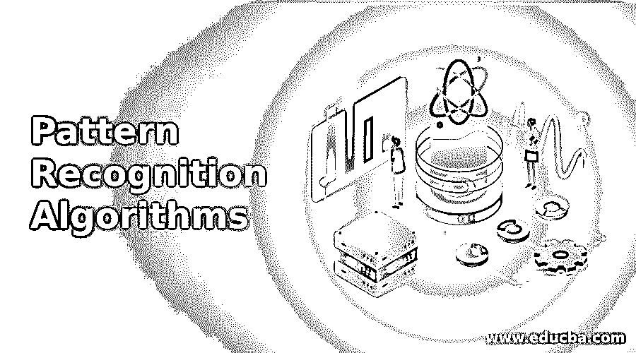
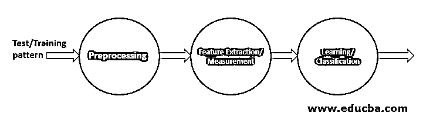

# 模式识别算法

> 原文：<https://www.educba.com/pattern-recognition-algorithms/>

## 模式识别算法简介

模式识别一直吸引着全世界科学家的注意力。在过去的十年中，它已经在医学、通信系统、军事、生物信息学、商业等各种应用中广泛存在。模式识别可以定义为人工对周围物体的识别。自然，识别的过程是复杂的人工任务。这是通过机器学习和模式识别特定算法在机器中完成的。模式识别为面部表情识别、语音识别、分类、医疗保健、地理信息系统、遥感、图像分析等问题提供了解决方案。

PR 方法的性能受到这些组件的影响。

<small>Hadoop、数据科学、统计学&其他</small>

*   数据及其数量
*   使用的技术或方法。
*   算法的设计者和它的使用者

### 模式识别中的算法

公关系统最难的部分是选择合适的模式。在本文中，我们将讨论与模式识别技术相关的算法。

根据调查，公关算法可以分为六种类型。

*   统计技术
*   结构技术
*   模板匹配
*   神经网络方法
*   模糊模型
*   混合模型

#### 1.统计算法模型

在这个模型中，模式以特征的形式来表示。这些特征以这样的方式选择，即不同的模式占用空间而不重叠。它能够预测和识别概率性质。它工作得如此之好，以至于所选择的特征有助于集群的形成。它分析概率分布、决策边界等。，用于模式。机器会相应地学习和适应。然后这些模式被投射到进一步的处理、训练中。然后我们应用测试模式来识别模式。这导致了进一步的分类方法。其中使用的各种方案有 Baye 的决策规则、PCA 等。

**图 1:统计模式识别模型**

#### 2.结构化算法模型

当我们看到一些结构性很强的模式时，统计模型就有点难以用于识别了。因此，在复杂的模式识别中，我们需要像多维实体这样的结构模型。在这里，模式本质上是分层的，被进一步分类成子类。在结构化方法中，我们遵循模式识别的方案，该方案由彼此相关的子模式来支配。该模型被扩展到结构及其在模式中的形式。有限自动机的描述能力越来越强。这种语言是 PR 语言，看起来很原始，但在模式识别方面却很强大。上下文相关的语言通过使用本质上确定性的过程来呈现。PR 系统的语法选择类型依赖于语法和原始规则。该模型成功地应用于形状分析、轮廓、图像分析等有限结构得到保证的场合。

#### 3.模板匹配算法模型

模板匹配的模型是最简单的。它是所有模型中最原始的。该模型用于确定两幅图像之间的相似性。匹配的模式被存储在模板中，并且模板被赋予标量和旋转变化的灵活性。该模型的能力依赖于数据库中已经存储的模板。在这种情况下，我们将相关函数作为识别函数，然后根据训练集的可用性对其进行优化。这种模型的唯一问题是，这种方法在扭曲的模式下工作时效率不高。

#### 4.基于神经网络的算法模型

神经网络是最广泛使用的模型。它们由平行结构或称为神经元的亚单位组成。它们被有效地用于分类。反复改变迭代模式和学习能力的权重的特性，使这个模型比其他现有的模型更有竞争力。感知器是最古老的神经元模型之一。它基本上是两层结构。如果我们发现输出函数是一个步骤，那么它做分类问题。如果这是线性的，那么它应该解决回归问题。

非常常用的是前馈反向传播神经网络，也缩写为 FFBPNN。在识别模式和需求函数中，各种神经网络用于不同的任务。神经网络的性能随着隐藏层数的增加而提高。神经元的数量也应该很大，以便能够代表问题，并找到隐藏在其中的模式。因此，需要在网络的规模和复杂性之间进行权衡。

#### 5.基于模糊的算法模型

模糊算法本质上相当复杂，但却能产生最佳的模式识别结果。这是因为建模是为了识别不确定的域和组件。这可以理解为概率方法的一部分。大多数真实世界的特征在本质上是模糊的；因此，我们可以在几乎最大的模式识别方案中应用模糊模型。对于与形式语言相关的模式，我们使用句法方法。当需要数据集的模糊划分时，可以说使用了语义技术。后来我们发现相似性指数依赖于模糊集和参考集之间距离的权重。

#### 6.混合算法模型

现在我们知道了一些模式识别算法的方法，我们可以说没有一种算法在所有情况下都是完全有效的。所以我们需要一起部署多种算法。这导致了一种新算法的诞生，称为 PR 算法的混合模型。在先验知识可用之前，我们无法决定最佳分类器。为了提高系统的性能，我们可以使用一组分类器和组合器来得出最终结论。多分类器的使用增强了系统的性能。每个单独的分类器在不同的特征空间中被训练。设计了一个决策函数来决定分类器及其精度。实现优化以获得形成一组分类器的决定。

### 结论

我们列举了不同模式识别算法的比较观点。明智的决定是根据问题陈述的需要来利用这些算法。为了识别未知的形状，我们使用模糊方法。这提高了模式识别算法的强度，并增加了混合方法的多样性。

### 推荐文章

这是一个模式识别算法指南。在这里，我们讨论模式识别算法的介绍以及 6 种不同的算法详细解释。您也可以浏览我们的其他相关文章，了解更多信息——

1.  [模式识别](https://www.educba.com/pattern-recognition/)
2.  [人工智能的用途](https://www.educba.com/uses-of-artificial-intelligence/)
3.  [模式识别应用](https://www.educba.com/pattern-recognition-applications/)
4.  [数据挖掘算法](https://www.educba.com/data-mining-algorithms/)

