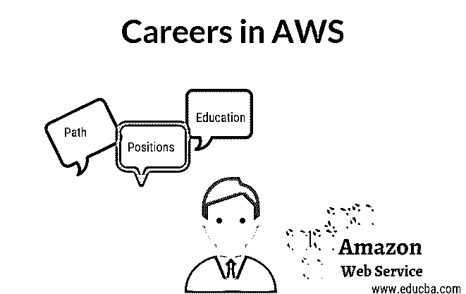

# AWS 中的职业

> 原文：<https://www.educba.com/careers-in-aws/>

## AWS 职业介绍

AWS 是当今 IT 行业中流行的云环境之一。因此，任何愿意现在就在 AWS 开始职业生涯的人，无论如何对他们的未来来说，都将是一个非常有吸引力的选择。根据基于当前传言的假设，在未来 5-6 年内，任何类型的 web 应用程序都将没有物理服务器，所有应用程序都将迁移到特定的云环境，在 AWS 中工作始终是以有吸引力的成本选择具有最大标志性功能的云环境的最佳选择。

### AWS 职业所需的教育

在 AWS 开始职业生涯显然需要对正常的 IT 相关教育有基本的了解。这非常需要对云计算有一个清晰的了解，必须对它的工作方式和正确的利用有信心。了解 AWS 可能需要硬件和软件配置、高级网络技能、服务器设置及其性能调整能力、操作系统内存管理(如果需要)、应用程序部署实用程序以及数据库或数据源配置方面的知识。但请注意，这并不是强制性的，如果你有这些经验，它一定会帮助人们学习 AWS。

<small>Hadoop、数据科学、统计学&其他</small>

### AWS 中的职业道路

亚马逊网络服务(AWS)始终是改善您职业道路的绝佳选择，因为它始终是一种动态的方法，看起来像是在 Amazon.com 作为一个面向整个世界或全球的成长中的业务部门而非常突出。AWS 从 2006 年开始专门从事云计算业务，当时它实际上为一些不同规模的公司提供了适当的云基础架构平台。由于 AWS 主要是在云中非常容易且低成本地帮助计算机、大型存储系统和其他网络或硬件相关的关键服务，因此它自动地受到整个关键组织的欢迎。

现在考虑到当前的 IT 市场，AWS 的使用日益增加，许多大小公司已经瞄准了在 AWS 中开始或转移他们自己的业务以获得更好的选择。因此，它会自动影响就业市场，AWS 方面的专家将永远是当前就业市场的焦点。

AWS 已经提供了他们授权中心的证书。显然，在当前竞争激烈的就业市场中，认证专家将毫无例外地获得更多的优先权。但在获得证书之前，必须以适当的方式了解 AWS，以便通过面试。这是全球市场上最受欢迎的证书之一。AWS 通常提供以下两种证书:

**准会员证书:**它也有三种不同的考试，通过这三种考试后，会员将被称为 AWS 的准会员。

*   解决方案架构师助理
*   作为开发人员加入
*   系统运行管理员助理

**专业认证:**主要是针对有经验的考生，这里同样有两个考试。

*   专业解决方案架构师
*   DevOps 管理员专业版

### AWS 职业的工作职位或应用领域

AWS 专业人员当前市场上的各种工作职位。如下例所示，可以是一些突出显示的作业:

*   **构建世界上最好的可扩展和负载平衡解决方案:** It 通常会寻找一些经验丰富的 AWS 工程师，他们真正擅长于提供各种或特定的解决方案，通过保持多个云计算的适当负载平衡来提高服务器或物理系统的可扩展性。该特性主要致力于提高服务器在多台云计算 PC 上的可用性。
*   **建立一个世界上最大的价格市场，其中云计算空间的价格将动态决定**:通常为这种关键需求寻找 AWS 开发人员，他们的主要目标是建立一个特定的环境，该环境提供一个基于适当创新的动态市场价格，特别是在云计算空间。主要目标是提高系统的性能或可伸缩性，解决一些令人兴奋的问题，或优化一些关键软件，所有这些都可以完成，但背后的定价模型。

与其说是上述那种特殊的工作，不如说是 AWS(软件)开发工程师、 [AWS 数据库](https://www.educba.com/aws-databases/)管理员、开放云产品经理、业务分析师或 AWS 中的开发人员等一些普通的工作，对于应届生和体验者来说，在市场上随时都有。

### 薪水

对于经验和知识渊博的专业人士来说，工资从来都不是一个很大的因素。由于 AWS 目前在所有成长中的客户中扮演着关键角色之一，因此 AWS 中的经验或认证专家肯定会获得非常高的薪酬，有时会超出预期。目前，AWS 提供的个人认证有不同的工资级别。根据目前的普遍信息，简单的 VMware 认证专家的起薪为 99330 美元。对于像 AWS 认证的解决方案架构师这样的专业人士来说，这个数字可能会越来越大。如果任何人有解决方案建筑师证书，他可以收到近 125800 美元。但是正如我所说的，薪水会因环境、国家或州的不同而不同。但是，与其他人相比，AWS 专业人员的平均工资在任何地方都很有吸引力。

### AWS 中的职业前景

亚马逊 web 服务(AWS)显然是云计算环境的领先提供商之一，这一点毋庸置疑。AWS 认证也是目前 IT 行业中非常有价值和突出的认证。这些证书将为 AWS 平台的专家直接验证的组织提供一个清晰的标识，并为 it 行业的其他组织打开一扇大门。无论你是愿意成为一名开发人员、管理员、架构师、数据库管理员，甚至是在大数据和普通数据的分析部分提升职业生涯，AWS 总是一个不错的职业选择。

### 结论 AWS 职业生涯

亚马逊在这个特定的 AWS 领域非常认真，他们在云计算的特定部分不断投资或创新。所以更新总是在这个特定的 AWS 认证上进行。由于他们不断成长的态度和越来越多的市场兴趣，空缺职位将会一直增加。我还想提一下，AWS 不仅会提供高薪，还会在你的职业生涯中给你一个非常好的角色，让你获得适当的工作满足感。

### 推荐文章

这是 AWS 的职业指南。在这里，我们讨论了 AWS 中的教育、所需技能以及工作职位、工资和职业前景。您也可以阅读以下文章，了解更多信息——

1.  [AWS 开发者工具](https://www.educba.com/aws-developer-tools/)
2.  [AWS 数据管道](https://www.educba.com/aws-data-pipeline/)
3.  [AWS 命令](https://www.educba.com/aws-commands/)
4.  [AWS 功能](https://www.educba.com/aws-features/)

