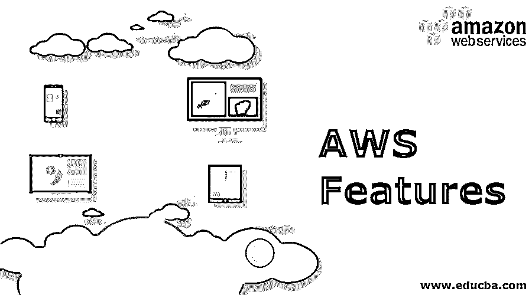
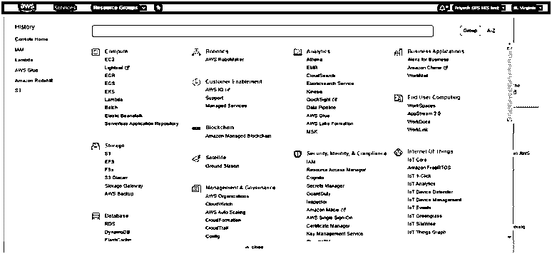
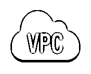
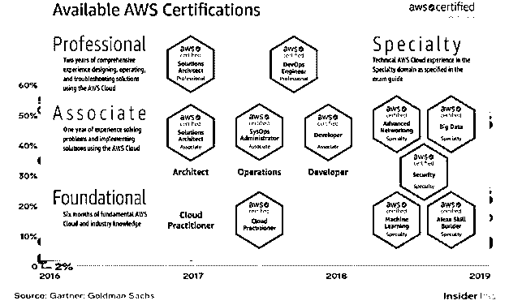
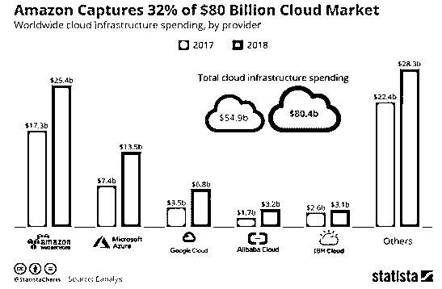

# AWS 功能

> 原文：<https://www.educba.com/aws-features/>

## AWS 功能介绍

AWS 特性是通过 AWS 云平台提供的托管服务和功能。它主要提供几种类型的云服务，如基础设施即服务(IaaS)、平台即服务(Paas)和软件即服务(Saas)。AWS 是亚马逊的子公司，提供各种与信息技术相关的服务。measure AWS 功能包括 EC2 等计算实例、S3、EBS 等存储服务、VPC 或虚拟私有云等网络和安全服务、IAM 策略等用户和角色管理功能、AWS RDS、自动扩展和负载平衡等关系数据库服务、AWS Lambda 等无服务器计算引擎服务。这些特性在 AWS 云中被添加和升级，以获得更好的功能。AWS 为其客户使用服务提供了现收现付计划。

### AWS 功能

以下是提到的 AWS 功能列表:

<small>Hadoop、数据科学、统计学&其他</small>

#### 1.简单的注册流程

在 AWS 中，我们不需要签署任何协议，我们只需要一个电子邮件 id 和信用/借记详细信息，我们就可以开始了。AWS 还提供一年的免费等级，其中大多数流行的服务在一定程度上是免费的。

#### 2.简单的按小时计费

每个实例或每个服务都有微计费，因此，如果您有 EC2 实例，您将按小时计费，这是非常透明的，即使 S3 桶也是按 GB 计费的。AWS 中的计费控制面板非常简单，他们为我们提供了一个集成的计费控制面板，该面板为您提供了一份报告，我们可以根据我们的要求，例如每月一次，基于服务等。

#### 3.AWS 包含云计算的 3 个重要支柱

AWS 有三个重要的支柱:IaaS、PaaS 和 SaaS，解释如下。

*   **IaaS(基础设施即服务)**

任何云架构的基础都是其基础架构，AWS 提供基本的计算基础架构，如存储、服务器和网络资源等。它主要由 it 管理员使用。AWS 服务 EC2 基于 IaaS 概念，通过它我们可以建立一个网站或分析数据等。

*   **平台即服务(PaaS)**

PaaS 主要由软件开发人员使用，因为它为开发和测试应用程序提供了一个运行时环境，而无需担心基础设施。亚马逊的弹性豆茎就是 PaaS 的一个很好的例子。

*   **SaaS(软件即服务)**

SaaS 允许云用户使用基于云的网络应用，如 AWS SNS 简单通知服务，SES 电子邮件服务，类似于 Gmail 或雅虎邮件等电子邮件服务。

#### 4.无所不在

AWS 云覆盖全球 22 个地理区域内的 69 个可用性区域，截至 2019 年，它提供 170 多种服务，这些服务分为计算、存储、安全、分析等不同的组。如下图所示。

#### 5.可扩展性和弹性

在 AWS 中，可扩展性是指在需求增加或减少时向上、向外或向下扩展计算资源的能力。在 AWS 中，我们有自动扩展服务。

弹性是跨多个目标(如 IP 地址、实例、消息服务、容器等)分配传入应用流量的能力。为此，我们在 AWS 中提供了弹性负载平衡器服务。

#### 6.灵活性

在 AWS 中，您可以选择您的操作系统、编程语言、数据库类型、您希望将内容交付到的位置等。并且只为您使用的东西付费，没有任何承诺。这将帮助您更专注于发展和业务，而不是学习您不了解或不具备专业知识的技术，并利用现有技能构建您的基础架构。在编程语言上，可以选择 java、python、go、json、ruby、C Sharp、Node JS 等。

借助 AWS CloudFormation，您可以轻松、经济高效地将本地应用迁移到云中。使用 AWS OpsWorks，您可以在几秒钟内更新多个资源。这将帮助您将更多的时间花在应用程序的开发和增长上，而不是担心基础设施。

#### 7.亚马逊的大量服务

以下是一些流行的亚马逊服务的简要描述。

*   **EC2(弹性计算云)**

这项服务为您提供了可以启动和运行软件的裸服务器/机器。您可以根据自己的需求选择机器的容量和处理能力。

*   **VPC(虚拟私有云)**

AWS 不允许完全控制云，相反，他们给你大块的云，这是 VPC。VPC 让你在云中创建网络，然后在这些网络中运行你的服务器。

*   **S3(简单存储服务)**

S3 通过创建类似于文件夹的 S3 存储桶，让您有机会上传和共享文件，它主要是一个文件存储系统，而不是块存储。你也可以在 S3 建立一个静态网站。

*   **关系数据库服务**

RDS 允许您在云上运行和管理数据库。RDS 拥有从 SQL Server 到 PostgreSQL 的所有主要类型的数据库，在 RDS 中，我们可以根据我们的需求创建数据库和分配内存，并借助跨区域复制使它们防故障，最近 AWS 推出了 Aurora，他们声称这是一款非常高性能的数据库。

*   **弹性负载平衡(ELB)和自动扩展**

它是一种服务，让您有机会将传入流量负载平衡到多台机器上，这样您就可以将 web 应用程序扩展到任意数量的用户。我们还有自动扩展功能，可以动态地向 ELB 添加容量，因此您的应用程序永远不会因负载而停机。

*   **AWSλ**

它是一个无服务器计算引擎。在 Lambda 中，您需要提供适当的代码来完成工作，并且只为计算时间付费。AWS Lambda 会根据工作负载自动扩展。它支持 Python，node。JS，C 夏普，Ruby，Go，Java。

#### 8.稳定性和值得信赖的供应商

亚马逊许多服务的可用性和持久性约为 99.99%，这也是 Spotify、网飞、Adobe 和 Airbnb 等公司将数据存放在 AWS 上的原因之一。

#### 9.简单的学习和认证

AWS 还为每项服务提供了详细的文档，它还有 AWS 培训和认证计划，这使得学习和理解 AWS 变得简单。AWS 认证是市场上最有价值的认证之一

**AWS 也是 2019 年的市场领导者，如下图所示。**

### 结论

由于定期更新的高质量服务、全天候支持、每项服务的详细文档以及与其他云服务提供商和传统基础架构相比更低的价格，AWS 拥有最高的市场价值。除此之外，亚马逊还投入巨资扩大其网络，并推出技术更先进但易于使用的服务。

AWS 也有一个活跃的社区，可以帮助用户了解 AWS 环境，他们也可以讨论他们在开发时面临的任何困难。AWS 也有许多服务的默认模板，这有助于用户避免重新发明轮子。AWS 的所有这些特性使其成为市场领导者。

### 推荐文章

这是 AWS 功能的指南。在这里，我们讨论 Amazon Web Services 特性列表，它通过提供高质量的服务来帮助公司，并支持他们的业务。您也可以浏览我们的其他相关文章，了解更多信息——

1.  [AWS 数据管道](https://www.educba.com/aws-data-pipeline/)
2.  [AWS 代码提交](https://www.educba.com/aws-codecommit/)
3.  [AWS 容器](https://www.educba.com/aws-containers/)
4.  [AWS 的优势](https://www.educba.com/benefits-of-aws/)
5.  [AWS 极光](https://www.educba.com/aws-aurora/)

