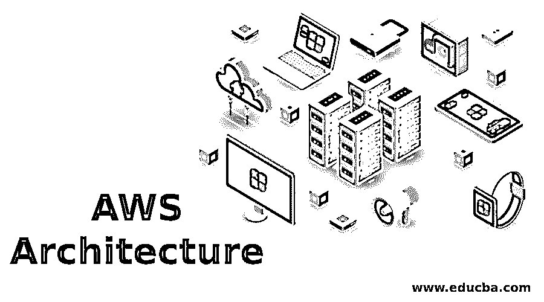

# AWS 架构

> 原文：<https://www.educba.com/aws-architecture/>

## AWS 架构介绍

AWS 架构由基础设施即服务组件和其他托管服务(如 RDS 或关系数据库服务)组成。AWS 架构的主要组件是弹性计算实例，通常称为 EC2 实例，这是可以为多个业务案例创建和使用的虚拟机。这些实例是可配置的，并且可以通过弹性负载平衡特性进行动态管理，以实现按需可伸缩性。

此外，还有存储组件，如 S3 存储桶和弹性块存储，或者说 EBS 与 EC2 实例相关联。AWS 体系结构提供某些网络和安全功能，如 IAM 角色和策略是其体系结构框架的一部分。AWS 架构随着增强的功能和服务不断发展，使 AWS 成为业界领先的云服务提供商。

<small>Hadoop、数据科学、统计学&其他</small>

### 了解 AWS 架构

这是亚马逊弹性计算云架构的基本结构。根据需求，可以在 EC2 实例的帮助下使用不同配置的虚拟机。定价选项，单个服务器映射可以使用它来完成。为了提高服务器和应用程序的效率，在 web 服务器上，使用一种称为负载平衡的技术来共享软件或硬件负载。在传统的 [web 应用](https://www.educba.com/what-is-web-application/)架构中，常用的网络设备是硬件负载平衡器。

AWS 体系结构提供了弹性负载平衡服务，其中跨多个可用源，流量被分发到 EC2 实例。此外，在负载平衡循环中，Amazon EC2 主机是动态添加或删除的。因此，负载平衡能力可以通过弹性负载平衡来动态增长和收缩。此后将调整流量需求，并且粘性会话将解决高级路由需求。

### AWS 服务交付

*   为了向网站提供内容，使用了 Amazon CloudFront。边缘位置的静态、动态和流媒体内容由 Amazon CloudFront 通过全球网络提供。最近的边缘位置自动接收用户端的内容，这提高了性能。像亚马逊 S3 和 EC2 实例一样，它也被优化为与 AWS 一起工作。以类似的方式，原始文件被存储，任何非 AWS 源服务器都可以很好地使用它。亚马逊网络服务中没有每月的承诺或合同。基于服务交付，只有很少一部分为内容付费。
*   为了提高性能，在弹性负载平衡器的帮助下，流量分布在 web 服务器上。通过多个可用区域，流量被分发到 [AWS EC2 实例](https://www.educba.com/what-is-aws-ec2/)。在负载平衡循环中，Amazon EC2 主机是动态添加或删除的。因此，负载平衡能力可以根据流量情况通过弹性负载平衡来动态增长和收缩。
*   像入站网络防火墙一样，亚马逊的弹性计算云提供了一个名为安全组的功能。需要指定允许到达实例的那些协议、端口。分配给每个 EC2 实例的一个或多个安全组将适当的流量路由到每个实例。对 EC2 实例的访问受到用于配置安全组的特定子网的限制。
*   在云中，内存缓存由 Amazon 弹性缓存管理。因此，缓存减少了服务的负载。此外，经常使用的信息被缓存，这有助于提高数据库的性能和可伸缩性。
*   与 MYSQL、Oracle 等类似，Amazon 关系数据库服务也提供类似的访问，它使用相同的工具、应用程序等。数据库软件会自动打补丁，并按照用户的指示管理备份。它还支持时间点恢复。仅对可用资源进行支付。
*   亚马逊 S3 将数据作为称为桶的对象存储在资源中。在这个桶中，根据需要，可以存储任意数量的对象。要将数据作为块存储来访问，可以使用 Amazon EBS。超越生命的运行实例，需要坚持。为了提高性能，Amazon EBS 卷最多可以达到 1tb。
*   与传统的托管模式不同，web 应用程序可以由 Amazon Web Services 动态扩展，以处理流量的变化。在预测流量之前，为了供应主机，流量预测模型在传统的主机模型中使用。根据这组触发器，可以提供 Amazon Web Services 实例来扩展机群。服务器的容量组可以由 Amazon AutoScaling 创建，它可以按需增长或收缩。

### AWS 架构的优势

AWS 架构对于任何组织都至关重要，因为它消除了设置基础设施来构建应用程序的负担。

它的一些优点如下:

*   管理、维护和投资开销被最小化。
*   这些资源是全球可用的，也是可靠的。
*   使用正确的工具可以提高生产率。
*   现代的云安全标准确保了安全性。
*   可伸缩性也得到了提高。

### 结论

从 web 开发人员到数据科学家，每个人都需要学习 AWS 架构。它的大量资源使得任何开发人员或分析人员的生活更加轻松，因为它涉及到技术的各个方面。新的资源和产品也逐渐添加到 AWS 中。AWS 的知识肯定会推动某人的职业生涯，并让他们在未来几年的就业市场上保持相关性，以及高工资范围。

### 推荐文章

这是 AWS 架构的指南。这里我们讨论 AWS 架构的介绍、理解和优点。您也可以浏览我们推荐的其他文章，了解更多信息——

1.  什么是 AWS 替代品？
2.  [采用 AWS 的云计算](https://www.educba.com/course/cloud-computing-with-aws/)
3.  [AWS 存储服务](https://www.educba.com/aws-storage-services/)
4.  [AWS 开发者工具](https://www.educba.com/aws-developer-tools/)

