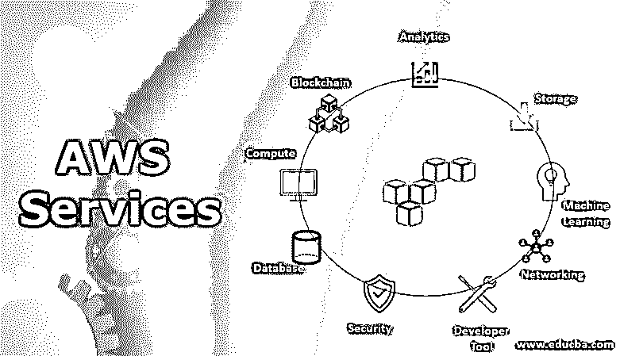
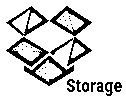
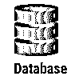
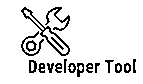
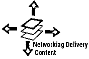

# AWS 服务

> 原文：<https://www.educba.com/aws-services/>

## AWS 服务简介

下面的文章提供了 AWS 服务的概要。亚马逊网络服务是一个按需云计算平台，提供灵活、可靠、可扩展、可管理且易于使用、经济高效的云计算解决方案。所有这些服务都有不同的抽象级别，如(IaaS) [基础设施即服务](https://www.educba.com/what-is-iaas/)、( PaaS) [平台即服务](https://www.educba.com/what-is-paas/)和(SaaS)打包的软件即服务，所有服务都可以按使用量付费，基本上意味着您只需为您正在使用的服务和它使用的计算资源付费。

很容易根据需要进行扩展。服务器分布在世界各地；因此容易获得，并且存储在这些服务器中的数据容易检索。此外，它安全可靠。如今，它作为云服务提供商被广泛使用和首选。它提供 100 多种服务，包括计算、存储、管理工具、分析、部署、IOT 等等。所有这些服务都是根据用户的订阅在亚马逊门户下提供的。这些服务中的大多数都是使用 SOAP 协议作为 HTTP 调用[来访问的。](https://www.educba.com/what-is-soap/)

<small>Hadoop、数据科学、统计学&其他</small>

### AWS 提供的服务列表

以下是 AWS 提供的服务列表:

*   分析学
*   储存；储备
*   计算
*   区块链
*   数据库ˌ资料库
*   开发者工具
*   网络和内容交付
*   安全性、身份和合规性
*   机器学习

#### 1.分析学

分析一直是企业增长的主要来源。数据总是有价值的，因为它提供有价值的信息。客户需要一个快速且可扩展的系统来处理大量数据并提供有用的见解。它为此提供了多种应用。亚马逊 EMR 提供了 [Hadoop 框架来处理](https://www.educba.com/hadoop-framework/)大数据。[亚马逊 Kinesis 帮助](https://www.educba.com/aws-kinesis/)分析实时流媒体数据。 [AWS 数据管道和](https://www.educba.com/aws-data-pipeline/) Glue 提供管道结构调度数据加载和处理。AWS 为几乎所有操作提供了更多的应用程序。

#### 

2。储存；储备

数据需要存储在某个地方进行处理。它提供三大类存储:对象、块和文件存储。亚马逊简单存储服务(S3)通过备份和复制提供可扩展的数据存储。Amazon Glacier 为存档数据提供存储，并提供价格合理的检索。AWS 备份服务管理数据的备份。它自动化了备份过程。除了这些应用程序，AWS storage 还提供其他服务。

#### 3.计算

计算服务是运行任何组织所必需。从托管完整的 web 应用程序到在无服务器环境中执行功能，计算机都是必不可少的。它为计算服务提供全面的产品组合，如亚马逊弹性计算云(EC2)为计算提供虚拟服务器或实例。它可以根据需求自动扩展。亚马逊弹性容器服务是一个高性能的容器服务，支持 Docker 容器。 [AWS Lambda 提供](https://www.educba.com/what-is-aws-lambda/)无服务器计算来运行应用程序。Lightsail 是一项易于使用的服务，提供虚拟服务器、存储、DNS 管理等。它提供了开发应用程序所需的所有服务。

#### 4.区块链

[区块链是一种新技术](https://www.educba.com/what-is-blockchain-technology/)，可以帮助客户与多方合作，维护经过验证的交易记录。亚马逊管理的区块链创建并管理一个区块链网络。此外，亚马逊 Quantum 分类账数据库(QLDB)提供了一个完全托管的分类账数据库来维护交易。

#### 

5。数据库ˌ资料库

数据库可以用来存储结构化数据。它提供了广泛的数据库服务来支持关系和非关系数据库。此外，它还提供一种服务来处理所有特定于应用程序的用例。亚马逊关系数据库服务提供了一个完全托管的数据库服务，包括 Oracle、SQL、MySQL 等。Amazon Aurora 提供了一种高性能、完全托管的关系数据库服务。Amazon Timestream 提供了一个完全托管的时间序列数据库。亚马逊 DynamoDB 为 [NoSQL 数据库](https://www.educba.com/what-is-nosql-database/)提供数据库服务。除了这些数据库，AWS 还提供许多其他数据库服务来支持几乎所有类型的需求。

#### 6.开发者工具

开发工具帮助开发人员快速安全地交付软件。它[帮助 DevOps](https://www.educba.com/what-is-devops/) 在不同的环境中自动构建、测试和部署应用程序。它还有助于维护源代码和版本控制。AWS Codestar 帮助用户在几分钟内建立一个连续的交付管道。AWS X-Ray 帮助调试生产应用程序。在 X 射线的帮助下，用户可以分析和识别性能问题和应用程序组件。 [AWS CodeCommit 提供了](https://www.educba.com/aws-codecommit/)完全托管的私有 GIT 存储库来存储代码和管理版本。除了这些服务，AWS 还提供 AWS CodePipeline、AWS CodeBuild、AWS CodeDeploy、AWS CLoud9 来支持开发和部署。

#### 

7。网络和内容交付

AWS 是一个[虚拟私有云](https://www.educba.com/virtual-private-cloud/)；它通过网络提供服务。因此，它确保 AWS 可以在网络上运行任何工作负载，并具有安全性、性能、可管理性和可用性。它通过私有连接在网络上提供一组资源。它通过虚拟网络向用户提供管理控制。它为网络中的负载平衡提供了一种应用。它还提供 DNS 来将最终用户路由到应用程序。

#### 

8。安全性、身份和合规性

而提供互联网安全服务是重中之重。通过 AWS 身份和访问管理，用户可以控制用户访问和[管理加密密钥](https://www.educba.com/what-is-encryption/)。 [AWS 防火墙管理器帮助](https://www.educba.com/aws-firewall-manager/)管理应用程序的防火墙规则。Amazon Inspector 是一种自动安全扫描，有助于提高应用程序的安全性和合规性。Amazon Macie 是一种基于机器学习的服务，用于识别、分类和保护敏感数据。除了这些安全检查服务，AWS 还提供了更多的应用程序来保证托管应用程序的安全。

#### 9.机器学习

从已有数据中学习被称为[机器学习或人工智能](https://www.educba.com/machine-learning-vs-artificial-intelligence/)。AWS 为人工智能提供了广泛的服务和预定义的模型。亚马逊 SageMaker 提供大规模快速构建、训练和部署模型的服务。它还支持定制模型构建。亚马逊识别用于分析图像和视频。除此之外，AWS 还为语音识别、语言翻译、聊天机器人和许多其他场景提供 ML 服务，具有高速度和可扩展性。

### 结论–AWS 服务

除了上述服务，AWS 还提供游戏技术、IOT、商业应用、管理和治理、AR 和 VR、媒体服务、移动、机器人等服务。AWS 完全安全地提供所有这些服务。因此，尽管具有高度的可扩展性和快速性，但数据是安全的，并且用户可以完全控制访问管理。此外，它具有成本效益和智能，让用户专注于最重要的事情，即业务和客户。除此之外，AWS 还试图提供越来越多的服务，开发人员将继续支持和改进这些服务。

### 推荐文章

这是 AWS 服务指南。这里我们讨论了 AWS (Amazon Web Services)提供的基本概念和 9 大服务列表。您也可以浏览我们推荐的其他文章，了解更多信息——

1.  [六大 AWS 备选方案](https://www.educba.com/aws-alternatives/)
2.  [采用 AWS 的云计算](https://www.educba.com/course/cloud-computing-with-aws/)
3.  [AWS 开发者工具](https://www.educba.com/aws-developer-tools/)
4.  [AWS 中的 IAM 角色](https://www.educba.com/iam-roles-in-aws/)

