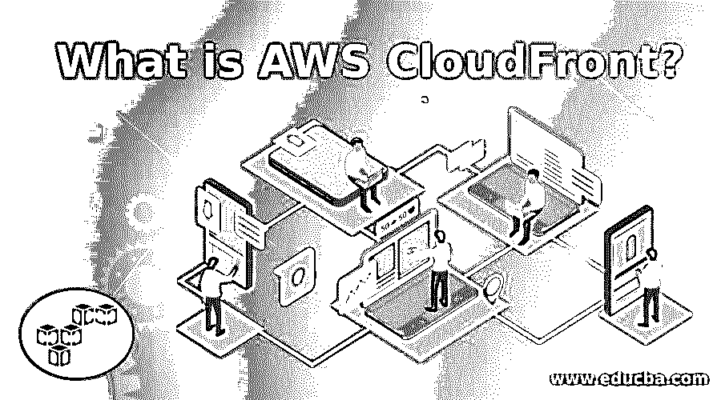

# 什么是 AWS CloudFront

> 原文：<https://www.educba.com/what-is-aws-cloudfront/>

## AWS CloudFront 简介

AWS Cloudfront 是领先的内容交付网络服务或 CDN 之一。CloudFront 是一种流行的服务，它提供具有可伸缩特性的 web 内容管理和分发服务。它以低延迟和高传输率处理和分发静态和动态 web 内容以及视频和应用程序文件。此外，AWS Cloud front 通过称为边缘位置的区域中心分发来自亚马逊 S3 水桶商店的内容。

CloudFront 服务支持缓存，以便根据 CloudFront edge 位置上的可用内容更快地交付 web 内容。有几个案例研究可用于实现特定于媒体和娱乐行业的服务。使用 AWS CloudFront 的一些受欢迎的应用程序是亚马逊 prime videos、Spotify、Hulu 和天空新闻。它也广泛用于软件分发生命周期。

<small>Hadoop、数据科学、统计学&其他</small>

### 如何配置 CloudFront 来交付内容？

需要创建一个 CloudFront 发行版，它告诉 CloudFront 您的内容将从哪里交付，以及如何管理内容交付等其他细节。

*   需要指定源服务器，如亚马逊 S3 存储桶。CloudFront 从这些服务器访问您的文件，然后通过 CloudFront edge 位置在全球范围内分发它们。
*   指定源服务器后，将文件上传到这些源服务器。上传的文件称为对象，它们可以是网页、媒体文件或其他可以通过 HTTP 提供的文件。
*   然后创建一个 CloudFront 发行版，当用户请求文件时，它会告诉 CloudFront 需要从哪个源服务器访问文件。
*   然后，CloudFront 为您新创建的发行版分配一个域名，这将在 CloudFront 控制台中可见。
*   CloudFront 将您的发行版的配置发送到它的所有边缘位置，CloudFront 在那里缓存您的对象的副本。

### CloudFront 是如何将内容交付给用户的？

配置完 CloudFront 后，用户的请求将按如下方式处理:

*   任何用户都可以访问您的应用程序或网站，并可以请求所需的对象，如 HTML 文件或媒体文件。
*   当用户发送请求时，域名服务器(DNS)将请求发送或路由到最近的 CloudFront 边缘位置或最能为其提供服务的边缘位置。
*   在边缘位置，可能有两种可能性，即所请求的文件是否在高速缓存中。如果文件在缓存中，那么 CloudFront 将它们返回给用户，如果文件不在缓存中，那么:
*   CloudFront 将您的发行版中的规范与请求进行比较。然后将请求转发到您的发行版的源服务器，比如 Amazon S3 bucket，以访问所请求的文件。
*   源服务器将请求的文件发送到 CloudFront edge 位置。
*   当请求文件的第一个字节到达时，CloudFront 开始向用户发送文件。
*   它还将文件保存到 CloudFront edge 位置的缓存中，以便将来同一个或另一个用户请求它们时可以很容易地访问它们。

### AWS CloudFront 的优势

以下是提到的优点:

*   快速省时
*   可以在全球范围内分发数据
*   高度安全的内容交付网络。
*   高度可编程
*   与亚马逊网络服务(AWS)高度或深度集成
*   提供 [SSL 优化](https://www.educba.com/what-is-ssl/)和高级功能，如字段级加密、会话票证、TLS 协议实施等。
*   提供访问控制。
*   为原点启用冗余
*   网络优化带来最佳性能。
*   大量工具的可用性，如 CodeCommit、CodeDeploy 等。
*   现收现付功能，即经济高效
*   亚马逊 CloudFront 和 AWS 云服务之间的数据免费传输。
*   积分回路
*   地理定位
*   删除无效文件

### AWS CloudFront 案例研究

*   葫芦
*   亚马逊 Prime 视频
*   天空新闻
*   M6
*   蓝色 Billywig
*   TVNZ
*   探索通讯
*   Spotify
*   班博泽
*   七大网络
*   Haystack 电视公司
*   奥特卡斯特
*   国家航空与航天局
*   Spuul
*   国王数字娱乐公司
*   超级细胞
*   中共运动会
*   洛克伍德出版公司
*   电影明星星球
*   Instacart
*   亚马逊生鲜
*   维维诺
*   数字美食
*   跳票吗
*   松弛的
*   连锁反应
*   com
*   豪华的
*   我的感觉
*   Desire2Learn
*   普通法规
*   文件夹盒
*   Dexecure

### CloudFront 的使用案例

*   静态资产缓存
*   安全性
*   直播和点播视频流
*   动态内容
*   API 加速
*   使用 Lambda@Edge 的可定制内容交付
*   软件分发

### 范围

亚马逊 CloudFront 是所有亚马逊网络服务中增长最快的服务。它的低延迟和最高吞吐量使其在需要快速传输内容的公司中很受欢迎。它在传输数据时提供了安全性，使数据使用起来更加可靠。这是最具创新性、进步性和创新性的技术之一。这对职业发展会有很大帮助。

### 谁是学习 AWS CloudFront 技术的合适受众？

任何人都可以学习这些技术，但是如果您事先了解以下主题，那么学习起来会很容易:

*   操作系统知识
*   虚拟化知识
*   网络知识
*   软件工程工具的知识
*   数据中心设施

### 这项技术将如何帮助你的职业发展？

这项技术发展迅速，在知名公司中非常受欢迎。AWS CloudFront 领域在全球范围内有多个工作机会。软件工程师的工资在 8.3 万美元到 12.4 万美元之间，高级软件开发人员的工资在 15.1 万美元到 21.7 万美元之间。

### 结论

这篇文章简要介绍了什么是 AWS CloudFront。这是一个创新的，充满活力和令人兴奋的领域来追求你的职业生涯。全球有成千上万的工作机会提供给感兴趣的人。

### 推荐文章

这是一个什么是 AWS CloudFront 的指南。在这里，我们讨论了 AWS CloudFront 的概念、范围、用途、优势、案例研究和职业生涯。您也可以浏览我们推荐的其他文章，了解更多信息——

1.  [什么是 AWS？](https://www.educba.com/what-is-aws/)
2.  [什么是肥皂？](https://www.educba.com/what-is-soap/)
3.  [HDFS 建筑](https://www.educba.com/hdfs-architecture/)
4.  [HTML5 vs JavaScript](https://www.educba.com/html5-vs-javascript/)
5.  [AWS 存储服务](https://www.educba.com/aws-storage-services/)

