# 什么是 AWS Lambda？

> 原文：<https://www.educba.com/what-is-aws-lambda/>

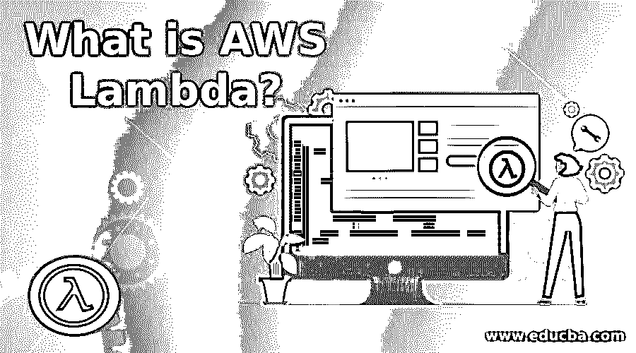

## AWS Lambda 简介

AWS Lambda 是 Amazon Web Services 提供的一项服务，允许您在特定事件发生时运行代码，这是由您定义的，或者当满足某些条件时，AWS 会自动管理、扩展您的计算资源。没有任何必要提供资源或管理您的服务器，这项服务允许您创建您的后端服务，该服务将在规模、性能和安全性上运行，并且无需服务器，您的付款将根据计算机时间计算。

### 问题

*   你心中有一个项目。你正在你的头脑中制定算法。您正在评估可用于构建项目的技术堆栈选项。一切都很顺利，直到您意识到您需要下载所需的软件、ide、工具并获得服务器空间来服务您的代码。
*   好的，在开始项目的实际编码之前，您需要设置基本的基础设施。哦，但是你需要你的应用程序在电脑和移动界面上无缝运行。这意味着在开始编码之前需要建立更多的基础设施。
*   对开发的初始阶段来说开销太大了？即使项目规模扩大，管理基础架构的开销也太大？你的项目是否超出了成本预算？除了编码，你的注意力是否分散在所有事情上？

**解决方案:**这些都是问题，但 AWS Lambda 就是解决方案。

<small>Hadoop、数据科学、统计学&其他</small>

### AWS Lambda–无服务器计算

AWS Lambda 允许您运行代码，而无需提供服务器和其他支持基础设施。您可以编写任何类型的应用程序或后端服务，而不必担心服务器或支持 DLLs 软件。你只需要关注你的代码。其余的一切都由 AWS 负责，从为您的代码提供服务、在特定事件上触发您的代码，以及当您的代码扩展时管理更多的服务器空间。

*   AWS 根据代码执行的时间向您收费，以 100 毫秒的倍数为单位。您的代码在服务器上闲置的时间是免费的。还有什么更好的动机来编写高效的代码。
*   术语“无服务器”通常表示向云的转移。借助云，您可以将您的运营职责委托给 AWS，并更加专注于通过您的应用程序提供更好的消费者体验。
*   当您这样做时，AWS 会处理诸如基础设施管理、集群、修补、安全、操作系统维护等任务。

### 为什么选择 AWS Lambda？

这是人的本性，评估技术/工具是否值得受益总是好的。

下面是 AWS Lambda 的一些特性，它们让开发者的生活变得简单。

#### 1.自带代码

正如 AWS 非常天真地吹嘘这个特性，Lambda 允许你用任何语言编码，AWS 将提供底层支持。因此，它支持几乎所有的本地语言、 [JavaScript 框架](https://www.educba.com/best-javascript-frameworks/)、第三方库等等。

#### 2.许多其他 AWS 服务

AWS 是所需基础设施的一站式商店。它可以轻松集成到各种服务中，例如存储(S3)、数据库(RDS、DynamoDB)、服务器(EC2)、安全管理(IAM)、网络(Route53、CloudFront)等等。

#### 3.自定义代码

需要编写一个为单一客户端量身定制的自定义后端逻辑？不要在客户端编写逻辑，而是使用 AWS Lambda 编写定制服务，使您的代码免于客户端平台更新。

#### 4.按使用付费

你不需要为你的代码闲置的时间付钱。例如，如果您的服务只在白天收到点击数，那么只为代码执行的时间付费。这是以 100 毫秒的时间范围计算的。

#### 5.自动缩放

当您的服务获得更高的点击率时，AWS 会自动增加资源。您不需要配置任何东西来获得额外的资源。您的代码可以处理的请求数量没有限制。因此，性能始终保持较高。

#### 6.亚马逊的灾难恢复

任何设施故障都不会影响您的应用程序，因为您的代码和数据会跨多个可用性区域进行复制。相反，请求会自动路由到另一个区域。

### AWS Lambda 教程

由于这是整个编程世界的一个习惯，我们将从一个简单的“Hello World”程序开始。

#### 先决步骤

要开始使用 AWS Lambda，您需要有一个 AWS 帐户。它不同于您用于购物的亚马逊帐户。如果您已经有一个，请登录到控制台并跳到下一部分。如果没有，请遵循以下步骤。不用担心；只要您的应用程序不超过免费层限制，它就是绝对免费的。

#### 创建 AWS 帐户

*   打开 [AWS 控制台](https://console.aws.amazon.com/console/home)。点击创建新的 AWS 帐户。

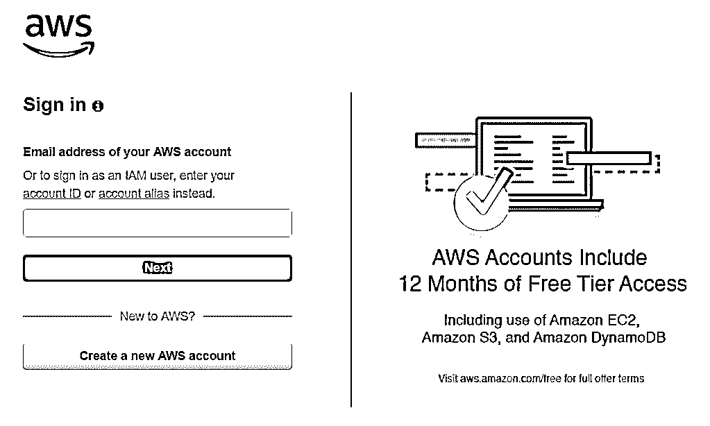

*   填写您的信息并更新您的卡详细信息。除非你超过免费层的使用限制，否则亚马逊不会向你收取任何费用。自由层的使用限制对于单用户开发来说是足够的。
*   完成注册过程后，再次访问步骤 1 中的链接。这一次，使用您的用户名和密码登录控制台。

#### 进入 Lambda 控制台

登录 AWS 管理控制台后，您会在标题窗格中看到一个指向服务的链接。点击它，你会发现 Lambda 在 Compute subsection 里面。

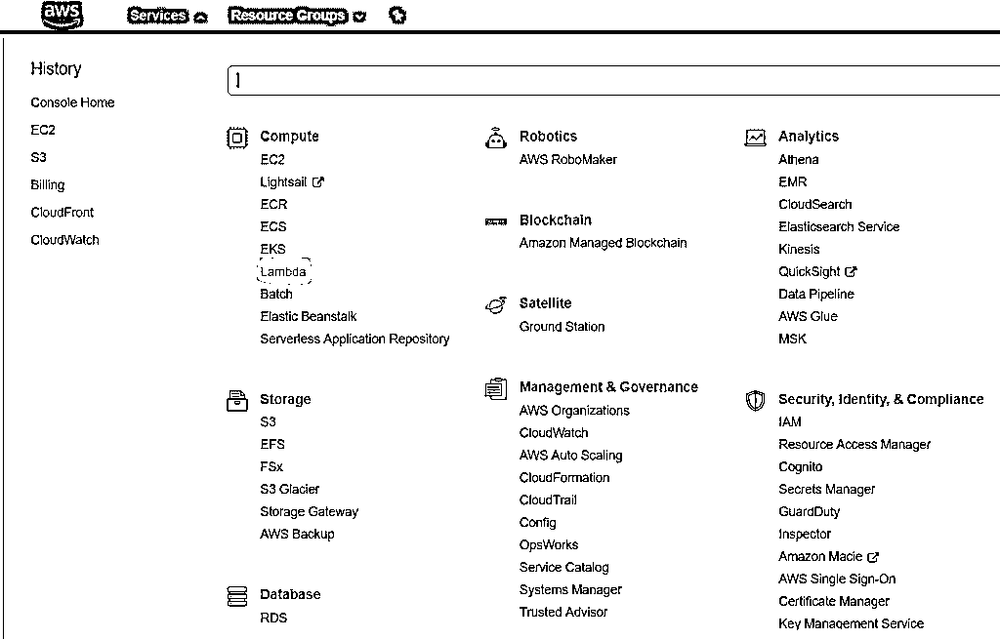

这是 lambda 控制台乍一看的样子:

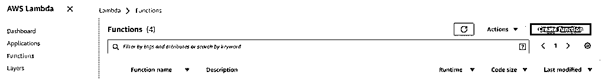

您还可以浏览 Lambda 仪表板，查看代码的统计数据。它让您深入了解调用计数、执行持续时间、成功率和出错率等。

一个示例仪表板看起来像下面这样。

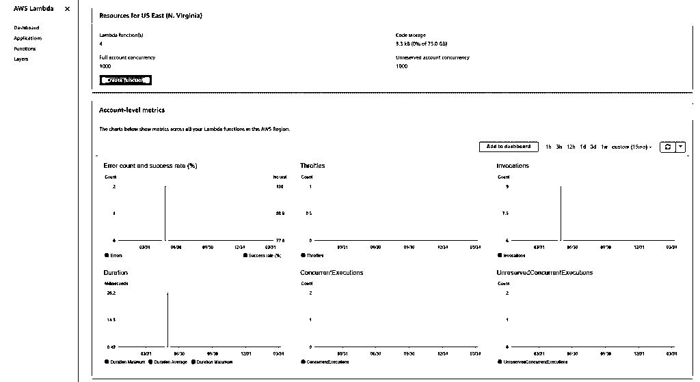

好了，下一步是创建一个函数。Lambda 中的所有代码都被称为函数，因为它们执行特定的任务。注意 Lambda 控制台右上角的 Create Function 按钮。

该按钮将带我们进入以下屏幕:

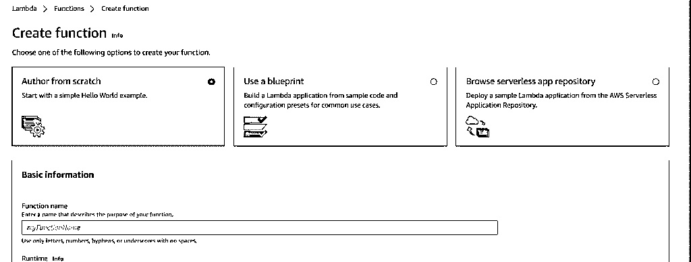

#### 创建 AWS Lambda 函数

让我们看看如何通过以下步骤创建 Lambda 函数:

**第一步:**

首先，我们有三个选择:

*   从头开始写:你会得到一个空白模板，可以从头开始写代码。
*   **使用蓝图:**包含一些库的模板，以满足您的需求。您只需要处理代码的逻辑。
*   **浏览无服务器应用程序库:**准备使用执行各种功能的内置代码。这些也可以很容易地用在您的代码中。

为了符合我们理解 Lambda 的目的，首先，我们将使用一个蓝图。然后，一旦你足够自信，你就可以从头开始构建你的代码，探索 Lambda 的潜力。

现在点击使用蓝图并搜索单词 hello。弹出以下结果。

因此，让我们使用 NodeJS 创建 hello world 应用程序。

**第二步:**

现在，我们来到我们功能的配置屏幕。输入您选择的名称，并从执行角色的下拉列表中选择“从 AWS 策略模板创建新角色”。将角色名称命名为“lambda_basic_execution”。

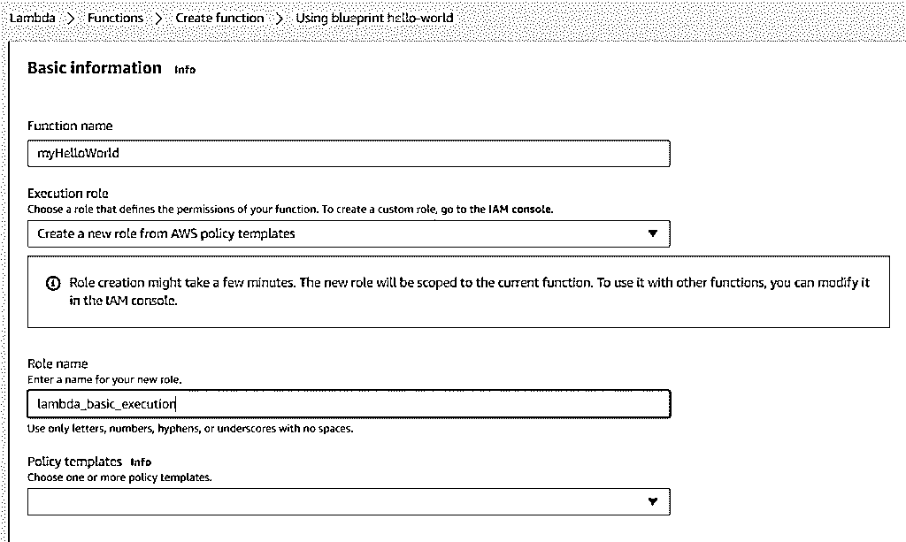

**Note:** An Execution Role defines the permissions that AWS Lambda can assume while executing your code. A basic execution means that lambda will simply execute the code where there is no third-party library involved. However, in case your code needs to interact with Amazon S3 or RDS or EC2, or any other services, appropriate permissions to access these services must be given to your lambda function.

点击屏幕底部的创建功能按钮。成功创建功能后，将出现以下屏幕。

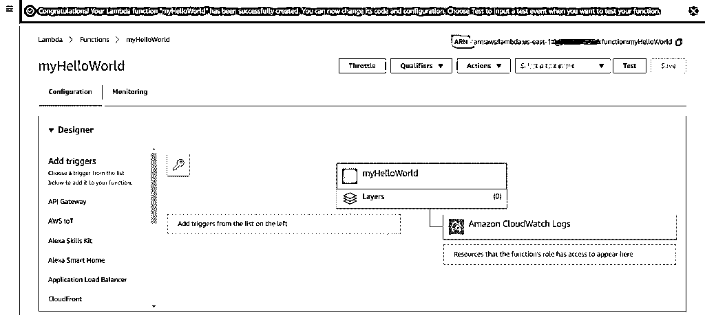

**Note:** The ARN or Amazon Resource Name is a unique name of your function. This can be used as the endpoint to trigger your function. The triggers in the designer section are where you add services that can trigger your function. In every service that can trigger your function, your function’s ARN would need to be configured. It’s like a two-way binding of services. The trigger service would know that it needs to hit your function, and your function would be configured to receive requests from the trigger services you add. Adding triggers is the next level of lambda tutorials and is beyond the scope of this article.

**第三步:**

设计器子部分下面是功能代码子部分。这是由 Amazon 提供的内联 IDE。

它看起来像这样:

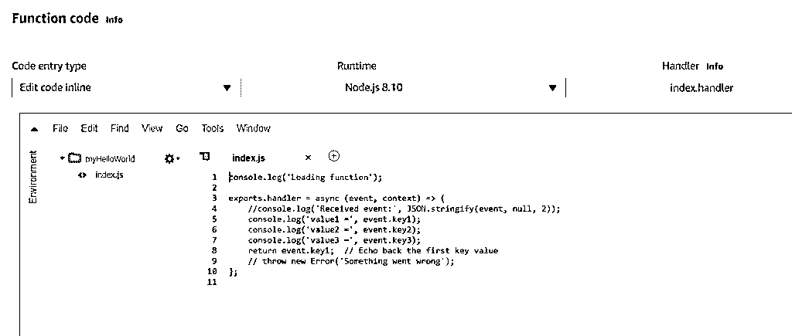

*   在“代码输入类型”下拉列表中，您可以选择是要在线编辑代码，还是从您的系统上传 zip 文件，或者从亚马逊 S3 上传 zip 文件。上传选项可用于复杂的代码，这些代码可以在本地系统中一些功能更好的 IDE 中轻松编辑。
*   运行时是支持你的代码的语言/框架。
*   处理程序是 lambda 函数中的一个调用函数。您的函数可以有多个处理程序，您可以指定从哪个处理程序开始执行。图片处理程序作为被指定执行特定任务的方法。

**第四步:**

在页面的顶部，你会看到一个带按钮的长条。点击选择一个测试事件来测试我们的代码。如果没有创建测试事件，这将提示您配置测试事件。

如下所示配置您的第一个测试事件:

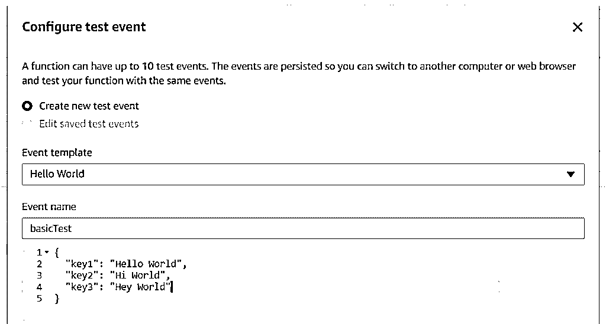

保存测试事件并点击测试。您将看到函数的执行结果。

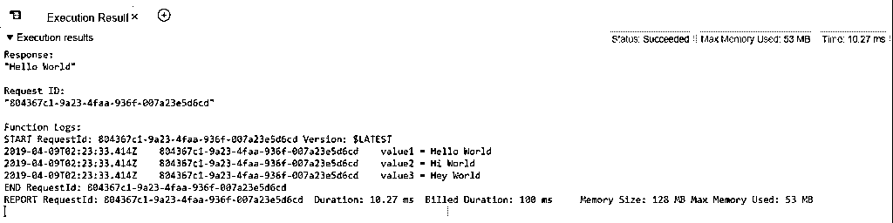

*   **响应:**你的函数返回的最终结果。注意，我们的函数返回了 key1。
*   **请求 ID:** 对您的函数的每个请求都有一个唯一的请求 ID。Amazon 使用这些来跟踪请求并生成您的账单信息。
*   **功能日志:**AWS Lambda 最有见地的部分。这些是详细的日志，指定了函数执行的开始和结束。与通常的 ide 中的调试不同，它非常依赖日志来进行调试。它们存储在 CloudWatch 中，以供将来参考。

恭喜你！您已经成功创建了一个 Lambda 函数。但是等等，我们还没有调用它。我们只是在自己的环境中测试了一下。所以让我们从外部世界调用它。

#### 调用 AWS Lambda 函数

我们将创建一个 REST API 来调用 Lambda 函数。

**第一步:**

去亚马逊 API 网关。它也可以在服务->网络和内容交付下找到。点击创建 API。

**第二步:**

如下配置您的 API 基本信息，并点击创建 API。

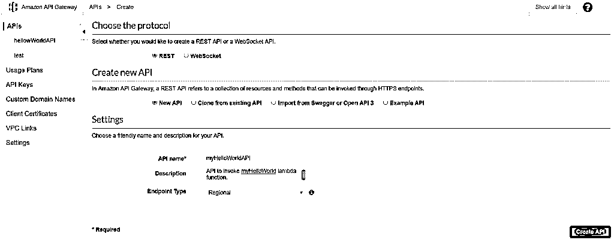

**第三步:**

现在您的 API 已经创建好了，但是 API 中还没有定义 HTTP 方法。单击操作下拉菜单并创建方法。您会注意到左侧窗格中出现了一个较小的下拉列表。点击下拉菜单中的 GET。所以基本上，我们正在为我们的 API 创建一个 HTTP GET 方法。

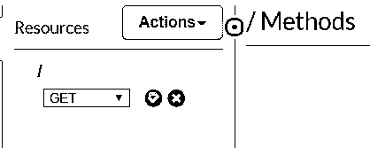

**第四步:**

配置 GET 方法来调用 lambda 函数，如下所示。您需要在 Lambda function 字段中指定 Lambda 函数的 ARN。点击保存。

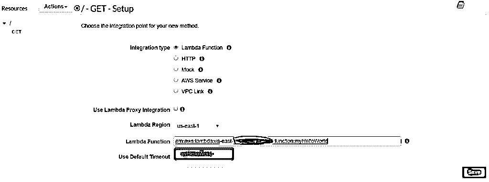

一旦您的 GET 方法被保存，您将到达下面的方法执行屏幕。

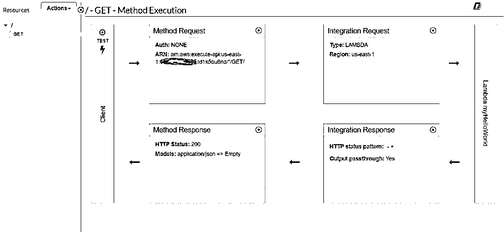

**Step 5:**

现在，您的 GET 方法也创建好了。但是我们仍然没有提供我们在测试环境中提供的键值对。我们的 Lambda 函数需要三个键和值。

单击集成请求并向下滚动到映射模板。如下定义映射模板。内容类型是 application/json。这只是您将在请求正文中发送的参数的格式。

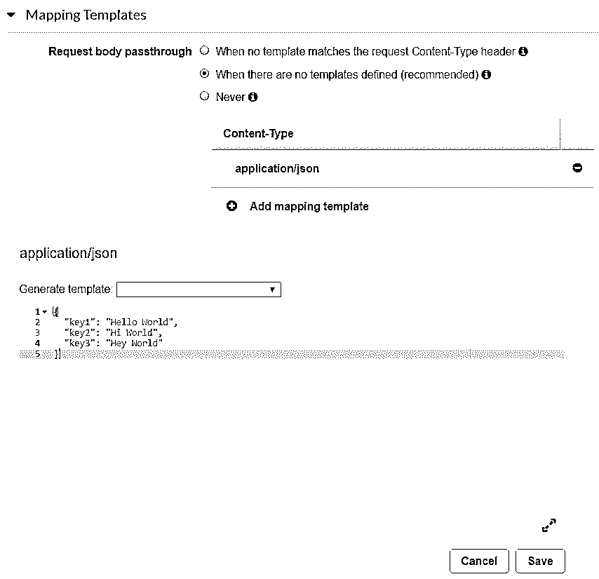

该 API 现在可以部署了。

**第六步:**

单击操作并部署 API。在部署弹出窗口中，选择 New Stage 并给出一个有意义的名称和描述。

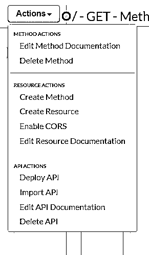

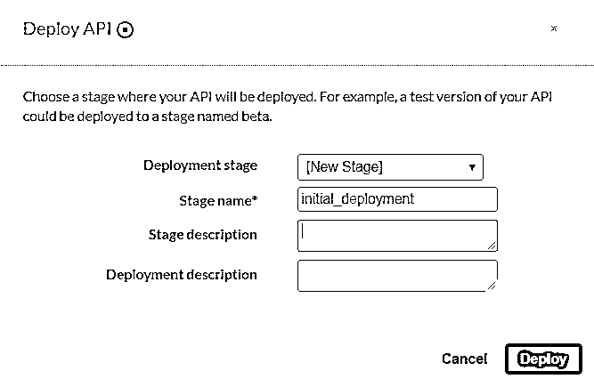

您将到达下面的屏幕，您的 API 的 REST 端点已经配置好，可以使用了。

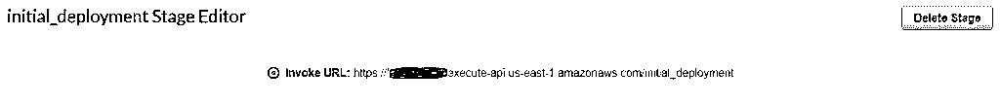

单击端点，浏览器将向您的 Lambda 函数发送请求并显示响应。

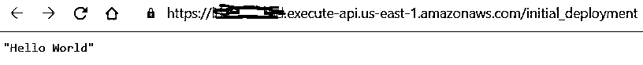

恭喜你！您也成功地调用了 Lambda 函数。相当大的成就。

### 谁能学习 AWS Lambda？

*   很明显，AWS Lambda 函数需要一些关于服务、服务部署、请求和响应的知识。
*   这是任何计算机程序员为了[创建网络应用](https://www.educba.com/what-is-web-application/)必须知道的基本知识。
*   如果您对这个主题没有足够的了解，建议您获取这些知识，以确保在 AWS Lambda 中进行无障碍编码。

AWS 也有关于其所有服务的全面文档。浏览文档，更深入地了解 AWS 世界。

### 在 AWS Lambda 的职业生涯

*   不仅仅是 Lambda，整个亚马逊网络服务部门如今都在蓬勃发展。
*   因此，AWS 服务领域需要专家。AWS 还提供适合您专业水平的认证。
*   有关这方面的更多信息，请访问 AWS 网站。

### 结论

既然您已经理解了 AWS Lambda 函数的基础，那么继续创建更多的函数并与其他 AWS 服务集成。

### 推荐文章

这是一个什么是 AWS Lambda 的指南？这里我们讨论一下入门，无服务器计算，AWS lambda 教程和职业。您也可以浏览我们推荐的其他文章，了解更多信息——

1.  [什么是 AWS？|它是如何工作的？](https://www.educba.com/what-is-aws/)
2.  [采用 AWS 的云计算](https://www.educba.com/course/cloud-computing-with-aws/)
3.  [MariaDB AWS](https://www.educba.com/mariadb-aws/)
4.  AWS 的替代产品有哪些？

