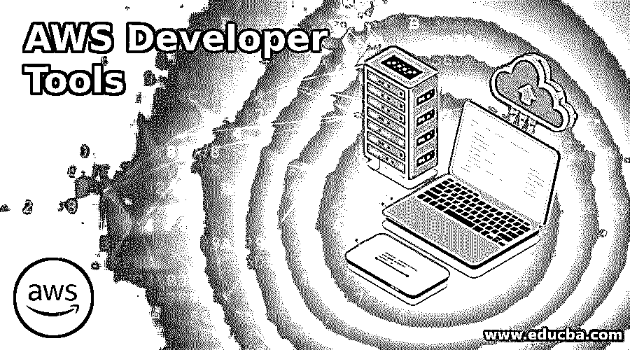

# AWS 开发人员工具

> 原文：<https://www.educba.com/aws-developer-tools/>

## AWS 开发人员工具简介

以下文章概述了 AWS 开发人员工具。亚马逊网络服务创建平台让用户安全地分发程序。这也改变了开发人员和 IT 操作，以提高性能。因此，可以设计、测试和部署 AWS 应用程序或适当的目的地。这个工具允许用户跟踪、存储和控制程序的源代码。要协调这些服务和第三方软件的端到端计算机代码处理，或者将每个服务分别与您现有的工具集成，您可以使用 AWS CodePipeline。

### 不同的 AWS 开发工具

下面给出了不同的工具:

<small>Hadoop、数据科学、统计学&其他</small>

#### 1.AWS CodeStar

您可以通过 AWS CodeStar 快速设计、安装和部署 AWS 应用程序。使用 AWS CodeStar，您可以在几分钟内启动整个正在进行的交付工具链，这样您可以更快地开始情感编码。AWS CodeStar 提供了一个单一的编程系统，允许您在一个位置管理计算机代码的创建。作为第三方，AWS CodeStar 整合了 AWS Cloud9 来帮助开发您。

#### 2.AWS 代码管道

它导致软件周期的自动发布，使用户能够定期检查和发布代码。这是一个不断提供更新的软件。代码已经过审查，可以部署到这个程序中了。它允许用户想象软件发布过程并简化它。可以使用图形界面或命令行界面。在此期间，人工批准者也可用于分析程序之间的数据。如果操作失败(可能是单元测试失败)，它会自动停止管道。CodePipeline 使用 AWS 身份和访问管理来处理可以改变访问过程的人。它还提供了按月支付活动管道费用的好处。

#### 3.AWS 代码构建

CodeBuild 编译源代码，执行测试，并生成可部署的设备程序包。你不应该有自己的构建服务器，用 CodeBuild 来控制它们和扩展它们。CodeBuild 不断扩展并同时处理几个组合，因此您的组合不会在不必要的队列中等待。您可以轻松地从预打包的构建环境开始，否则，您可以使用定制设计的环境创建自己的构建工具。Amazon CodeBuild 为你使用的计数工具按分钟付费。

#### 4.AWS 代码提交

CodeCommit 有助于安全地构建应用程序，而无需控制系统处理和向外扩展它们。云中的服务由专业人员控制。这有助于公司建立安全、可扩展的私有数据库，这些数据库受到高度保护且易于访问。它消除了设置、控制和缩放设备的需要。没有硬件或软件可用于管理更新。高度冗余、健壮的架构用于呈现代码提交。当客户端项目增长时，CodeCommit 会立即增加存储库的数量和规模，用户不必担心。在此帮助下，用户可以存储二进制代码、图片和库。它还提供了数据的安全特性。

#### 5.AWS 代码部署

AWS CodeDeploy 协助交付生产软件。它推出的产品迅速融入了新功能。CodeDepley 是一项安排 Amazon EC2 实例应用程序部署和更新的服务。当自动完成工作时，你减少了手动时间。它与几个文件兼容，并且可以很容易地与现有的软件发布过程相结合。如果用户有几个实例或 1000 个实例，Amazon CodeDeploy 将使用。这也导致了同样的环境技术的重新设计。它确保应用程序的高可用性，实施滚动更新并跟踪应用程序的安全性，以符合法规。

#### 6.AWS 配置

要监视和分析 AWS 资源配置的变化，我们建议使用 Config。这也测试任何修改是否与法律相矛盾。出现这种情况时，该资源会被标上 AWS Config。

#### 7.AWS 云开发工具包

这个 AWS 云解决方案目前可以在您的开发者预览版中为您的团队提供一个高级的、集中的框架，帮助您用您使用的任何编程语言定义资源。AWS 构建库——公司事先设计的一系列模块——也可以构建 AWS 基础设施。

### 结论

因此，我们学习了 AWS 的开发人员工具，它们在许多方面都是可靠和安全的。它还包含 AWS 身份和访问管理，允许发布唯一的保护权限。整个 AWS 是经济的，所以没有额外的成本，因为客户只需为他或她使用的东西付费。

### 推荐文章

这是 AWS 开发者工具指南。这里我们讨论 AWS 开发工具的介绍和不同类型。您也可以看看以下文章，了解更多信息–

1.  [微服务工具](https://www.educba.com/microservices-tools/)
2.  [AWS 竞争对手](https://www.educba.com/aws-competitors/)
3.  [网络安全工具](https://www.educba.com/cyber-security-tools/)
4.  [AWS 深度学习](https://www.educba.com/aws-deep-learning/)

