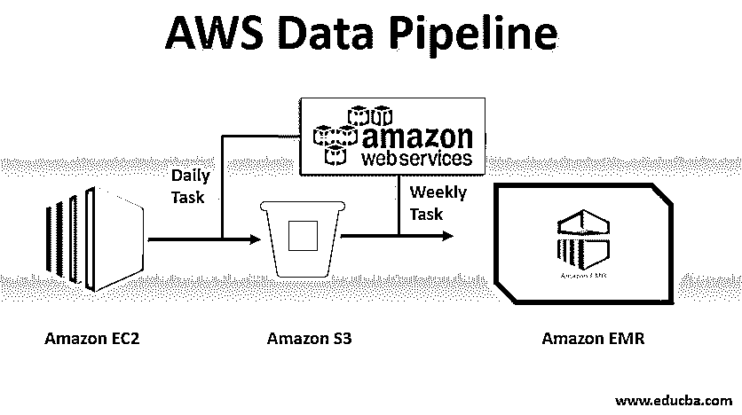
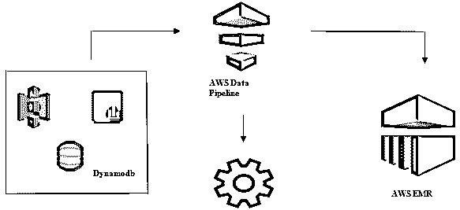
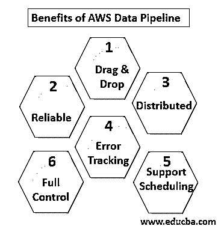
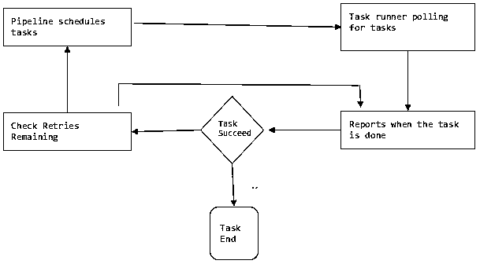

# AWS 数据管道

> 原文：<https://www.educba.com/aws-data-pipeline/>

## AWS 数据管道简介

AWS Data Pipeline 是一种托管 web 服务产品，可用于构建和处理 AWS 的各种计算和存储组件之间的数据流，以及作为外部数据库、文件系统和业务应用程序的内部数据源。AWS 数据管道构建在云接口上，可以针对特定的时间间隔或事件进行调度。它有助于收集、转换和处理数据，使之成为各种组件之间具有业务逻辑的逻辑数据流。AWS 数据管道服务可靠、可扩展、经济高效、易于使用且灵活。它帮助组织维护其他业务组件之间的数据完整性，如亚马逊 S3 到亚马逊 EMR 数据集成，用于大数据处理。

### 需要数据管道

让我们试着用例子来理解对数据管道的需求:

<small>Hadoop、数据科学、统计学&其他</small>

#### 示例#1

我们有一个网站，根据用户搜索或过滤显示图像和 gif。我们的主要重点是提供内容。要实现的某些目标如下

*   **改善内容交付:**高效、快速地满足用户需求。
*   **高效管理应用程序:**存储用户数据和网站日志，以备日后分析之用。
*   **改善业务:**使用存储的数据和分析做出决策，以更低的成本改善业务。

#### 实施例 2

要实现这些目标，需要解决某些瓶颈问题:

*   不同格式和不同位置的大量数据使得处理、存储和迁移数据成为复杂的任务。

不同类型数据的不同数据存储组件:

*   注册用户可能的实时数据: **Dynamo DB** 。
*   潜在用户的网络服务器日志:**亚马逊 S3** 。
*   人口统计数据和登录凭证:**亚马逊 RDS。**
*   传感器数据和第三方数据集:**亚马逊 S3。**

#### 解决方法

*   **可行的解决方案:**我们可以看到，我们必须使用不同类型的工具来将数据从非结构化转换为结构化，以便进行分析。在这里，我们必须使用不同的工具来存储数据，并再次转换，分析和存储处理后的数据。不是一个划算的解决方案。
*   **最佳解决方案:**使用处理、可视化和迁移的数据管道。数据管道在从不同地方迁移数据，以及代表您在同一位置分析和处理数据时非常有用。

### 什么是 AWS 数据管道？

AWS Data Pipeline 基本上是亚马逊提供的一项 web 服务，它可以帮助您以可扩展和可靠的方式转换、处理和分析您的数据，并将处理后的数据存储在 S3、DynamoDb 或您的内部数据库中。

*   通过 AWS 数据管道，您可以轻松访问不同来源的数据。
*   大规模转换和处理数据。
*   高效地将结果传输到其他服务，如 S3、DynamoDb 表或内部数据存储。

#### 数据管道的基本用法示例

*   我们可以有一个网站部署在 EC2 上，每天生成日志。
*   一个简单的日常任务可以是从 E2 复制日志文件，并实现它们到 S3 桶。
*   每周任务可以是处理数据，并通过 Amazon EMR 启动数据分析，以基于所有收集的数据生成每周报告。

#### 使用 AWS 数据管道启动数据分析

*   从不同的数据源收集数据，如 S3、Dynamodb、内部、传感器数据等。
*   对 AWS EMR 执行转换、处理和分析，以生成每周报告。
*   每周报告保存在 Redshift、S3 或内部数据库中。

### AWS 数据管道的优势

以下几点解释了 AWS 数据管道的优势:

*   易于理解和使用的拖放控制台。
*   **分布式和可靠的基础设施:**数据管道运行在可扩展的服务上，并且是可靠的，如果任何错误或任务失败，它可以被设置为重试。
*   **支持调度和错误跟踪:**你可以调度你的任务，并跟踪它们是成功还是失败。
*   **分布式:**可以在多台机器上并行运行，也可以以线性方式运行。
*   完全控制 EC2、EMR 集群等计算资源。

### AWS 数据管道组件

以下是 AWS 数据管道的组件:

#### 1.管道定义

将您的业务逻辑转换成 AWS 数据管道。

*   **数据节点**:包含可能是数据源的名称、位置、格式(S3、dynamodb、内部部署)
*   **活动**:移动、转换或查询您的数据。
*   安排:安排你每天或每周的活动。
*   **前置条件**:启动调度程序检查源数据可用性等条件。
*   **资源**:计算资源 EC2，EMR。
*   **动作**:更新数据管道，发送通知，触发报警。

#### 2.管道

在这里，您可以调度和运行任务来执行定义的活动。

*   **管道** C **组件:**管道组件与管道定义的组件相同。
*   **实例:**在运行任务时，AWS 编译所有组件以创建某些可操作的实例。这样的实例拥有关于特定任务的所有信息。
*   **尝试:**我们已经讨论了数据管道及其重试机制的可靠性。您可以在这里设置任务失败时重试的次数。

#### 3.任务运行程序

从 AWS 数据管道请求或轮询任务，然后执行这些任务。

### AWS 数据管道定价

以下几点解释了 AWS 数据管道定价:

#### 1.自由层

作为 AWS 免费使用层的一部分，您可以免费使用 AWS 数据管道。新注册用户每月可获得为期一年的免费优惠:

*   3 在自动气象站上免费低频运行的先决条件。
*   5 次在 AWS 上运行的低频率活动，不收取任何费用。

#### 2.低频

低频率意味着一天运行一次或更少。Data Pipeline 遵循与其他 AWS web 服务相同的计费策略，即根据您的使用情况计费。它根据您的任务、活动和前提条件每天运行的频率以及它们运行的位置(AWS 或内部)来计费。高频率活动被安排为每天运行一次以上。

**示例:**我们可以计划每小时运行一次活动并处理网站日志，也可以每 12 小时运行一次。然而，如果前提条件没有满足，低频活动是那些每天运行一次或更少的活动。非活动管道具有非活动、挂起和完成状态。

#### 3.按区域显示的 AWS 数据管道的定价

**地区#1:** 美国东部(北弗吉尼亚)、美国西部(俄勒冈州)、亚太地区(悉尼)、欧盟(爱尔兰)

|  | **高频** | **低频** |
| AWS 上运行的活动或前提条件 | 每月 1 美元 | 每月 0.06 美元 |
| 内部运行的活动或前提条件 | 每月 2.50 美元 | 每月 1.5 美元 |
| 闲置管道:每月 1 美元 |  |  |

**区域#2:** 亚太地区(东京)

|  | **高频** | **低频** |
| AWS 上运行的活动或前提条件 | 每月 0.9524 美元 | 每月 0.5715 美元 |
| 内部运行的活动或前提条件 | 每月 2.381 美元 | 每月 1.4286 美元 |
| 闲置管道:每月 0.9524 美元 |  |  |

从 DynamoDB 表向亚马逊 S3 移动数据的日常工作，即 AWS 上的低频活动，每月成本为 0.60 美元。如果我们添加 EC2 来生成基于亚马逊 S3 数据的报告，总管道成本将是每月 1.20 美元。如果我们每 6 个小时运行一次这个活动，那么每月将花费 2 美元，因为这将是一个高频率的活动。

### 结论

AWS 数据管道是一个非常方便的解决方案，可以以较低的成本管理指数级增长的数据。它非常可靠，并且可以根据您的使用情况进行扩展。对于任何需要处理大量数据的业务需求，AWS Data Pipeline 都是实现我们所有业务目标的非常好的选择。

### 推荐文章

这是 AWS 数据管道指南。在这里，我们讨论数据管道的需求，什么是 AWS 数据管道，它的组件和定价细节。您也可以浏览我们的其他相关文章，了解更多信息——

1.  [AWS EBS](https://www.educba.com/aws-ebs/)
2.  [AWS 数据库](https://www.educba.com/aws-databases/)
3.  [什么是 AWS EC2？](https://www.educba.com/what-is-aws-ec2/)
4.  [数据可视化的优势](https://www.educba.com/benefits-of-data-visualization/)
5.  [AWS 的 7 大竞争对手的功能](https://www.educba.com/aws-competitors/)
6.  [了解亚马逊网络服务功能列表](https://www.educba.com/aws-features/)

