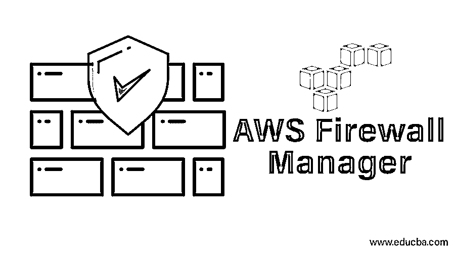

# AWS 防火墙管理器

> 原文：<https://www.educba.com/aws-firewall-manager/>

## AWS 防火墙管理器简介

AWS 防火墙管理器是一个集中为您的亚马逊服务的安全目的的管理服务，其中防火墙管理器使您可以轻松地在您新创建的应用程序上设置一些常见的安全规则，从而确保您的应用程序的一些安全性；您还可以根据自己的需求更改这些规则，并在整个基础架构中以分层方式为所有应用程序或特定应用程序设置新的访问服务策略。

### 先决条件

在开始使用防火墙管理器之前，请确保已经执行了以下步骤:

<small>Hadoop、数据科学、统计学&其他</small>

#### 1.加入亚马逊网络服务组织

为了使用防火墙管理器，用户帐户必须在 AWS 组织中。如果用户的账户已经是会员，可以直接执行步骤 ii。如果用户帐户不是成员，则创建组织，因为用户帐户是主帐户。创建组织后，向其添加其他帐户并启用这些功能。

#### 2.设置 AWS 防火墙管理器的管理员帐户

防火墙管理器必须与您创建的组织的主帐户相链接。然后，该帐户被称为 AWS 防火墙管理器管理员帐户。

*   使用 AWS 组织的主帐户登录 AWS 的控制台。如果任何其他帐户有权限这样做，它也可以用来登录。
*   打开防火墙管理器的控制台。
*   选择开始。
*   提供必须与防火墙管理器链接的帐户 ID。然后将创建防火墙管理器管理员帐户。
*   选择设置管理员。

#### 3.启用 AWS 配置

必须为 AWS 组织中的每个帐户启用 AWS 配置帐户。可以手动或使用模板启用配置。此外，必须指定需要防火墙保护的资源。

### 如何使用 AWS 防火墙管理器？

它主要执行两种操作。

*   启用 Web 应用程序防火墙规则。
*   启用神盾局高级防护。

让我们在下面的步骤中看看这些是如何做到的:

#### 使用 AWS 防火墙管理器启用 WAF 规则的步骤

可以使用 AWS 防火墙管理器启用 WAF 规则。

下面是做同样事情的步骤。

**第一步:**完成上一节提到的先决条件。

**第二步:**创建规则。

为此，根据用户的需求创造条件。

| **请求** | **条件** |
| 阻止或允许带有恶意脚本的请求 | 跨站点脚本匹配条件。 |
| 根据 IP 地址阻止或允许请求 | IP 匹配条件。 |
| 根据国家阻止或允许请求 | 地理匹配条件。 |
| 根据长度阻止或允许请求 | 尺寸约束条件。 |
| 阻止或允许基于恶意 SQL 代码的请求 | SQL 注入匹配条件。 |
| 基于字符串阻止或允许请求 | 字符串匹配条件。 |
| 基于正则表达式模式阻止或允许请求 | 正则表达式匹配条件。 |

然后，使用 AWS web 应用程序防火墙创建规则，并向其添加条件。

要创建规则，请执行以下步骤:

*   登录 AWS 控制台并打开 WAF 控制台。
*   从导航窗格中选择规则。
*   选择创建规则。
*   输入名称、云观察指标名称、规则类型、速率限制等值。
*   通过指定是否必须阻止来添加条件。
*   如果必须添加多个条件，则选择添加另一个条件并重复上述步骤。
*   完成上述步骤后，选择创建。

**第三步:**创建一个规则组

解释满足特定条件时要执行的操作的一组规则称为规则组。可以购买或手动创建规则组。

要创建规则组，必须执行以下步骤。

*   使用在先决条件步骤中创建的管理员帐户登录 AWS 控制台。
*   打开防火墙管理器的控制台。
*   从导航窗格中选择[安全策略](https://www.educba.com/security-policies/)。
*   如果没有满足所有先决条件，控制台会指示用户修复它。完成先决条件后，选择
*   选择创建策略。
*   选择创建 AWS 防火墙管理器策略并添加新的规则组。
*   选择 AWS 区域后，选择下一步。
*   选择“下一步”,因为已经创建了规则和条件。
*   选择创建规则组。
*   输入一个名称。
*   输入要与统治组关联的 CloudWatch 度量名称。命名约定必须遵循。即，姓名应包含字母数字字符，如 a-z、A-Z、0-9 或特殊字符，如 _-！"#`+*},./.不应出现空白。
*   选择一个规则
*   选择添加规则。
*   选择创建。

**步骤 4:** 使用 AWS 防火墙管理器为 AWS WAF 创建并应用策略。

要为此创建策略，请执行以下步骤。

*   由于规则组已经创建，将显示规则组摘要页面。选择下一步。
*   输入姓名。
*   选择 WAF 作为策略类型。
*   选择一个 AWS 区域。
*   选择添加规则组。
*   该策略可以执行两个操作。按规则组设置的计数或操作。

选择计数；如果必须测试策略和规则组，请选择按规则组设置的操作。现在，出于演示的目的，选择计数。

*   选择下一步。
*   根据要求，选择必须包括在策略中或从策略中排除的帐户，然后选择确定。
*   选择必须保护的资源类型。如果必须保护带有标记的资源，请选择“使用标记来包括/排除资源”。
*   选择创建并将此策略应用于现有资源和新资源。
*   选择下一步。
*   预览创建的策略，并根据需要进行编辑。
*   选择创建策略。

#### 使用 AWS 防火墙管理器启用 shield 高级防护的步骤

**步骤 1:** 完成先决条件。

**步骤 2:** 使用 AWS 防火墙管理器创建并应用 Shield 高级防护策略。

*   使用在先决条件步骤中创建的管理员帐户登录 AWS 控制台。
*   打开防火墙管理器的控制台。
*   从导航窗格中选择安全策略。
*   选择创建策略。
*   选择高级防护。
*   输入一个名称。
*   根据要求，选择必须包括在策略中或从策略中排除的帐户，然后选择确定。
*   选择必须保护的资源类型。如果必须保护带有标记的资源，请选择“使用标记来包括/排除资源”。
*   选择创建并将此策略应用于现有资源和新资源。
*   选择下一步。
*   预览创建的策略，并根据需要进行编辑。
*   选择创建策略。

**第三步:**DDoS 团队可以根据需求进行授权。这是一个可选步骤。

**第四步:**设置 AWS 云手表警报和 SNS 通知。

**步骤 5:** 部署创建的规则并跟踪全球威胁环境的仪表板。

### 优势

下面是提到的优点:

*   Shield advanced protection 可用于 CloudFront 发行版、应用程序、经典的弹性负载平衡器。
*   由于防火墙管理器与 AWS WAF 管理的规则相连接，因此预先配置的 WAF 规则很容易在应用程序上部署。
*   由于 Shield advanced protection 和 AWS WAF 规则与 AWS 组织相关，因此可以从同一位置跨一个或多个帐户启用。
*   安全团队可以在它的帮助下获得威胁通知，团队可以做出响应并避免攻击。

### AWS 防火墙管理器定价

它的定价取决于用户的资源。如果客户拥有 Amazon Web Services Shield Advanced，将免费提供防火墙管理器。但是，如果他们更改用于跟踪资源配置变化的 AWS 配置规则，防火墙管理器将被收费。如果客户同时拥有 Amazon Web Services Web 应用程序防火墙和 Shield Standard，则会出现以下定价标准。

*   **防火墙管理器的保护策略:**每个地区都有月租费。
*   **AWS Web 应用防火墙 Web 访问控制列表或规则:**创建这些列表或规则的防火墙管理人员将根据当前价格付费。
*   **AWS 的配置规则:**创建这些规则的防火墙管理员将被要求根据当前定价付款。

我们知道，AWS 支持“按使用付费”。因此，不会有任何最低费用或定价，也不会有前期承诺。

让我们试着用一个表格来理解上面提到的细节。

| **比较基础** | **AWS WAF****AWS 屏蔽标准** | **AWS 盾进阶** |
| 所有公共区域 | 每个地区每份保单 100 美元 | 包括在内。每个地区每个政策不收费。 |
| 全球(亚马逊 CloudFront 位置) | 每个地区每份保单 100 美元 | 包括在内。每个地区每个政策不收费。 |
| AWS WAF WebACLs 或规则 | 基于目前的定价。 | 包括在内。没有额外费用。 |
| AWS 配置规则 | 基于目前的定价。 | 基于目前的定价。 |

### 结论

它是一种提供安全管理的服务，主要执行两项任务–启用 Web 应用程序防火墙规则以管理和配置规则，以及 AWS 高级防护保护。这份文件清楚地解释了亚马逊网络服务防火墙管理器的先决条件，工作，定价和优势。

### 推荐文章

这是 AWS 防火墙管理器的指南。在这里，我们讨论了先决条件，如何使用 AWS 防火墙管理器，其优势和定价的细节。您也可以浏览我们的其他相关文章，了解更多信息——

1.  [AWS 服务](https://www.educba.com/aws-services/)
2.  [AWS 的优势](https://www.educba.com/benefits-of-aws/)
3.  [什么是 AWS？](https://www.educba.com/what-is-aws/)
4.  [AWS 存储服务](https://www.educba.com/aws-storage-services/)

