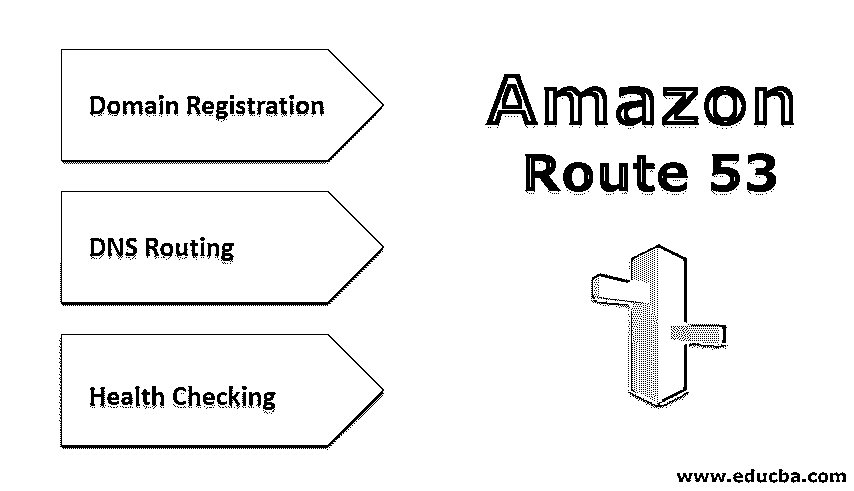
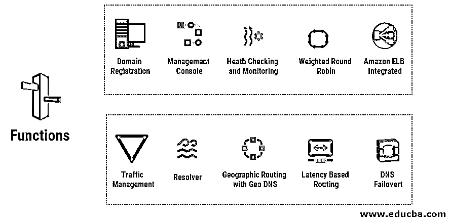

# 亚马逊 53 号公路

> 原文：<https://www.educba.com/amazon-route-53/>

## 亚马逊 53 号公路简介

Amazon Route 53 是一个高度可扩展和高度可用的云 DNS web 服务。它是为各种企业和开发者设计的，为他们提供了一种高性价比和可靠的路由方式。它通过将最终用户的域名转换成相应的数字 IP 地址(不同的计算机使用这些地址相互连接),来帮助最终用户路由到各种互联网应用程序。它也与 IPV6 高度兼容。它可以根据需要以不同的组合来执行 3 种功能，如健康检查、DNS 路由和域注册。

### 亚马逊 53 号线是什么？

它是一个用于云应用的域名系统 web 服务。它们让您可以有效地将所有用户请求连接到 AWS 基础设施。用户也可以被路由到 AWS 基础设施之外。可以使用 Amazon Route 53 配置 DNA 健康检查将流量路由到健康的端点。它还可以用于监控应用程序的健康和端点。

<small>Hadoop、数据科学、统计学&其他</small>

*   它的流量包括不同的路由类型，如加权循环法、Geo DNS、基于延迟的路由和帮助您管理全局流量的 Geoproximity。
*   所有不同的路由类型以及 DNS 故障转移为您提供了一个具有高容错性和低延迟的体系结构。
*   它的通信流有一个简单易用的可视化编辑器，允许您管理最终用户到应用程序端点的路由。它可以覆盖单个自动气象站区域，也可以覆盖全球。
*   it 部门还提供域名注册工具，帮助购买和管理各种域名。
*   它还会自动为您的域配置 DNS 设置。

使用它可以执行三个主要功能。这些功能可以任意组合执行。

如果您想要执行所有三个功能，请遵循以下步骤:

*   **域名注册:**帮助您为[您的网络应用](https://www.educba.com/what-is-web-application/)或网站注册您想要的域名。你应该准备好网站名称。
*   **DNS 路由:**当最终用户在其 web 浏览器中输入您的域名或子域名时，它有助于将他们的浏览器连接到您的 web 应用程序或网站。
*   健康检查:it 部门通过互联网向 web 服务器等资源发送自动请求，以检查其健康状况和功能是否正常。

### 亚马逊 Route 53 怎么配置？

下面给出了如何配置亚马逊 Route 53:

#### 第一步:域名注册

*   打开、设置和配置 Amazon Route 53 控制台。
*   如果您是新用户，请从域注册中选择立即开始选项。
*   如果您已经有一个域，请选择注册域。
*   选择注册域。
*   应该输入首选域名，并检查其可用性。
*   一旦您的域可用，请选择添加到购物车。
*   选择注册的年数，然后选择
*   输入联系人和邮政编码详细信息，然后选择
*   查看并验证输入的详细信息，然后选择接受条款和条件。
*   选择完成购买。

#### 第二步:亚马逊 S3 桶为您的领域

*   创建一个亚马逊 S3 桶来托管您的网站。
*   您可以为您的域名创建另一个亚马逊 S3 存储桶。
*   你甚至可以上传你的网站到亚马逊 S3 桶。

#### 步骤 3:将 DNS 流量路由到您的域的 S3 存储桶

*   打开亚马逊 Route 53 控制台。
*   从导航窗格中选择托管区域。当您创建域名时，Amazon Route 53 会使用您的域名自动创建托管区域。
*   从托管区域列表中选择带有您的域名的托管区域。
*   选择创建记录集。记录包含有关流量路由的信息，并存储在托管区域中。

现在输入以下详细信息:

1.  **名称:**默认值将是您的托管区域和域名。您也可以添加 www 来路由 DNS 流量到您的域 S3 桶。
2.  **类型:**选择一个–IP v4 地址。
3.  **别名:**选择
4.  **别名目标:**提供 S3 时段区域名称。
5.  **路由策略:**选择默认值。
6.  **评估目标健康:**选择默认值。

*   挑选
*   通过在浏览器中打开网站来测试和验证网站是否正常工作。

### 亚马逊路线 53 的功能

10 大功能如下:

*   **流量管理:**高性价比，简单的流量管理。使用健康、延迟、邻近性和所有其他考虑因素，将最终用户路由到最适合您应用的端点。
*   **解析器:**重复 DNS 可用于亚马逊 VPC 和其他网络。有条件的 DNS 端点和转发规则是为解析 Amazon Route 53 的私有托管区域中的主自定义名称而创建的。
*   **使用地理 DNS 的地理路由:**最终用户的地理位置用于将他们路由到指定的端点。它还让您以更简单的方式平衡不同端点之间的负载。
*   **基于延迟的路由:**最终用户被[路由到 AWS 端点](https://www.educba.com/what-is-aws/)，并被提供可能的低延迟和高性能。它有助于提高应用程序的整体性能。
*   **DNS 故障转移:**它有助于检测站点故障。它会自动将网站用户重定向和路由到另一个位置。
*   **域名注册:**域名注册服务由亚马逊 Route 53 提供。它可以让你搜索、转移你现有的域名到 Amazon Route 53，并注册和创建新的域名。
*   **管理控制台:**使用 ASWS 管理控制台。它让你无需任何编码就能管理亚马逊路线 53 [。](https://www.educba.com/what-is-coding/)
*   **健康检查和监控:**它通过使用健康检查代理持续监控应用程序来确定应用程序的可用性。它监控应用程序的性能和健康状况。
*   **加权循环法(WRR):** 亚马逊 Route 53 也提供加权循环法功能。
*   **亚马逊 ELB 集成:**弹性负载均衡与亚马逊 Route 53 集成，实现更好的负载均衡。

### 结论

它是一个高度可扩展、高度可用、高度灵活、简单、快速、经济高效、安全可靠的云域名系统 web 服务。它与如此多的其他 AWS 基础设施集成，以提供容错和低延迟的架构。域名注册和创建都大大简化了。

### 推荐文章

这是亚马逊 53 号路线的指南。这里我们分别讨论如何配置亚马逊 route 53 的各种功能。您也可以浏览我们推荐的其他文章，了解更多信息——

1.  什么是亚马逊 VPC？
2.  [营销云培训](https://www.educba.com/marketing-cloud-training/)
3.  [什么是 AWS EC2？](https://www.educba.com/what-is-aws-ec2/)
4.  [数字营销工具](https://www.educba.com/digital-marketing-tools/)

