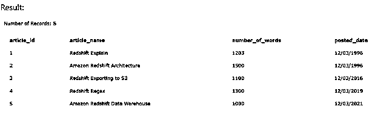
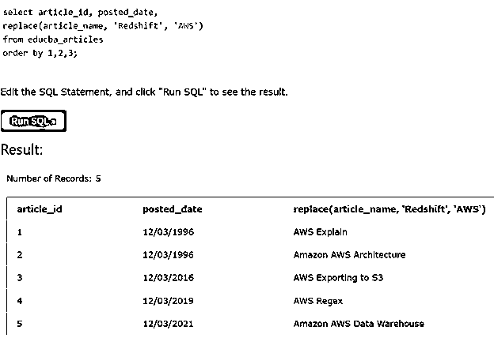
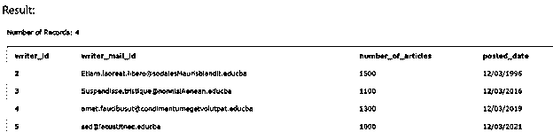
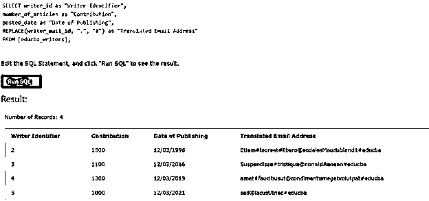
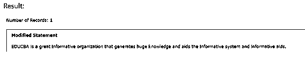

# 红移替换

> 原文：<https://www.educba.com/redshift-replace/>

## 红移替换简介

AWS 红移中提供了红移替换功能，可以根据需要将一个字符或包含某些字符的字符串替换为另一个字符或字符集。在 replace 函数的情况下，我们可以用目标字符串中所需的任何预期值替换源字符串中构成字符串的字符集的特定字符的所有出现。

在本文中，我们将了解 replace 函数的语法，它在 Amazon Redshift 中是如何工作的，并研究如何在多个示例的帮助下实现该函数。最后，我们将结束我们的发言。

<small>Hadoop、数据科学、统计学&其他</small>

**语法—**

替换函数的语法如下所示

`REPLACE (source string, characters to be replaced, characters with which to replace)`

在上述语法中，所使用的术语逐一进行了详细描述

**Source string–**这是包含要替换的字符的主字符串，这与我们想要的输出字符串相同，但只是包含了根据我们的要求替换的字符。

**要替换的字符—**这可以是要从源字符串中替换的单个或多个字符。请注意，源字符串中的所有此类事件都需要从源字符串中替换。此字符必须是 CHAR 数据类型字符或 VARCHAR 数据类型字符串。

**要替换的字符-**这可以是一个字符或一组字符，其数据类型为 CHAR 或 VARCHAR 字符串，这些字符将放在源字符串中，而不是要替换的字符。

**返回值–**REPLACE 函数返回的值是一个 VARCHAR 数据类型的新字符串，包含所有出现的新老字符。如果要替换的字符或要替换的字符的任何值为空，则 replace 函数的返回值也为空。

### 替换功能是如何工作的？

尽管 replace 函数的外观和工作方式与红移函数 REGEXP_REPLACE 函数和 TRANSLATE 函数相似，但两者有本质上的不同。在 REGEXP_REPLACE 函数中，搜索源字符串以找到与指定正则表达式匹配的模式，并且只检查字符串中是否存在这种模式，而在 translate 函数中，我们可以用其他多个目标单个字符替换源字符串中存在的多个单个字符，我们希望源字符替换这些目标单个字符。在 replace 函数的情况下，我们可以用目标字符串中所需的任何预期值替换源字符串中构成字符串的字符集的特定字符的所有出现。

### 红移替换的例子

下面给出了红移替换的例子:

#### 示例#1

让我们考虑一个例子，其中我们有一个名为 educba_articles 的表，它包含为组织编写的文章的所有信息。为了检查表 educba_articles 的内容，我们可以执行下面的查询语句

`SELECT * FROM educba_articles;`

执行上述查询语句的输出如下图所示

假设我们想要将文章名称列中出现的所有字符组 Redshift 替换为 AWS。为此，我们可以在 Redshift 中使用 REPLACE 函数，我们的查询语句将源字符串作为列 article_name 的名称，要替换的字符和要替换的字符分别是 Redshift 和 AWS。因此，我们的查询语句如下所示

`select article_id, posted_date,
replace(article_name, 'Redshift', 'AWS')
from educba_articles
order by 1,2,3;`

执行上述查询语句的输出如下所示

#### 实施例 2

现在让我们考虑另一个例子，其中多次出现的特定字符被从源字符串替换为指定的目标字符。我们的数据库中还有一个名为 educba_writers 的表，它包含与组织的作者相关的信息和详细信息。为了观察表中的联系人，让我们启动下面提到的查询--

`SELECT * FROM educba_writers;`

执行上述查询语句的输出如下图所示

正如您所看到的，我们有一个名为 writer's mail id 的列，其中包含作者的电子邮件地址。让我们试着替换所有出现的(。)带(#)哈希字符的点。这将通过使用 replace 函数来完成，我们的查询语句将如下所示

`SELECT writer_id as "Writer Identifier",
number_of_articles as "Contribution",
posted_date as "Date of Publishing",
REPLACE(writer_mail_id, ".", "#") as "Translated Email Address"
FROM [educba_writers];`

执行上述查询语句的输出给出了下图所示的结果。我们可以观察到，在我们的源字符串编写器邮件 id–中，所有出现的点运算符都被替换为散列运算符 i=or

#### 实施例 3

让我们再考虑一个例子，在这个例子中，我们将尝试操作一组字符中出现多次的字符串值。我们有一个字符串“EDUCBA 是一个伟大的教育组织，它产生大量的知识，并帮助教育系统和教育援助。”其中我们想要用信息字符集替换教育字符集的所有出现。为此，我们可以使用以下查询语句–

`SELECT REPLACE ("EDUCBA is a great educational organization that generates huge knowledge and aids the educational system and educational aids.", "educational", "informative") as "Modified Statement";`

执行上述查询语句的输出如下图所示

### 结论

REPLACE 函数有助于将特定表达式或列值中的特定字符或字符集替换为所需的字符或出现次数。请注意，所有出现的指定字符都将从源字符串中替换。

### 推荐文章

这是红移替换的指南。在这里，我们将讨论 REPLACE 函数是如何工作的，以及示例和输出。您也可以看看以下文章，了解更多信息–

1.  [红移子串](https://www.educba.com/redshift-substring/)
2.  红移日期差值
3.  [什么是 AWS 红移？](https://www.educba.com/what-is-aws-redshift/)
4.  [红移物化视图](https://www.educba.com/redshift-materialized-views/)

