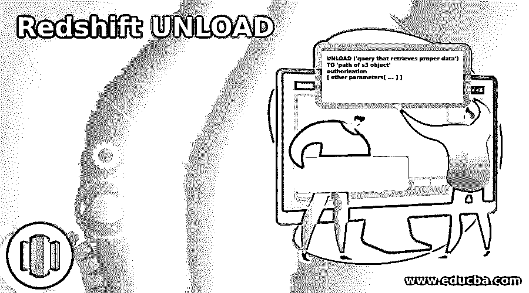
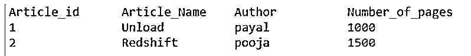
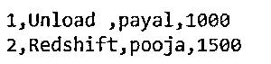

# 红移卸载

> 原文：<https://www.educba.com/redshift-unload/>

## 红移卸载简介

红移卸载是与亚马逊红移数据仓库平台中的复制命令相反的过程。unload 命令在其输出中传输查询检索到的所有数据，并将其存储在亚马逊 S3 数据湖中。因此，在使用 redshift 数据仓库平台生成和分析报告时，我们可以高性能地处理大量数据。copy 命令的工作是将亚马逊 S3 的 lakes 或 bucket 中的所有数据传输到仓库的表中，而 unload 命令的功能正好相反，它从查询中获取数据，并将这些数据存储在亚马逊 S3 的 lakes 或 bucket 中。

### 红移卸载工作

*   大多数情况下，当我们需要以无法在亚马逊红移平台内完成的方式执行数据分析时，例如在机器学习的情况下，或者当我们需要多个应用程序使用我们的数据时，我们必须从红移表中导出数据，并将它们移动到亚马逊 S3 桶。
*   为此，第一步将是尝试 select 的多个查询，并找到适合您的导出要求的查询。然后，您可以尝试不同的查询，直到在查询结果中找到正确的检索数据。下一步是执行卸载命令，并将数据传输到 S3 存储桶。

### 红移卸载的语法

下面给出了 redshift UNLOAD 命令的语法:

<small>Hadoop、数据科学、统计学&其他</small>

`UNLOAD ('query that retrieves proper data')
TO 'path of s3 object'
authorization
[ other parameters[ ... ] ]`

其中其他参数可以是:

`{ [ FORMAT [ AS ] ] CSV | PARQUET
| ENCRYPTED [ AUTO ] | ZSTD
| PARALLEL [ { ON | TRUE } | { OFF | FALSE } ] | HEADER
| MAXFILESIZE [AS] maximum size [ MB | GB ] | FIXEDWIDTH [ AS ] 'specification of fixed width'
| ADDQUOTES
| NULL [ AS ] 'string which has the value as NULL'
| BZIP2
| GZIP
| PARTITION BY ( name of column[, ... ] ) [ INCLUDE ] | MANIFEST [ VERBOSE ] | ESCAPE
| ALLOWOVERWRITE
| DELIMITER [ AS ] 'character to be delimited'
| REGION [AS] 'region of Amazon web service' }`

redshift 的 UNLOAD 命令中使用的参数:

让我们从上面提到的 Amazon Redshift 中 unload 命令的语法中看到一些最常用的参数:

*   **检索正确数据的查询:**这是 SELECT 查询的标准形式，它将获取那些包含我们想要从红移数据仓库传输到亚马逊 S3 云的数据的行和列。
*   **授权:**为了执行从 redshift 的数据仓库到亚马逊 S3 的数据卸载，正在执行命令的用户应该具有访问和修改 S3 的数据的权限。为此，我们需要首先授权用户。
*   **按列名分区:**在卸载过程中，如果我们提到分区键，根据这些键进行分区，输出文件将被存储在各自的文件夹中，这些都是由红移在内部自动完成的。在进行分区时，Amazon redshift 遵循与 Apache Hive 相同的分区创建和数据存储约定。
*   **Header:** 每当生成包含表格数据的输出文件时，如果我们提到 Header 参数，那么所有作为表格数据标题的列名都会在输出中与其数据一起导出。
*   **MANIFEST [VERBOSE]:** 如果我们指定该参数，则在执行卸载过程时，将创建包含数据的输出文件以及该输出数据文件的详细信息列表。这个清单文件是以 JSON 文本格式编写的，其中包括从红移数据仓库复制并存储在亚马逊 S3 的每个输出数据文件的所有 URL。
*   **要分隔的字符:**该分隔符有助于指定一个 ASCII 字符，该字符在卸载时写入输出文件时被视为字段的分隔符。最常用的分隔符是逗号(，)、制表符(t)或管道符号(|)。
*   **Region [AS]“亚马逊 web 服务区域”:**该参数帮助指定卸载时输出文件的目的地所在的亚马逊 AWS 区域中 S3 桶的位置。每当亚马逊 S3 和 Redshift warehouse 的 AWS 区域存在差异时，我们都必须指定亚马逊的目标 S3 存储桶所在的 AWS 区域。

### 红移卸载示例

以下是红移卸载的示例:

unload 命令的使用及其目的可以根据必须使用它们的场景而有所不同。现在让我们考虑一个例子，我们有一个场景，我们必须将一个红移表卸载到 S3 桶中的一个 CSV 文件。例如，我们有一个名为“EDUCBA_Articles”的表。我们必须将它卸载到一个 CSV 文件中，该文件位于 S3 的 S3 桶中的某个位置://EducbaBucket/myUnloadFolder/。

因此，我们将在用例中使用下面的 unload 命令。

**代码:**

`unload ('select * from EDUCBA_Articles')
to 'S3://EducbaBucket/myUnloadFolder/'
‘name of my role’ ‘arn:aws:iam::154895623154582:role/MyRoleNameInRedshift’
CSV;`

我们在红移数据仓库中的源表如下所示:

**输出:**

在红移中执行上面的卸载命令后，我们在 S3 桶的指定位置得到下面的输出文件。

### 结论

我们可以使用 Redshift UNLOAD 命令从 Redshift 的数据仓库中获取数据，并将其移动到 S3 云中我们指定的路径。在使用这个命令时，我们可以使用语法中指定的其他参数来提到更多的细节。

### 推荐文章

这是红移卸载指南。这里我们分别讨论红移卸载的介绍、工作原理和实例。您也可以看看以下文章，了解更多信息–

1.  [红移物化视图](https://www.educba.com/redshift-materialized-views/)
2.  [红移子串](https://www.educba.com/redshift-substring/)
3.  [红移创建表](https://www.educba.com/redshift-create-table/)
4.  红移日期差值

