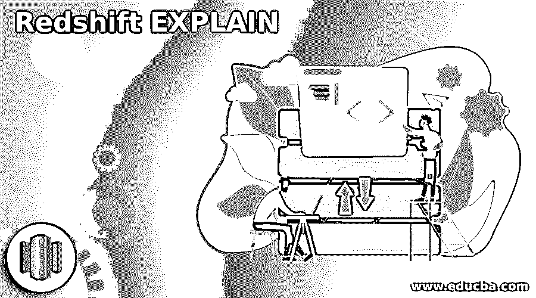
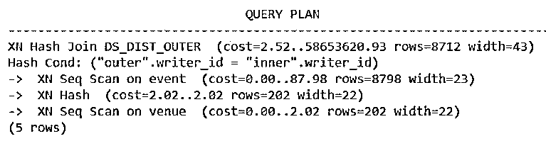
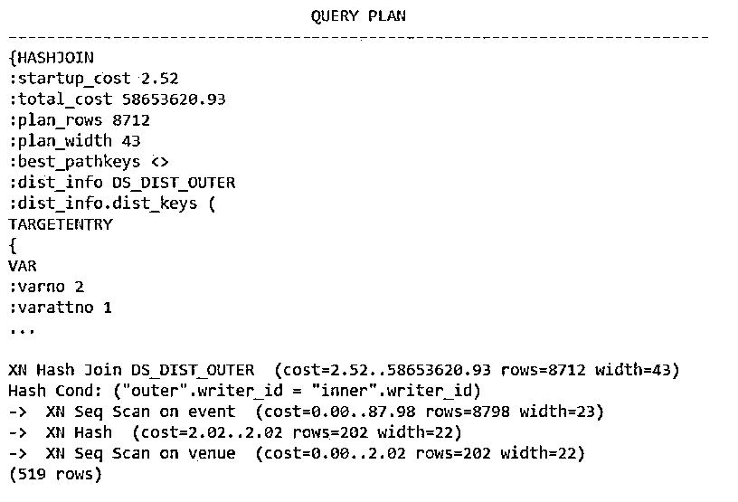
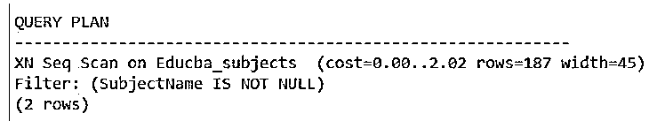

# 红移解释

> 原文：<https://www.educba.com/redshift-explain/>

## 红移介绍解释

Redshift EXPLAIN 用于检查和查看在执行 EXPLAIN 命令本身中提到的查询时将要执行的执行步骤的完整流程。我们可以检查性能，并尝试通过更改执行连接的列以及更多类似的内容，使我们的查询和查询中使用的子句(如 join 子句)更加优化。explain 命令以摘要格式显示执行计划，如果指定了 verbose 参数，它将显示完整的详细执行计划。

### 红移解释的语法

Amazon Redshift 中使用的 EXPLAIN 命令的语法与 SQL EXPLAIN 命令中的语法非常相似。

<small>Hadoop、数据科学、统计学&其他</small>

下面的语句显示了 Redshift 中 EXPLAIN 命令的语法。

`EXPLAIN [VERBOSE] statement to be analyzed/query`

在上述语法中，使用的术语如下:

*   **VERBOSE:** 通常，对于您在 EXPLAIN 命令中指定的任何查询语句，该命令只返回一个概括形式的解释，它简单地指定了执行流程的所有步骤。在这种情况下，如果您在语法 VERBOSE 中指定此可选参数，则该命令将检索查询语句执行将执行的所有步骤的详细分步信息，而不仅仅是查询计划的简短摘要。
*   **要分析/查询的语句:**这可以是任何需要计算、分析和研究的 SQL 语句，解释命令将考虑这些语句来检索此处指定的语句查询的查询计划。这些语句只能包括数据操作命令，如 UPDATE、INSERT、SELECT、DELETE 或 CREATE TABLE，而不能包括任何其他与数据定义语言相关的查询语句。

### 解释命令的性能

*   EXPLAIN 语句的性能主要受创建临时表的时间因素的影响。在执行包含子表达式或嵌套查询的查询语句时，可能需要由查询创建内部临时表，以便引用它并考虑它来操作和检索查询语句的最终结果集。
*   如果 EXPLAIN 命令用于这样的查询，那么我们也必须创建这些临时表用于分析目的。因为即使我们不必检索查询的最终结果集。中间临时表的创建和创建它们所需的时间、它们的其他连接以及许多其他与执行相关的步骤都需要考虑，并显示在 EXPLAIN 命令的输出中。
*   这就是为什么如果 EXPLAIN 中使用的查询语句涉及临时表的创建，那么在创建临时表的情况下，获取 EXPLAIN 命令中指定的查询语句的执行步骤的输出可能会花费一些时间。最终的性能取决于查询计划的统计数据和模式。

**Note:** The EXPLAIN command cannot be used for the Database operations and DDL commands other than creating a table, insert, delete, select, select into and update.

### 红移的例子解释了

下面给出的示例展示了 SQL 查询中 EXPLAIN 命令的实现:

#### 示例#1

我们将首先考虑 SQL 中的查询语句，它将从 Educba_articles 表中检索名为 Article_id 和 Article_name 的列的值，并从 Educba_writers 表中检索 writer_id 和 writer_name 的信息。为此，我们可以使用 EXPLAIN 命令来理解这个 select 查询的查询计划和执行流程，该查询将由 Redshift 中的 DBMS 内部执行。

**代码:**

`EXPLAIN
select Article_id, Article_name, Educba_articles. writer_id, writer_name
from Educba_articles, Educba_writers
where Educba_articles. writer_id = Educba_writers. writer_id;`

在 Amazon Redshift 中执行上述命令的输出如下图所示。

**输出:**

#### 实施例 2

现在，如果您想要获得与上面指定的相同的查询语句的执行计划，但是以更详细的方式，包括一步一步的信息，那么您可以只使用 EXPLAIN 命令中的参数 VERBOSE。

**代码:**

`EXPLAIN VERBOSE
select Article_id, Article_name, Educba_articles. writer_id, writer_name
from Educba_articles, Educba_writers
where Educba_articles. writer_id = Educba_writers. writer_id;`

在 Amazon Redshift 中执行上述命令的输出如下图所示，其中包含执行计划的详细步骤。

**输出:**

#### 实施例 3

现在，我们将尝试获取涉及表创建的查询语句的执行流信息。假设我们必须创建一个名为 Educba_topics 的表，方法是使用 CREATE TABLE AS 语句从 Educba_subjects 表中选择列值。为此，我们希望通过使用 EXPLAIN 来查看详细的执行计划。

**代码:**

`explain create table Educba_topics as
select * from Educba_subjects
where SubjectName is not null;`

为了检索详细的计划，您可以在上面的命令中使用 VERBOSE。在 Amazon Redshift 中执行上述命令的输出如下图所示，其中包含了概括的执行计划。

**输出:**

### 结论

在 Amazon Redshift 中可以使用 EXPLAIN 命令来研究在执行 EXPLAIN 命令中提到的任何 SQL 查询语句时所遵循的执行步骤的详细流程。在使用这个命令时，我们必须小心，因为除了本文中指定的命令之外，它不支持检索 DDL 命令的执行计划。如果您想要检索执行计划的汇总信息，那么您可以跳过可选参数 VERBOSE 的指定，而要获得执行流的详细信息，您可以在 EXPLAIN 命令中指定 VERBOSE。

### 推荐文章

这是一个红移解释指南。这里我们分别讨论解释命令的介绍、执行和示例。您也可以看看以下文章，了解更多信息–

1.  [红移物化视图](https://www.educba.com/redshift-materialized-views/)
2.  [红移子串](https://www.educba.com/redshift-substring/)
3.  [红移创建表](https://www.educba.com/redshift-create-table/)
4.  红移日期差值

