# 红移 JSON

> 原文：<https://www.educba.com/redshift-json/>

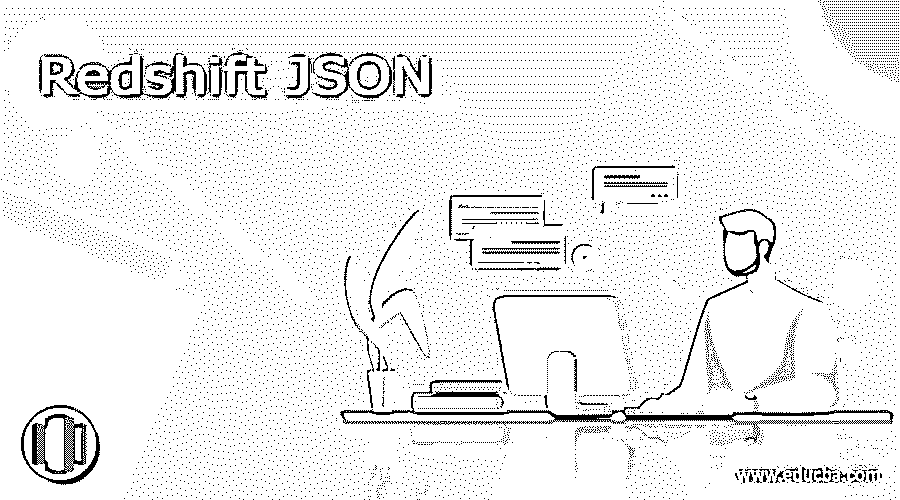

## 红移 JSON 的定义

在 Redshift 中处理 JSON 文档时，Redshift JSON 的支持是有限的，基本上，redshift 中有三种类型的选项可以将数据加载到表中。第一个选项是我们可以在将数据加载到 redshift 之前将 JSON 文件转换成关系模型，要使用这个选项加载数据，我们需要创建关系目标数据库。第二种选择是加载 redshift 表中的所有 JSON 文档，并使用 JSON 函数查询这些文档，redshift 中有多个 JSON 函数可用于查询 JSON 文档的数据。

**语法**

<small>Hadoop、数据科学、统计学&其他</small>

下面是 JSON 在 redshift 中的语法如下。

1) `Select json_function (name_of_json_column, ‘value of json column’) where condition`

2) `Select json_function (name_of_json_column,) group by, order by`

红移 JSON 的参数描述语法。

1) JSON 函数–这是我们使用 JSON 数据从 JSON 列中检索的函数。redshift 中有多个 JSON 函数可用于查询 JSON 数据。我们可以在 redshift 中使用 JSON 函数来检索 JSON 列数据。

2)Select–Select 命令与 JSON 函数一起使用，通过使用子句和条件运算符从表中检索数据。

3)列名——这是 JSON 数据列的名称，我们使用 JSON 函数从表中检索数据。

4)json 列的值——这就是我们用来在 redshift 中分离 JSON 文档数据的列值。我们可以按照我们在查询中使用的值从表列中分离数据。

5) Where 条件——我们可以使用 redshift 中的 Where 条件从列中检索 JSON 文档。

6)Order by condition——我们可以使用 redshift 中的 Order by condition 从列中检索 JSON 文档。

7)Group by condition——我们可以在 redshift 中使用 Group by condition 从列中检索 JSON 文档。

### JSON 在红移中是如何工作的？

在 redshift 中加载 JSON 文档有多种选择。加载数据后，我们可以通过使用以下 JSON 函数来检索 JSON 数据。

1)是有效的 JSON 数组(IS_VALID_JSON_ARRAY)函数。
2)是有效的 JSON (IS_VALID_JSON)函数。
3) Json 序列化(JSON_SERIALIZE)函数。
4) Json 解析(JSON_PARSE)函数。
5) Json 提取路径文本(JSON_EXTRACT_PATH_TEXT)函数。
6) Json 提取数组元素文本(Json _ EXTRACT _ ARRAY _ ELEMENT _ TEXT)函数。

*   如果我们想存储少量的键-值对，那么 JSON 文档是最适合的。使用 JSON 格式可以节省存储数据的存储空间。
*   我们可以使用 JSON 格式在一个列中存储多个键值对，但不能使用其他格式存储多个键值对。
*   对整数数据类型值或不是 JSON 格式的数据使用 JSON 函数。我们只能对 JSON 类型的文档应用 JSON 函数。

下面的例子表明我们只能在 JSON 类型的列上应用 JSON 函数。

**代码:**

`Select json_extract_path_text (stud_name, 'A') as key2 from redshift_json where stud_id = 101;`

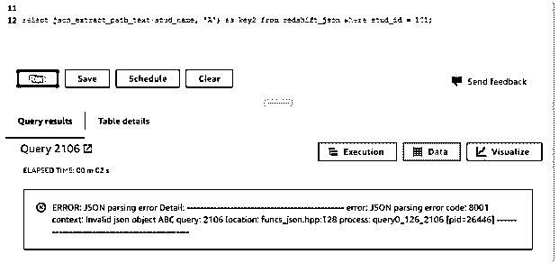

*   在上面的例子中，我们已经在 stud_name 列上应用了 JSON 函数，并试图检索作为“A”的键值对，但是它将显示错误为我们在查询中使用的无效 JSON 对象。
*   此外，它将显示查询的解析错误。
*   我们不能在 redshift 中将整数数据类型列与 JSON 函数一起使用，我们只需要使用 JSON 类型的数据。

下面的示例说明了我们不能在 redshift 中使用带有 JSON 函数的列的整数数据类型。

**代码:**

`Select json_extract_path_text (stud_id) from redshift_json where stud_id = 101;`

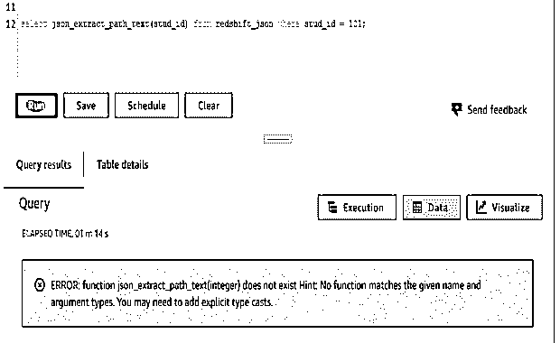

*   在上面的例子中，我们使用列名作为 JSON 函数的 stud_id，stud_id 数据类型作为整数。因此，它会发出类似整数不存在的错误，即没有找到任何匹配的函数或参数。
*   我们可以使用 copy 命令将 JSON 文件中的数据加载到红移表中。我们也可以使用存储在 S3 桶中的 JSON 文件。
*   我们还可以通过使用选项 auto 来自动复制 JSON 文件字段，或者我们需要指定 JSON 文件的路径。

### 例子

下面是 JSON 在红移方面的例子如下。

#### 1)使用 IS_VALID_JSON 函数查询 JSON 字段

以下示例显示了使用 IS_VALID_JSON 函数查询 JSON 字段，如下所示。这个函数验证 JSON 字符串。

在下面的例子中，我们使用 JSON 列来验证来自函数的 JSON 数据。我们在 JSON 列中没有发现任何无效的 JSON 数据。

**代码:**

`Select stud_id, json, is_valid_json (json) from redshift_json order by stud_id;`

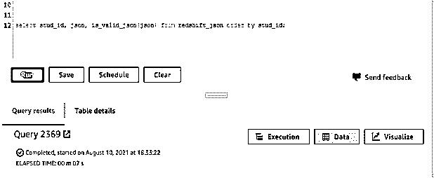

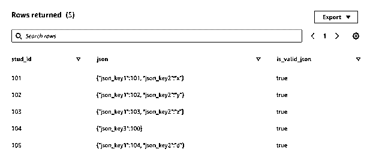

#### 2)使用 is_valid_json_array 函数查询 JSON 字段

*   下面的示例显示了使用 is_valid_json_array 函数查询 JSON 字段，如下所示。这个函数验证 JSON 数组字符串。
*   在下面的例子中，我们使用 JSON 列来验证来自函数的 JSON 数组值。我们在 JSON 列中没有找到任何 JSON 数组。

**代码:**

`Select stud_id, json, is_valid_json_array (json) from redshift_json order by stud_id;`

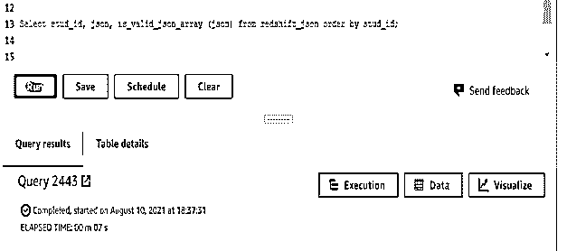

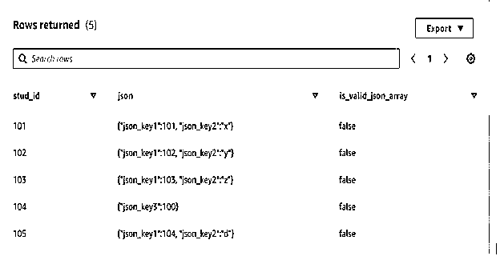

#### 3)使用 json_extract_path_text 函数查询 JSON 字段

*   下面的例子展示了如何使用 json_extract_path_text 函数查询 JSON 字段。这个函数从文本中提取值。
*   在下面的例子中，我们使用 json 列从函数中提取路径文本数据。

**代码:**

`Select stud_id, json, json_extract_path_text (json, 'key2') as json_key from redshift_json order by stud_id;`

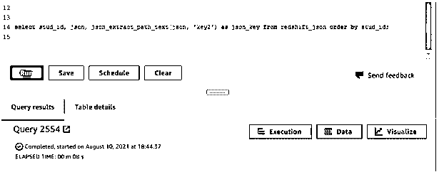

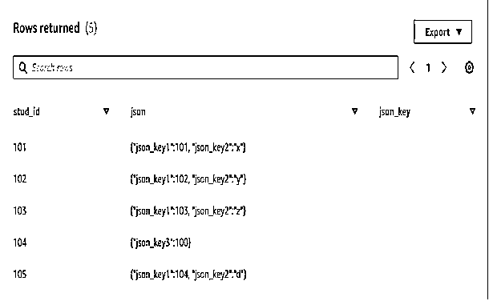

#### 4)使用 json_parse 函数查询 JSON 字段

*   下面的例子展示了如何使用 json_parse 函数查询 JSON 字段。这个函数用于解析 JSON 值。
*   在下面的例子中，我们使用 json 列来解析函数中的数据。

**代码:**

`Select stud_id, json, json_parse (json) as json_key from redshift_json order by stud_id;`

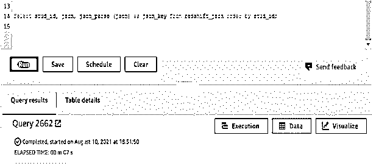

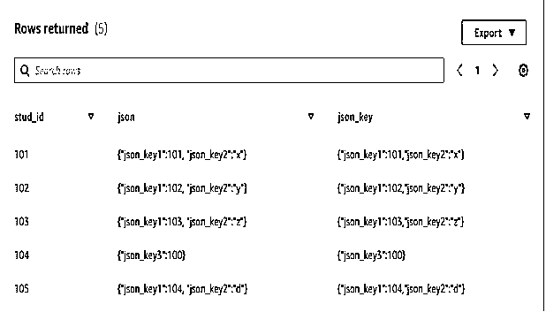

### 结论

我们可以使用多个 JSON 函数从表列中查询数据。红移 JSON 对于在键值对中存储值非常有用和重要。使用 JSON，我们可以在一个列中存储多个列值。我们还可以在 redshift 中使用 JSON 来最小化存储使用。

### 推荐文章

这是红移 JSON 的指南。这里我们讨论定义，语法，JSON 如何在红移中工作？示例分别用代码实现。您也可以看看以下文章，了解更多信息–

1.  [什么是 AWS 红移？](https://www.educba.com/what-is-aws-redshift/)
2.  红移日期差值
3.  [红移子串](https://www.educba.com/redshift-substring/)
4.  [红移物化视图](https://www.educba.com/redshift-materialized-views/)

